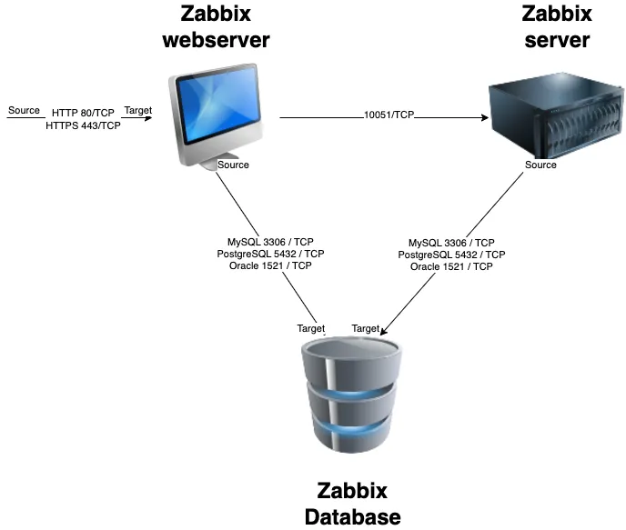

# Getting started with Zabbix

## Requirements

Zabbix has a set of requirements that need to be met on the hardware level and software level. These requirements can change over time and also depends on the size of your setup and the software you choose.
So before you start buying metal or installing a random database version have a look at the Zabbix documentation and check the latest requirements for the version you want to install. The latest requirements can be found [here](https://www.zabbix.com/documentation/current/en/manual/installation/requirements). Don't forget to select your correct *Zabbix* version from the list.


## Basic OS configuration before we start

### firewall 

It's important for our Zabbix server to have an OS that is well prepared before we start to install our monitoring tool. First we need to make sure our firewall is installed. 

``# dnf install firewalld --now``

Our firewall is installed now, and we are ready to configure the needed ports. For our Zabbix server, we need to allow access to port 10051/tcp this is the port where our Zabbix trapper listens on for incoming data. So we need to open this port in our firewall to allow access to our Zabbix trapper.

```# firewall-cmd --add-service=Zabbix-server --permanent```

or if the service is not known

```# firewall-cmd --add-port=10051/tcp --permanent```

???+ note
    Firewalld is the replacement of iptables in Redhat and allows us to make changes available immediately without the need to restart a service. It's possible that your distribution is not using [Firewalld](https://www.firewalld.org) in this case you have to look to the documentation of your OS.

### timeserver

Another thing we need to configure is the setup of timeserver and sync our Zabbix server to the timeserver by making use of an ntp client. This needs to be done for the Zabbix server but also for the devices we will monitor as time is very important for Zabbix. Imagine one of our hosts having a time zone that is wrong we could end up looking for a problem in Zabbix that happened 6h ago while it had happened maybe only 2h ago.

```# dnf install chronyd --now```

Chrony should be installed now and enabled and running. This can be verified with the command:

```# systemctl status chronyd```

???+ note
    dnf is a packagemanager from RedHat you need to replace dnf with your correct packagemanager like zyper, apt, yum, ... chrony is a replacement for ntpd and does a better job being faster and more accurate. If your OS does not support [chrony](https://chrony-project.org/) then maybe ntpd is still available.


Once Chrony is installed we also need to setup our correct time zone. We can have a look first with 'timedatectl' to see how our time is configured 
```
# timedatectl
               Local time: Thu 2023-11-16 15:09:14 UTC
           Universal time: Thu 2023-11-16 15:09:14 UTC
                 RTC time: Thu 2023-11-16 15:09:15
                Time zone: UTC (UTC, +0000)
System clock synchronized: yes
              NTP service: active
          RTC in local TZ: no
```

Make sure that the service cronyd is active, see above on how to do if you missed it.
We can choose the correct time zone from a list that we can lookup with the following command:

```
# timedatectl list-time zones
```

This will give us a list with all available time zones. Choose the one closest to you.
```
Africa/Abidjan
Africa/Accra

...

Pacific/Tongatapu
Pacific/Wake
Pacific/Wallis
UTC
```

We can now configure our correct time zone with the following command:

```
timedatectl set-time zone Europe/Brussels
```

When we look again we should see our time zone properly configured.
```
# timedatectl
               Local time: Thu 2023-11-16 16:13:35 CET
           Universal time: Thu 2023-11-16 15:13:35 UTC
                 RTC time: Thu 2023-11-16 15:13:36
                Time zone: Europe/Brussels (CET, +0100)
System clock synchronized: yes
              NTP service: active
          RTC in local TZ: no
```
???+ note
    Some people like to install all servers in the UTC time zone so that all server logs are in the same time zone when having servers all over the world. Zabbix supports user based time zone settings so it's possible to keep the time zone in UTC on the server and then add the correct time zone in the user interface if you like.


We can test if Chrony is syncronizing with the correct timeservers as well by running the command chronyc

```
# chronyc
chrony version 4.2
Copyright (C) 1997-2003, 2007, 2009-2021 Richard P. Curnow and others
chrony comes with ABSOLUTELY NO WARRANTY.  This is free software, and
you are welcome to redistribute it under certain conditions.  See the
GNU General Public License version 2 for details.

chronyc>
```

Then we type ```sources```

```
chronyc> sources
MS Name/IP address         Stratum Poll Reach LastRx Last sample
===============================================================================
^- 51-15-20-83.rev.poneytel>     2   9   377   354   +429us[ +429us] +/-  342ms
^- 5.255.99.180                  2  10   377   620  +7424us[+7424us] +/-   37ms
^- hachi.paina.net               2  10   377   412   +445us[ +445us] +/-   39ms
^* leontp1.office.panq.nl        1  10   377   904  +6806ns[ +171us] +/- 2336us
```

Here we can see that we are using a bunch of ntp servers that are not in our own country so we better swicht to some timeservers in our local country or if we have a timeserver in our company we could use this one. We can find some local timeservers here : [https://www.ntppool.org/](https://www.ntpool.org)

To change this we have to edit our config file "/etc/chrony.conf" and replace the existing ntp server with our local one 

```
# Use public servers from the pool.ntp.org project.
# Please consider joining the pool (http://www.pool.ntp.org/join.html).
pool 2.centos.pool.ntp.org iburst
```

And change it to a local server:

```
# Use public servers from the pool.ntp.org project.
# Please consider joining the pool (http://www.pool.ntp.org/join.html).
pool be.pool.ntp.org iburst
```

Don't forget to restart the ntpd client of course.

```
# systemctl restart chronyd
```

When we look again we will see that we are now using our local timeservers.

```
chronyc> sources

MS Name/IP address         Stratum Poll Reach LastRx Last sample
===============================================================================
^- ntp1.unix-solutions.be        2   6    17    43   -375us[ -676us] +/-   28ms
^* ntp.devrandom.be              2   6    17    43   -579us[ -880us] +/- 2877us
^+ time.cloudflare.com           3   6    17    43   +328us[  +27us] +/- 2620us
^+ time.cloudflare.com           3   6    17    43   +218us[  -83us] +/- 2815us
```

## Installing Zabbix

Before we can install Zabbix we first have to know how the design is. The Zabbix server has been build op modular based on 3 components.

- The Zabbix server
- The Zabbix web server
- The Zabbix database



All these components can be installed on 1 server or can be split over 3 different servers. 
The Zabbix server itself is the brain this part is doing all the trigger calculations and sending all the alert.
The database is where the Zabbix server stores its config and all the data that we have gathered.
The web server provides us with a front-end. Note that Zabbix has a API and that this is also located on the front-end and not on the Zabbix server side.

All these parts have to work together so as you can see in our image above. The Zabbix server needs to read the config and store the data in our database and the Zabbix front-end needs to be able to write the configuration in the database as well. The Zabbix front-end also needs to check the online status of our Zabbix server and needs to read some other information as well.

For our setup, we will use 2 VM's 1 VM with a Zabbix server and the Zabbix web server and another VM with the database.


### Installing Zabbix with MariaDB


Let us start with the installation of the MariaDB server, you need to create a MariaDB repository configuration file `mariadb.repo` manually in the following path `/etc/yum.repos.d/`.
To create a MariaDB repository file, you can use the following command.


#### Add the MariaDB repo

```
vi /etc/yum.repos.d/mariadb.repo
```

The above command will create a new repository file, Once it is created, you need to add the following configuration into the file.
Make sure your version, in this case 10.11, is supported by Zabbix by looking at the latest [requirements](https://www.zabbix.com/documentation/current/en/manual/installation/requirements) for your version. 

```
# MariaDB 10.11 RedHatEnterpriseLinux repository list - created 2023-11-01 14:20 UTC
# https://mariadb.org/download/
[mariadb]
name = MariaDB
# rpm.mariadb.org is a dynamic mirror if your preferred mirror goes offline. See https://mariadb.org/mirrorbits/ for details.
# baseurl = https://rpm.mariadb.org/10.11/rhel/$releasever/$basearch
baseurl = https://mirror.23m.com/mariadb/yum/10.11/rhel/$releasever/$basearch
# gpgkey = https://rpm.mariadb.org/RPM-GPG-KEY-MariaDB
gpgkey = https://mirror.23m.com/mariadb/yum/RPM-GPG-KEY-MariaDB
gpgcheck = 1


```
Lets update our OS first with the latest patches

```
# dnf update -y
```
#### Install the MariaDB database

Now we are ready to install our MariaDB database.

```
# dnf install MariaDB-server MariaDB-client
```

We are now ready to enable and start or MariaDB database.
```
# systemctl enable mariadb --now
```
Once the installation is complete, you can verify the version of the MariaDB server by using the following command:

```
# mysql -V
```

The output should look like this:

```
mysql  Ver 15.1 Distrib 10.11.6-MariaDB, for Linux (x86_64) using  EditLine wrapper
```

And when we ask the status of our MariaDB server we should get an output like this:

```
# systemctl status mariadb

● mariadb.service - MariaDB 10.11.6 database server
     Loaded: loaded (/usr/lib/systemd/system/mariadb.service; enabled; preset: disabled)
    Drop-In: /etc/systemd/system/mariadb.service.d
             └─migrated-from-my.cnf-settings.conf
     Active: active (running) since Sat 2023-11-18 19:19:36 CET; 2min 13s ago
       Docs: man:mariadbd(8)
             https://mariadb.com/kb/en/library/systemd/
    Process: 41986 ExecStartPre=/bin/sh -c systemctl unset-environment _WSREP_START_POSITION (code=exited, status=0/SUCCESS)
    Process: 41987 ExecStartPre=/bin/sh -c [ ! -e /usr/bin/galera_recovery ] && VAR= ||   VAR=`cd /usr/bin/..; /usr/bin/galera_recovery`; [ $? -eq 0 ]   && systemctl set-environment _WSREP_START>
    Process: 42006 ExecStartPost=/bin/sh -c systemctl unset-environment _WSREP_START_POSITION (code=exited, status=0/SUCCESS)
   Main PID: 41995 (mariadbd)
     Status: "Taking your SQL requests now..."
      Tasks: 9 (limit: 12344)
     Memory: 206.8M
        CPU: 187ms
```
#### Securing the database

It's time to secure our database by removing the test database and user and set our own root password.  Run the command `mariadb-secure-installation`, you should get the following output.

```
# mariadb-secure-installation

NOTE: RUNNING ALL PARTS OF THIS SCRIPT IS RECOMMENDED FOR ALL MariaDB
      SERVERS IN PRODUCTION USE!  PLEASE READ EACH STEP CAREFULLY!

In order to log into MariaDB to secure it, we'll need the current
password for the root user. If you've just installed MariaDB, and
haven't set the root password yet, you should just press enter here.

Enter current password for root (enter for none):
OK, successfully used password, moving on...

Setting the root password or using the unix_socket ensures that nobody
can log into the MariaDB root user without the proper authorisation.

You already have your root account protected, so you can safely answer 'n'.

Switch to unix_socket authentication [Y/n] n
 ... skipping.

You already have your root account protected, so you can safely answer 'n'.

Change the root password? [Y/n] y
New password:
Re-enter new password:
Password updated successfully!
Reloading privilege tables..
 ... Success!


By default, a MariaDB installation has an anonymous user, allowing anyone
to log into MariaDB without having to have a user account created for
them.  This is intended only for testing, and to make the installation
go a bit smoother.  You should remove them before moving into a
production environment.

Remove anonymous users? [Y/n] y
 ... Success!

Normally, root should only be allowed to connect from 'localhost'.  This
ensures that someone cannot guess at the root password from the network.

Disallow root login remotely? [Y/n] y
 ... Success!

By default, MariaDB comes with a database named 'test' that anyone can
access.  This is also intended only for testing, and should be removed
before moving into a production environment.

Remove test database and access to it? [Y/n] y
 - Dropping test database...
 ... Success!
 - Removing privileges on test database...
 ... Success!

Reloading the privilege tables will ensure that all changes made so far
will take effect immediately.

Reload privilege tables now? [Y/n] y
 ... Success!

Cleaning up...

All done!  If you've completed all of the above steps, your MariaDB
installation should now be secure.

Thanks for using MariaDB!
```
#### Create the Zabbix database 

```
# mysql -uroot -p
password

MariaDB [(none)]> create database zabbix character set utf8mb4 collate utf8mb4_bin;
MariaDB [(none)]> grant all privileges on zabbix.* to 'zabbix-web'@'<zabbix-server-ip>' identified by '<zabbix-web password>';
MariaDB [(none)]> grant all privileges on zabbix.* to 'zabbix-srv'@'<zabbix-server-ip>' identified by '<zabbix-srv password>';
MariaDB [(none)]> grant all privileges on zabbix.* to 'zabbix-web'@'localhost' identified by '<zabbix-web password>';
MariaDB [(none)]> grant all privileges on zabbix.* to 'zabbix-srv'@'localhost' identified by '<zabbix-srv password>';
MariaDB [(none)]> set global log_bin_trust_function_creators = 1;
MariaDB [(none)]> quit
```

???+ warning
    The Zabbix documentation explicitly mentions that deterministic triggers need to be created during the import of schema. On MySQL and MariaDB, this requires GLOBAL log_bin_trust_function_creators = 1 to be set if binary logging is enabled and there is no superuser privileges and log_bin_trust_function_creators = 1 is not set in MySQL configuration file.


#### Add the Zabbix repository and populate the DB

```
# rpm -Uvh https://repo.zabbix.com/zabbix/6.5/rocky/9/x86_64/zabbix-release-6.5-2.el9.noarch.rpm
# dnf clean all
# dnf install zabbix-sql-scripts
```
Upload the data from zabbix (db structure, images, user, ... )

```
# zcat /usr/share/zabbix-sql-scripts/mysql/server.sql.gz | mysql --default-character-set=utf8mb4 -uzabbix-srv -p zabbix
```

???+ warning
    Depending on the speed of your hardware or VM this can take a few seconds upto a few minutes so please don't cancel just sit and wait for the prompt

Log back into your MariaDB Database as root

```
# mysql -uroot -p
```
Remove the global parameter again as its not needed anymore and also for security reasons.

```
MariaDB [(none)]> SET GLOBAL log_bin_trust_function_creators = 0;
Query OK, 0 rows affected (0.001 sec)
```

#### Configure the firewall

One last thing we need to do is open the firewall and allow incoming connections for the MariaDB database from our Zabbix server because at the moment we dont accept any connections yet.

```
# firewall-cmd --list-all
public (active)
  target: default
  icmp-block-inversion: no
  interfaces: enp0s3 enp0s8
  sources:
  services: cockpit dhcpv6-client  ssh
  ports:
  protocols:
  forward: yes
  masquerade: no
  forward-ports:
  source-ports:
  icmp-blocks:
  rich rules:
```

First we will create an appropriate zone for our MariaDB and open port 3306/tcp but only for the ip from our Zabbix server.

```
# firewall-cmd --new-zone=mariadb-access --permanent
success

# firewall-cmd --reload
success

# firewall-cmd --get-zones
block dmz drop external home internal mariadb-access nm-shared public trusted work

# firewall-cmd --zone=mariadb-access --add-source=<zabbix-serverip> --permanent

success
# firewall-cmd --zone=mariadb-access --add-port=3306/tcp  --permanent

success
# firewall-cmd --reload
```

Now lets have a look to our firewall rules to see if they are what we expected:

```
# firewall-cmd --zone=mariadb-access --list-all
```
```
mariadb-access (active)
  target: default
  icmp-block-inversion: no
  interfaces:
  sources: <ip from zabbix-server>
  services:
  ports: 3306/tcp
  protocols:
  forward: no
  masquerade: no
  forward-ports:
  source-ports:
  icmp-blocks:
  rich rules:
```

Our database server is ready now to accept connections from our Zabbix server :).
You can continue with the next task [Installing the Zabbix Server](#installing-the-zabbix-server)


### Installing Zabbix with MySQL

ToDo

### Installing Zabbix with PostgreSQL

ToDo

### Setting up Zabbix HA

ToDo


### Installing the Zabbix Server

Before you start to install your Zabbix server make sure the server is properly configure as we explained in our topic [Basic OS configuration before we start](#basic-os-configuration-before-we-start).

#### Adding the Zabbix repository

From the [Zabbix Download page](https://www.zabbix.com/download) select the correct Zabbix version you would like to install. In our case it will be 7.0 LTS. Select the correct OS distribution as well. This will be Rocky Linux 9 in our case. We are going to install the Server and will be using NGINX.


Our first step is to disable Zabbix packages provided by EPEL, if you have it installed. Edit file /etc/yum.repos.d/epel.repo and add the following statement.

```
[epel]
...
excludepkgs=zabbix*
```
???+ Tip
    Having the epel repository enabled is a bad practice and could be dangerous if you use EPEL it's best to disable the repo and use dnf install <package> --enablerepo=epel. This way you will never overwrite or install unwanted packages by accident.

Our next task is to install the Zabbix repository on our OS and do a dnf cleanup of old data

``` 
rpm -Uvh https://repo.zabbix.com/zabbix/6.5/rocky/9/x86_64/zabbix-release-6.5-2.el9.noarch.rpm
dnf clean all
```
#### Installing the Zabbix server

Now that we have our repository with software added to our system we are ready to install our Zabbix server and webserver. Remember the webserver could be installed on another system. There is no need to install both on the same server.

    7  dnf install zabbix-server-mysql zabbix-web-mysql zabbix-nginx-conf zabbix-selinux-policy zabbix-agent
    8  vi /etc/zabbix/zabbix_server.conf
    9  setenforce 0
   10  systemctl enable zabbix-server --now
   11  tail /var/log/zabbix/zabbix_server.log
   12  tail -f /var/log/zabbix/zabbix_server.log
   13  systemctl stop zabbix-server
   14  systemctl start zabbix-server
   15  tail -f /var/log/zabbix/zabbix_server.log


