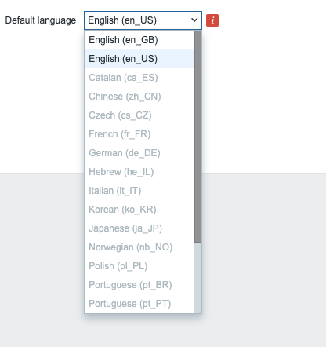

## Getting started with Zabbix

## Requirements

Zabbix has a set of requirements that need to be met on the hardware level and software level. These requirements can change over time and also depends on the size of your setup and the software you choose.
So before you start buying metal or installing a random database version have a look at the Zabbix documentation and check the latest requirements for the version you want to install. The latest requirements can be found [here](https://www.zabbix.com/documentation/current/en/manual/installation/requirements). Don't forget to select your correct *Zabbix* version from the list.


## Basic OS configuration before we start

### firewall 

It's important for our Zabbix server to have an OS that is well prepared before we start to install our monitoring tool. First we need to make sure our firewall is installed. 

``# dnf install firewalld --now``

Our firewall is installed now, and we are ready to configure the needed ports. For our Zabbix server, we need to allow access to port 10051/tcp this is the port where our Zabbix trapper listens on for incoming data. So we need to open this port in our firewall to allow access to our Zabbix trapper.

```# firewall-cmd --add-service=Zabbix-server --permanent```

or if the service is not known

```# firewall-cmd --add-port=10051/tcp --permanent```

???+ note
    Firewalld is the replacement of iptables in Redhat and allows us to make changes available immediately without the need to restart a service. It's possible that your distribution is not using [Firewalld](https://www.firewalld.org) in this case you have to look to the documentation of your OS.

### timeserver

Another thing we need to configure is the setup of timeserver and sync our Zabbix server to the timeserver by making use of an ntp client. This needs to be done for the Zabbix server but also for the devices we will monitor as time is very important for Zabbix. Imagine one of our hosts having a time zone that is wrong we could end up looking for a problem in Zabbix that happened 6h ago while it had happened maybe only 2h ago.

```# dnf install chronyd --now```

Chrony should be installed now and enabled and running. This can be verified with the command:

```# systemctl status chronyd```

???+ note
    dnf is a packagemanager from RedHat you need to replace dnf with your correct packagemanager like zyper, apt, yum, ... chrony is a replacement for ntpd and does a better job being faster and more accurate. If your OS does not support [chrony](https://chrony-project.org/) then maybe ntpd is still available.


Once Chrony is installed we also need to setup our correct time zone. We can have a look first with 'timedatectl' to see how our time is configured 
```
# timedatectl
               Local time: Thu 2023-11-16 15:09:14 UTC
           Universal time: Thu 2023-11-16 15:09:14 UTC
                 RTC time: Thu 2023-11-16 15:09:15
                Time zone: UTC (UTC, +0000)
System clock synchronized: yes
              NTP service: active
          RTC in local TZ: no
```

Make sure that the service cronyd is active, see above on how to do if you missed it.
We can choose the correct time zone from a list that we can lookup with the following command:

```
# timedatectl list-time zones
```

This will give us a list with all available time zones. Choose the one closest to you.
```
Africa/Abidjan
Africa/Accra

...

Pacific/Tongatapu
Pacific/Wake
Pacific/Wallis
UTC
```

We can now configure our correct time zone with the following command:

```
timedatectl set-time zone Europe/Brussels
```

When we look again we should see our time zone properly configured.
```
# timedatectl
               Local time: Thu 2023-11-16 16:13:35 CET
           Universal time: Thu 2023-11-16 15:13:35 UTC
                 RTC time: Thu 2023-11-16 15:13:36
                Time zone: Europe/Brussels (CET, +0100)
System clock synchronized: yes
              NTP service: active
          RTC in local TZ: no
```
???+ note
    Some people like to install all servers in the UTC time zone so that all server logs are in the same time zone when having servers all over the world. Zabbix supports user based time zone settings so it's possible to keep the time zone in UTC on the server and then add the correct time zone in the user interface if you like.


We can test if Chrony is syncronizing with the correct timeservers as well by running the command chronyc

```
# chronyc
chrony version 4.2
Copyright (C) 1997-2003, 2007, 2009-2021 Richard P. Curnow and others
chrony comes with ABSOLUTELY NO WARRANTY.  This is free software, and
you are welcome to redistribute it under certain conditions.  See the
GNU General Public License version 2 for details.

chronyc>
```

Then we type ```sources```

```
chronyc> sources
MS Name/IP address         Stratum Poll Reach LastRx Last sample
===============================================================================
^- 51-15-20-83.rev.poneytel>     2   9   377   354   +429us[ +429us] +/-  342ms
^- 5.255.99.180                  2  10   377   620  +7424us[+7424us] +/-   37ms
^- hachi.paina.net               2  10   377   412   +445us[ +445us] +/-   39ms
^* leontp1.office.panq.nl        1  10   377   904  +6806ns[ +171us] +/- 2336us
```

Here we can see that we are using a bunch of ntp servers that are not in our own country so we better swicht to some timeservers in our local country or if we have a timeserver in our company we could use this one. We can find some local timeservers here : [https://www.ntppool.org/](https://www.ntpool.org)

To change this we have to edit our config file "/etc/chrony.conf" and replace the existing ntp server with our local one 

```
# Use public servers from the pool.ntp.org project.
# Please consider joining the pool (http://www.pool.ntp.org/join.html).
pool 2.centos.pool.ntp.org iburst
```

And change it to a local server:

```
# Use public servers from the pool.ntp.org project.
# Please consider joining the pool (http://www.pool.ntp.org/join.html).
pool be.pool.ntp.org iburst
```

Don't forget to restart the ntpd client of course.

```
# systemctl restart chronyd
```

When we look again we will see that we are now using our local timeservers.

```
chronyc> sources

MS Name/IP address         Stratum Poll Reach LastRx Last sample
===============================================================================
^- ntp1.unix-solutions.be        2   6    17    43   -375us[ -676us] +/-   28ms
^* ntp.devrandom.be              2   6    17    43   -579us[ -880us] +/- 2877us
^+ time.cloudflare.com           3   6    17    43   +328us[  +27us] +/- 2620us
^+ time.cloudflare.com           3   6    17    43   +218us[  -83us] +/- 2815us
```

## Installing Zabbix

Before we can install Zabbix we first have to know how the design is. The Zabbix server has been build op modular based on 3 components.

- The Zabbix server
- The Zabbix web server
- The Zabbix database

{width=800}

All these components can be installed on 1 server or can be split over 3 different servers. 
The Zabbix server itself is the brain this part is doing all the trigger calculations and sending all the alert.
The database is where the Zabbix server stores its config and all the data that we have gathered.
The web server provides us with a front-end. Note that Zabbix has a API and that this is also located on the front-end and not on the Zabbix server side.

All these parts have to work together so as you can see in our image above. The Zabbix server needs to read the config and store the data in our database and the Zabbix front-end needs to be able to write the configuration in the database as well. The Zabbix front-end also needs to check the online status of our Zabbix server and needs to read some other information as well.

For our setup, we will use 2 VM's, 1 VM with a Zabbix server and our Zabbix web server and another VM with our Zabbix database.


### Installing Zabbix with MariaDB


Let us start with the installation of the MariaDB server, you need to create a MariaDB repository configuration file `mariadb.repo` manually in the following path `/etc/yum.repos.d/`.
To create a MariaDB repository file, you can use the following command.


#### Add the MariaDB repo

```
# vi /etc/yum.repos.d/mariadb.repo
```

The above command will create a new repository file, Once it is created, you need to add the following configuration into the file.
Make sure your version, in this case 10.11, is supported by Zabbix by looking at the latest [requirements](https://www.zabbix.com/documentation/current/en/manual/installation/requirements) for your version. 

```
# MariaDB 10.11 RedHatEnterpriseLinux repository list - created 2023-11-01 14:20 UTC
# https://mariadb.org/download/
[mariadb]
name = MariaDB
# rpm.mariadb.org is a dynamic mirror if your preferred mirror goes offline. See https://mariadb.org/mirrorbits/ for details.
# baseurl = https://rpm.mariadb.org/10.11/rhel/$releasever/$basearch
baseurl = https://mirror.23m.com/mariadb/yum/10.11/rhel/$releasever/$basearch
# gpgkey = https://rpm.mariadb.org/RPM-GPG-KEY-MariaDB
gpgkey = https://mirror.23m.com/mariadb/yum/RPM-GPG-KEY-MariaDB
gpgcheck = 1


```
Lets update our OS first with the latest patches

```
# dnf update -y
```
#### Install the MariaDB database

Now we are ready to install our MariaDB database.

```
# dnf install MariaDB-server MariaDB-client
```

We are now ready to enable and start or MariaDB database.
```
# systemctl enable mariadb --now
```
Once the installation is complete, you can verify the version of the MariaDB server by using the following command:

```
# mysql -V
```

The output should look like this:

```
mysql  Ver 15.1 Distrib 10.11.6-MariaDB, for Linux (x86_64) using  EditLine wrapper
```

And when we ask the status of our MariaDB server we should get an output like this:

```
# systemctl status mariadb

● mariadb.service - MariaDB 10.11.6 database server
     Loaded: loaded (/usr/lib/systemd/system/mariadb.service; enabled; preset: disabled)
    Drop-In: /etc/systemd/system/mariadb.service.d
             └─migrated-from-my.cnf-settings.conf
     Active: active (running) since Sat 2023-11-18 19:19:36 CET; 2min 13s ago
       Docs: man:mariadbd(8)
             https://mariadb.com/kb/en/library/systemd/
    Process: 41986 ExecStartPre=/bin/sh -c systemctl unset-environment _WSREP_START_POSITION (code=exited, status=0/SUCCESS)
    Process: 41987 ExecStartPre=/bin/sh -c [ ! -e /usr/bin/galera_recovery ] && VAR= ||   VAR=`cd /usr/bin/..; /usr/bin/galera_recovery`; [ $? -eq 0 ]   && systemctl set-environment _WSREP_START>
    Process: 42006 ExecStartPost=/bin/sh -c systemctl unset-environment _WSREP_START_POSITION (code=exited, status=0/SUCCESS)
   Main PID: 41995 (mariadbd)
     Status: "Taking your SQL requests now..."
      Tasks: 9 (limit: 12344)
     Memory: 206.8M
        CPU: 187ms
```
#### Securing the database

It's time to secure our database by removing the test database and user and set our own root password.  Run the command `mariadb-secure-installation`, you should get the following output.

```
# mariadb-secure-installation

NOTE: RUNNING ALL PARTS OF THIS SCRIPT IS RECOMMENDED FOR ALL MariaDB
      SERVERS IN PRODUCTION USE!  PLEASE READ EACH STEP CAREFULLY!

In order to log into MariaDB to secure it, we'll need the current
password for the root user. If you've just installed MariaDB, and
haven't set the root password yet, you should just press enter here.

Enter current password for root (enter for none):
OK, successfully used password, moving on...

Setting the root password or using the unix_socket ensures that nobody
can log into the MariaDB root user without the proper authorisation.

You already have your root account protected, so you can safely answer 'n'.

Switch to unix_socket authentication [Y/n] n
 ... skipping.

You already have your root account protected, so you can safely answer 'n'.

Change the root password? [Y/n] y
New password:
Re-enter new password:
Password updated successfully!
Reloading privilege tables..
 ... Success!


By default, a MariaDB installation has an anonymous user, allowing anyone
to log into MariaDB without having to have a user account created for
them.  This is intended only for testing, and to make the installation
go a bit smoother.  You should remove them before moving into a
production environment.

Remove anonymous users? [Y/n] y
 ... Success!

Normally, root should only be allowed to connect from 'localhost'.  This
ensures that someone cannot guess at the root password from the network.

Disallow root login remotely? [Y/n] y
 ... Success!

By default, MariaDB comes with a database named 'test' that anyone can
access.  This is also intended only for testing, and should be removed
before moving into a production environment.

Remove test database and access to it? [Y/n] y
 - Dropping test database...
 ... Success!
 - Removing privileges on test database...
 ... Success!

Reloading the privilege tables will ensure that all changes made so far
will take effect immediately.

Reload privilege tables now? [Y/n] y
 ... Success!

Cleaning up...

All done!  If you've completed all of the above steps, your MariaDB
installation should now be secure.

Thanks for using MariaDB!
```
#### Create the Zabbix database 

```
# mysql -uroot -p
password

MariaDB [(none)]> CREATE DATABASE zabbix CHARACTER SET utf8mb4 COLLATE utf8mb4_bin;
MariaDB [(none)]> CREATE USER 'zabbix-web'@'<zabbix server ip>' IDENTIFIED BY '<password>';
MariaDB [(none)]> CREATE USER 'zabbix-srv'@'<zabbix server ip>' IDENTIFIED BY '<password>';
MariaDB [(none)]> GRANT ALL PRIVILEGES ON zabbix.* TO 'zabbix-srv'@'<zabbix server ip>';
MariaDB [(none)]> GRANT SELECT, UPDATE, DELETE, INSERT ON zabbix.* TO 'zabbix-web'@'<zabbix server ip>';
MariaDB [(none)]> SET GLOBAL log_bin_trust_function_creators = 1;
MariaDB [(none)]> QUIT

```

???+ warning
    The Zabbix documentation explicitly mentions that deterministic triggers need to be created during the import of schema. On MySQL and MariaDB, this requires GLOBAL log_bin_trust_function_creators = 1 to be set if binary logging is enabled and there is no superuser privileges and log_bin_trust_function_creators = 1 is not set in MySQL configuration file.


#### Add the Zabbix repository and populate the DB

```
# rpm -Uvh https://repo.zabbix.com/zabbix/6.5/rocky/9/x86_64/zabbix-release-6.5-2.el9.noarch.rpm
# dnf clean all
# dnf install zabbix-sql-scripts
```
Upload the data from zabbix (db structure, images, user, ... )

```
# zcat /usr/share/zabbix-sql-scripts/mysql/server.sql.gz | mysql --default-character-set=utf8mb4 -uroot -p zabbix
```

???+ warning
    Depending on the speed of your hardware or VM this can take a few seconds upto a few minutes so please don't cancel just sit and wait for the prompt

Log back into your MariaDB Database as root

```
# mysql -uroot -p
```
Remove the global parameter again as its not needed anymore and also for security reasons.

```
MariaDB [(none)]> SET GLOBAL log_bin_trust_function_creators = 0;
Query OK, 0 rows affected (0.001 sec)
```

#### Configure the firewall

One last thing we need to do is open the firewall and allow incoming connections for the MariaDB database from our Zabbix server because at the moment we dont accept any connections yet.

```
# firewall-cmd --list-all
public (active)
  target: default
  icmp-block-inversion: no
  interfaces: enp0s3 enp0s8
  sources:
  services: cockpit dhcpv6-client  ssh
  ports:
  protocols:
  forward: yes
  masquerade: no
  forward-ports:
  source-ports:
  icmp-blocks:
  rich rules:
```

First we will create an appropriate zone for our MariaDB and open port 3306/tcp but only for the ip from our Zabbix server.

```
# firewall-cmd --new-zone=mariadb-access --permanent
success

# firewall-cmd --reload
success

# firewall-cmd --get-zones
block dmz drop external home internal mariadb-access nm-shared public trusted work

# firewall-cmd --zone=mariadb-access --add-source=<zabbix-serverip> --permanent

success
# firewall-cmd --zone=mariadb-access --add-port=3306/tcp  --permanent

success
# firewall-cmd --reload
```

Now lets have a look to our firewall rules to see if they are what we expected:

```
# firewall-cmd --zone=mariadb-access --list-all
```
```
mariadb-access (active)
  target: default
  icmp-block-inversion: no
  interfaces:
  sources: <ip from zabbix-server>
  services:
  ports: 3306/tcp
  protocols:
  forward: no
  masquerade: no
  forward-ports:
  source-ports:
  icmp-blocks:
  rich rules:
```

Our database server is ready now to accept connections from our Zabbix server :).
You can continue with the next task [Installing the Zabbix Server](#installing-the-zabbix-server)


### Installing Zabbix with MySQL


Let us start with the installation of the MySQL server, you need to create a MySQL repository first so that we can install the proper files for our MySQL server
It's alwqys best to check the Zabbix [documentation](https://www.zabbix.com/documentation/current/en/manual/installation/requirements) to see what version is supported so you don't install a version that is not supported or is not supported anymore.

#### Add the MySQL repo

Run the following command to install the MySQL repo for version 8.0

```# dnf -y install https://dev.mysql.com/get/mysql80-community-release-el9-1.noarch.rpm```

???+ Note
    If you install this on RedHat 8 and higher or alternatives like CentOS, Rocky or Alma 8 then you need to disable the mysql module by running 'module disable mysql'.

Let's update our OS first with the latest patches

```# dnf update -y```

#### Installing the MySQL database

```# dnf -y install mysql-community-server ```

We are now ready to enable and start or MySQL database.

```# systemctl enable mysqld --now```

Once the installation is complete, you can verify the version of the MySQL server by using the following command:

```# mysql -V```

The output should look like this:

```mysql  Ver 8.0.35 for Linux on x86_64 (MySQL Community Server - GPL)```

And when we ask the status of our MariaDB server we should get an output like this:

```
# systemctl status mysqld

● mysqld.service - MySQL Server
     Loaded: loaded (/usr/lib/systemd/system/mysqld.service; enabled; preset: disabled)
     Active: active (running) since Mon 2023-11-20 22:15:51 CET; 1min 15s ago
       Docs: man:mysqld(8)
             http://dev.mysql.com/doc/refman/en/using-systemd.html
    Process: 44947 ExecStartPre=/usr/bin/mysqld_pre_systemd (code=exited, status=0/SUCCESS)
   Main PID: 45012 (mysqld)
     Status: "Server is operational"
      Tasks: 37 (limit: 12344)
     Memory: 448.3M
        CPU: 4.073s
     CGroup: /system.slice/mysqld.service
             └─45012 /usr/sbin/mysqld

Nov 20 22:15:43 mysql-db systemd[1]: Starting MySQL Server...
Nov 20 22:15:51 mysql-db systemd[1]: Started MySQL Server.
```
#### Securing the MySQL database

MySQL will secure our database with a random root password that is generated when we install the database. First thing we need to do is replace it with our own password. To find what the password is we need to read the log file with the followin command:

```# grep 'temporary password' /var/log/mysqld.log```

Change the root password as soon as possible by logging in with the generated, temporary password and set a custom password for the superuser account:
```
# mysql -uroot -p
```
```
mysql> ALTER USER 'root'@'localhost' IDENTIFIED BY '<my mysql password>';
mysql> quit
```
Next we can run the command mysql_secure_installation, you should get the following output:

???+ Note
    There is no need to reset the root password for MySQL again as we have reset it already. The next step is optional but recommended.

```
# mysql_secure_installation

Securing the MySQL server deployment.

Enter password for user root:
The 'validate_password' component is installed on the server.
The subsequent steps will run with the existing configuration
of the component.
Using existing password for root.

Estimated strength of the password: 100
Change the password for root ? ((Press y|Y for Yes, any other key for No) : n

 ... skipping.
By default, a MySQL installation has an anonymous user,
allowing anyone to log into MySQL without having to have
a user account created for them. This is intended only for
testing, and to make the installation go a bit smoother.
You should remove them before moving into a production
environment.

Remove anonymous users? (Press y|Y for Yes, any other key for No) : y
Success.


Normally, root should only be allowed to connect from
'localhost'. This ensures that someone cannot guess at
the root password from the network.

Disallow root login remotely? (Press y|Y for Yes, any other key for No) : y
Success.

By default, MySQL comes with a database named 'test' that
anyone can access. This is also intended only for testing,
and should be removed before moving into a production
environment.


Remove test database and access to it? (Press y|Y for Yes, any other key for No) : y
 - Dropping test database...
Success.

 - Removing privileges on test database...
Success.

Reloading the privilege tables will ensure that all changes
made so far will take effect immediately.

Reload privilege tables now? (Press y|Y for Yes, any other key for No) : y
Success.

All done!
```
Let's create our DB users and the correct permissions in the database:

```mysql -uroot -p```

```
mysql> CREATE DATABASE zabbix CHARACTER SET utf8mb4 COLLATE utf8mb4_bin;
mysql> CREATE USER 'zabbix-web'@'<zabbix server ip>' IDENTIFIED BY '<password>';
mysql> CREATE USER 'zabbix-srv'@'<zabbix server ip>' IDENTIFIED BY '<password>';
mysql> GRANT ALL PRIVILEGES ON zabbix.* TO 'zabbix-srv'@'<zabbix server ip>';
mysql> GRANT SELECT, UPDATE, DELETE, INSERT ON zabbix.* TO 'zabbix-web'@'<zabbix server ip>';
mysql> SET GLOBAL log_bin_trust_function_creators = 1;
mysql> QUIT
```

???+ warning
    The Zabbix documentation explicitly mentions that deterministic triggers need to be created during the import of schema. On MySQL and MariaDB, this requires GLOBAL log_bin_trust_function_creators = 1 to be set if binary logging is enabled and there is no superuser privileges and log_bin_trust_function_creators = 1 is not set in MySQL configuration file.

#### Add the Zabbix repository and populate the DB

```
# rpm -Uvh https://repo.zabbix.com/zabbix/6.5/rocky/9/x86_64/zabbix-release-6.5-2.el9.noarch.rpm
# dnf clean all
# dnf install zabbix-sql-scripts
```
Now let;s upload the data from zabbix (db structure, images, user, ... )

```
# zcat /usr/share/zabbix-sql-scripts/mysql/server.sql.gz | mysql --default-character-set=utf8mb4 -uroot -p zabbix
Enter password:
```

???+ warning
    Depending on the speed of your hardware or VM this can take a few seconds upto a few minutes so please don't cancel just sit and wait for the prompt.

```
Log back into your MySQL Database as root

# mysql -uroot -p
```

Remove the global parameter again as its not needed anymore and also for security reasons.

```
mysql> SET GLOBAL log_bin_trust_function_creators = 0;
Query OK, 0 rows affected, 1 warning (0.00 sec)
```

#### Configure the firewall
One last thing we need to do is open the firewall and allow incoming connections from our Zabbix server to our MySQL database because at the moment we dont accept any connections yet.

```
# firewall-cmd --list-all
public (active)
  target: default
  icmp-block-inversion: no
  interfaces: enp0s3 enp0s8
  sources:
  services: cockpit dhcpv6-client  ssh
  ports:
  protocols:
  forward: yes
  masquerade: no
  forward-ports:
  source-ports:
  icmp-blocks:
  rich rules:
```

First we will create an appropriate zone for our MySQL Database and open port 3306/tcp but only for the IP from our Zabbix server. This way no one unallowed is able to connect.

```
# firewall-cmd --new-zone=mysql-access --permanent
success

# firewall-cmd --reload
success

# firewall-cmd --get-zones
block dmz drop external home internal mysql-access nm-shared public trusted work

# firewall-cmd --zone=mysql-access --add-source=<zabbix-serverip> --permanent

success
# firewall-cmd --zone=mysql-access --add-port=3306/tcp  --permanent

success
# firewall-cmd --reload
```

Now lets have a look to our firewall rules to see if they are what we expected:

```
# firewall-cmd --list-all --zone=mysql-access
```

```
mysql-access (active)
  target: default
  icmp-block-inversion: no
  interfaces:
  sources: <ip from the zabbix-server>
  services:
  ports: 3306/tcp
  protocols:
  forward: no
  masquerade: no
  forward-ports:
  source-ports:
  icmp-blocks:
  rich rules:
```

Our database server is ready now to accept connections from our Zabbix server :).
You can continue with the next task [Installing the Zabbix Server](#installing-the-zabbix-server)


### Installing Zabbix with PostgreSQL

For our DB setup with PostgreSQL we need to add our PostgreSQL repository first to the system. As of writing PostgreSQL 13-16 are supported but best is to have a look before you install it as new versions may be supported and older maybe unsupported both by Zabbix and PostgreSQL. Usually it's a good idea to go with the latest version that is supported by Zabbix. Zabbix also supports the extension TimescaleDB this is someting we will talk later about. As you will see the setup from PostgreSQL is very different from MySQL not only the installation but also securing the DB.

The table of compatibility can be found [here](https://docs.timescale.com/self-hosted/latest/upgrades/upgrade-pg/).

#### Add the PostgreSQL repo

So let us start first setting up our PostgreSQL repository with the folowing commands.

```
# Install the repository RPM:
sudo dnf install -y https://download.postgresql.org/pub/repos/yum/reporpms/EL-9-x86_64/pgdg-redhat-repo-latest.noarch.rpm

# Disable the built-in PostgreSQL module:
sudo dnf -qy module disable postgresql

# Install PostgreSQL:
sudo dnf install -y postgresql16-server

# Initialize the database and enable automatic start:
sudo /usr/pgsql-16/bin/postgresql-16-setup initdb
sudo systemctl enable postgresql-16 --now
```

#### Securing the PostgreSQL database

As i told you PostgreSQL works a bit different then MySQL or MariaDB and this applies aswell to how we manage access permissions. Postgres works with a file with the name pg_hba.conf where we have to tell who can access our database from where and what encryption is used for the password. So let's edit this file to allow our frontend and zabbix server to access the database.

???+ note
    Client authentication is configured by a configuration file with the name ```pg_hba.conf```. HBA here stands for host based authentication. For more information feel free to check the [PostgreSQL documentation](https://www.postgresql.org/docs/current/auth-pg-hba-conf.html).

Add the following lines, the order here is important.

```
# vi /var/lib/pgsql/16/data/pg_hba.conf
```

```
# "local" is for Unix domain socket connections only
local   zabbix          zabbix-srv                              	scram-sha-256
local   all             all                                     	peer
# IPv4 local connections:
host    zabbix          zabbix-srv      <ip from zabbix server/24>	scram-sha-256
host    zabbix          zabbix-web      <ip from zabbix server/24>	scram-sha-256
host    all             all             127.0.0.1/32            	scram-sha-256
```
After we changed the pg_hba file don't forget to restart postgres else the settings will not be applied. But before we restart let us also edit the file postgresql.conf and allow our database to listen on our network interface for incomming connections from the zabbix server. Postgresql will standard only allow connections from the socket.

```
# vi /var/lib/pgsql/16/data/postgresql.conf
```
and replace the line with listen_addresses so that PostgreSQL will listen on all interfaces and not only on our localhost.

```
#listen_addresses = 'localhost' with  listen_addresses = '*'
```

When done restart the PostgreSQL cluster and see if it comes back online in case of an error check the ```pg_hba.conf``` file you just edited for typos.

```
# systemctl restart postgresql-16
```


For our Zabbix server we need to create tables in the database for this we need ot install the Zabbix repository like we did for our Zabbix server and install the Zabbix package containing all the database tables images icons, ....

#### Add the Zabbix repository and populate the DB

```
# dnf install https://repo.zabbix.com/zabbix/6.0/rhel/9/x86_64/zabbix-release-6.0-4.el9.noarch.rpm -y
# dnf install zabbix-sql-scripts -y
```

Now we are ready to create our Zabbix users for the server and the frontend:

```
# su - postgres 
# createuser --pwprompt zabbix-srv
Enter password for new role: <server-password>
Enter it again: <server-password>
``` 
Let's do the same for our frontend let's create a user to connect to the database:

```
# createuser --pwprompt zabbix-web
Enter password for new role: <frontend-password>
Enter it again: <frontend-password>
```

Next we have to unzip the database schema files. Run as user root followin command::

```
# gzip -d /usr/share/zabbix-sql-scripts/postgresql/server.sql.gz
```

We are now ready to create our database zabbix. Become user postgres again and run next command to create the database as our user zabbix-srv:

```
# su - postgres
# createdb -E Unicode -O zabbix-srv  zabbix
```
Let's verify that we are really connected to the database with the correct session.
Login from the Postgres shell on the zabbix database

```
# psql -d zabbix -U zabbix-srv
```
Make sure we are logged in with our correct user ```zabbix-srv```.

```
zabbix=> SELECT session_user, current_user;
 session_user | current_user
--------------+--------------
 zabbix-srv   | zabbix-srv
(1 row)
```

PostgreSQL works a bit different then MySQL or MariaDB when it comes to almost everything :) One of the things that it has that MySQL not has are for example shemas. If you like to know more about it i can recommend [this](https://hevodata.com/learn/postgresql-schema/#schema)  URI. It explains in detail what it is and why we need it. But in short ...  In PostgreSQL schema enables a multi-user environment that allows multiple users to access the same database without interference. Schemas are important when several users use the application and access the database in their way or when various applications utilize the same database. There is a standard schema that you can use but the better way is to create our own schema.

???+ Note
    There is a standard schema ```public``` that you can use but the better way is to create our own schema this was if later something else is installed next to the Zabbix database it will be easier to create users with only access to the newly created database tables.

```
zabbix=> CREATE SCHEMA zabbix_server AUTHORIZATION "zabbix-srv";
CREATE SCHEMA
zabbix=> set search_path to "zabbix_server";
zabbix=> \dn
          List of schemas
     Name      |       Owner
---------------+-------------------
 public        | pg_database_owner
 zabbix_server | zabbix-srv
(2 rows)


```
Now we have our DB ready with correct permissions for user ```zabbix-srv``` but not yet for our user ```zabbix-web```. Let's fix this first and give the rights to connect to our schema.

```
zabbix=# GRANT USAGE ON SCHEMA zabbix_server TO "zabbix-web";
GRANT
```

The user ```zabbix-web``` has now the rights to connect to our schema but cannot to anything yet lets fix this but also don't give too many rights.

```
zabbix=# GRANT SELECT, INSERT, UPDATE, DELETE ON ALL TABLES IN SCHEMA zabbix_server TO "zabbix-web";
GRANT
zabbix=# GRANT SELECT, UPDATE ON ALL SEQUENCES IN SCHEMA zabbix_server TO "zabbix-web";
GRANT
```

There we go both users are created with the correct permissons.
We are now ready to populate the database with the Zabbix table structures etc ... log back in as user postgres and run the following commands 


Let's upload the Zabbix SQL file we extracted earlier to populate our database with the needed schemas images users etc ...

???+ warning
    Depending on the speed of your hardware or VM this can take a few seconds upto a few minutes so please don't cancel just sit and wait for the prompt.


```
zabbix=# \i /usr/share/zabbix-sql-scripts/postgresql/server.sql
CREATE TABLE
CREATE INDEX
...
...
INSERT 0 1
INSERT 0 1
INSERT 0 1
INSERT 0 1
COMMIT
zabbix=#
```

???+ note
    If the import fails with ```psql:/usr/share/zabbix-sql-scripts/postgresql/server.sql:7: ERROR:  no schema has been selected to create in```  then you probably made an error in the line where you set the search path.

Lets verify that our tables are properly created with the correct permissions

```
zabbix=# \dt
                        List of relations
    Schema     |            Name            | Type  |   Owner
---------------+----------------------------+-------+------------
 zabbix_server | acknowledges               | table | zabbix-srv
 zabbix_server | actions                    | table | zabbix-srv
 zabbix_server | alerts                     | table | zabbix-srv
 zabbix_server | auditlog                   | table | zabbix-srv
 zabbix_server | autoreg_host               | table | zabbix-srv
...
...
 zabbix_server | usrgrp                     | table | zabbix-srv
 zabbix_server | valuemap                   | table | zabbix-srv
 zabbix_server | valuemap_mapping           | table | zabbix-srv
 zabbix_server | widget                     | table | zabbix-srv
 zabbix_server | widget_field               | table | zabbix-srv
(173 rows)
```
???+ Note
    If you are like me and don't like to set the search path every time you logon with the user zabbix-srv to the correct search path you can run the following SQL. ```zabbix=> alter role "zabbix-srv" set search_path = "$user", public, zabbix_server ;```

If you are ready you can exit the database and return as user root.

```
zabbix=>  \q
# exit
```

#### Configure the firewall

One last thing we need to do is open the firewall and allow incoming connections for the PostgreSQL database from our Zabbix server because at the moment we dont accept any connections yet.

```
# firewall-cmd --list-all
public (active)
  target: default
  icmp-block-inversion: no
  interfaces: enp0s3 enp0s8
  sources:
  services: cockpit dhcpv6-client  ssh
  ports:
  protocols:
  forward: yes
  masquerade: no
  forward-ports:
  source-ports:
  icmp-blocks:
  rich rules:
```

First we will create an appropriate zone for our PostgreSQL DB and open port 5432/tcp but only for the ip from our Zabbix server.

```
# firewall-cmd --new-zone=postgresql-access --permanent
success

# firewall-cmd --reload
success

# firewall-cmd --get-zones
block dmz drop external home internal nm-shared postgresql-access public trusted work

# firewall-cmd --zone=postgresql-access--add-source=<zabbix-serverip> --permanent

success
# firewall-cmd --zone=postgresql-access --add-port=5432/tcp  --permanent

success
# firewall-cmd --reload
```

Now lets have a look to our firewall rules to see if they are what we expected:

```
# firewall-cmd --zone=postgresql-access --list-all
```

```
postgresql-access (active)
  target: default
  icmp-block-inversion: no
  interfaces:
  sources: 192.168.56.18
  services:
  ports: 5432/tcp
  protocols:
  forward: no
  masquerade: no
  forward-ports:
  source-ports:
  icmp-blocks:
  rich rules:
```

Our database server is ready now to accept connections from our Zabbix server :).
You can continue with the next task [Installing the Zabbix Server](#installing-the-zabbix-server)


### Setting up Zabbix HA

ToDo


### Installing the Zabbix Server

Before you start to install your Zabbix server make sure the server is properly configure as we explained in our topic [Basic OS configuration before we start](#basic-os-configuration-before-we-start).
Something else that is important in this case is that we need to disable SELinux. We will see later in chapter [Securing Zabbix](/Zabbix-Book/12-Securing%20Zabbix) how to do this properly. 
We can check the status of SELinux with the command ```sestatus``` :

```
# sestatus
SELinux status:                 enabled
SELinuxfs mount:                /sys/fs/selinux
SELinux root directory:         /etc/selinux
Loaded policy name:             targeted
Current mode:                   enforcing
Mode from config file:          enforcing
Policy MLS status:              enabled
Policy deny_unknown status:     allowed
Memory protection checking:     actual (secure)
Max kernel policy version:      33
```

As you can see we are now in enforcing mode.
To disable SELinux just run ```setenforce 0``` to disable it. 

```
# setenforce 0
# sestatus

SELinux status:                 enabled
SELinuxfs mount:                /sys/fs/selinux
SELinux root directory:         /etc/selinux
Loaded policy name:             targeted
Current mode:                   permissive
Mode from config file:          enforcing
Policy MLS status:              enabled
Policy deny_unknown status:     allowed
Memory protection checking:     actual (secure)
Max kernel policy version:      33
```
As you can see our current mode is now permissive. 
However this is not persistent so we also need to alter our SELinux configuration file. This can be done by altering the file ```/etc/config/selinux``` and replacing enforcing by permissive.
A more easy way is to run the following command :
```
sed -i 's/SELINUX=enforcing/SELINUX=permissive/g' /etc/selinux/config
```

This line will alter the config file for you. So when we run ```sestatus``` again we will see that we are in ```permissive``` mode and that our config file is also in ```permissive``` mode. 


We can verify this with our **cat** commando.

```
# cat /etc/selinux/config

# This file controls the state of SELinux on the system.
# SELINUX= can take one of these three values:
#     enforcing - SELinux security policy is enforced.
#     permissive - SELinux prints warnings instead of enforcing.
#     disabled - No SELinux policy is loaded.
# See also:
# https://docs.fedoraproject.org/en-US/quick-docs/getting-started-with-selinux/#getting-started-with-selinux-selinux-states-and-modes
#
# NOTE: In earlier Fedora kernel builds, SELINUX=disabled would also
# fully disable SELinux during boot. If you need a system with SELinux
# fully disabled instead of SELinux running with no policy loaded, you
# need to pass selinux=0 to the kernel command line. You can use grubby
# to persistently set the bootloader to boot with selinux=0:
#
#    grubby --update-kernel ALL --args selinux=0
#
# To revert back to SELinux enabled:
#
#    grubby --update-kernel ALL --remove-args selinux
#
SELINUX=permissive
# SELINUXTYPE= can take one of these three values:
#     targeted - Targeted processes are protected,
#     minimum - Modification of targeted policy. Only selected processes are protected.
#     mls - Multi Level Security protection.
SELINUXTYPE=targeted
```
And we can also verify it with our commando ```setstatus``` 

```
# sestatus

SELinux status:                 enabled
SELinuxfs mount:                /sys/fs/selinux
SELinux root directory:         /etc/selinux
Loaded policy name:             targeted
Current mode:                   permissive
Mode from config file:          permissive
Policy MLS status:              enabled
Policy deny_unknown status:     allowed
Memory protection checking:     actual (secure)
Max kernel policy version:      33
```


#### Adding the Zabbix repository

From the [Zabbix Download page](https://www.zabbix.com/download) select the correct Zabbix version you would like to install. In our case it will be 7.0 LTS. Select the correct OS distribution as well. This will be Rocky Linux 9 in our case. We are going to install the Server and will be using NGINX.


Our first step is to disable Zabbix packages provided by EPEL, if you have it installed. Edit file /etc/yum.repos.d/epel.repo and add the following statement.

```
[epel]
...
excludepkgs=zabbix*
```
???+ Tip
    Having the EPEL repository enabled is a bad practice and could be dangerous if you use EPEL it's best to disable the repo and use dnf install <package> --enablerepo=epel. This way you will never overwrite or install unwanted packages by accident.

Our next task is to install the Zabbix repository on our OS and do a dnf cleanup so that old cache files from our repository metadata is cleaned up.

``` 
rpm -Uvh https://repo.zabbix.com/zabbix/6.5/rocky/9/x86_64/zabbix-release-6.5-2.el9.noarch.rpm
dnf clean all
```
???+ note
    A repository is a config in Linux that you can add to make packages available for you OS to install. The best way to look at it is maybe to think of it like an APP store that you add where you can find the software of your vendor. In this case the repository form Zabbix. There are many repositories you can add but you should be sure that they can be trusted. So it's always a good idea to stick to the repositories of your OS and only add extra repositories when you are sure they are to be trusted and needed. In our case the repository is from our vendor Zabbix so it should be safe to add. Epel is another popular repository for RedHat systems that is considered to be safe.


#### Installing the Zabbix server for MySQL/MariaDB

Now that we have our repository with software added to our system we are ready to install our Zabbix server and webserver. Remember the webserver could be installed on another system. There is no need to install both on the same server.

```dnf install zabbix-server-mysql zabbix-web-mysql```

Now that we have installed our packages for the Zabbix server and our frontend we still need to change the configuration of our Zabbix server so that we can connect to our database. Open the file ```/etc/zabbix/zabbix_server.conf``` and replace the following lines:

```
DBHost=<ip or dns of your MariaDB server>
DBName=<the name of your database>
DBUser=<the user that will connect to the database>
DBPassword=<your super secret password>
```
Make sure you don't have a '#' in front of the config parameter else Zabbix will see this as text and not as a parameter. Also make sure that there are not extra duplicate lines Zabbix will always take the last config parameter if there is more then 1 line with the same parameter

In our case the config will look like this:

```
# vi /etc/zabbix/zabbix_server.conf

DBHost=<ip or dns of your MariaDB server>
DBName=zabbix
DBUser=zabbix-srv
DBPassword=<your super secret password>
DBPort=3306
```

???+ Note
    The Zabbix server configuration file has the option to include an extra config file with parameters you like to alter or add. In production it's probably better to not touch the configuration file but to add a new file and include the parameters you like to change. This way you never have to edit your original configuration file after an upgrade it will also make your life more easy when working with configuration tools like Ansible, Puppet, SaltStack, .... The only thing that needs to be done is remove the # in front of the line '# Include=/usr/local/etc/zabbix_server.conf.d/*.conf' and make sure the path exists with a customized config file of your won that is readable by the user zabbix.


Ok now that we have changed the configuration of you Zabbix server so that it is able to connect to our DB we are  ready to start. Run the following command to enable the Zabbix server and make it active on boot next time.

```systemctl enable zabbix-server --now```

Our Zabbix server service will start and if everything goes well you should see in the Zabbix server log file the following output 

```tail /var/log/zabbix/zabbix_server.log```

```
  1123:20231120:110604.440 Starting Zabbix Server. Zabbix 7.0.0alpha7 (revision 60de6a81aca).
  1123:20231120:110604.440 ****** Enabled features ******
  1123:20231120:110604.440 SNMP monitoring:           YES
  1123:20231120:110604.440 IPMI monitoring:           YES
  1123:20231120:110604.440 Web monitoring:            YES
  1123:20231120:110604.440 VMware monitoring:         YES
  1123:20231120:110604.440 SMTP authentication:       YES
  1123:20231120:110604.440 ODBC:                      YES
  1123:20231120:110604.440 SSH support:               YES
  1123:20231120:110604.440 IPv6 support:              YES
  1123:20231120:110604.440 TLS support:               YES
  1123:20231120:110604.440 ******************************
  1123:20231120:110604.440 using configuration file: /etc/zabbix/zabbix_server.conf
  1123:20231120:110604.470 current database version (mandatory/optional): 06050143/06050143
  1123:20231120:110604.470 required mandatory version: 06050143
  1124:20231120:110604.490 starting HA manager
  1124:20231120:110604.507 HA manager started in active mode
  1123:20231120:110604.508 server #0 started [main process]
  1126:20231120:110604.509 server #2 started [configuration syncer #1]
  1125:20231120:110604.510 server #1 started [service manager #1]
  1133:20231120:110604.841 server #9 started [lld worker #1]
  1132:20231120:110604.841 server #8 started [lld manager #1]
  1134:20231120:110604.841 server #10 started [lld worker #2]
```

If there was an error and the server was not able to connect to the database you would see something like this in the server log file :

```
 10773:20231118:213248.570 Starting Zabbix Server. Zabbix 7.0.0alpha7 (revision 60de6a81aca).
 10773:20231118:213248.570 ****** Enabled features ******
 10773:20231118:213248.570 SNMP monitoring:           YES
 10773:20231118:213248.570 IPMI monitoring:           YES
 10773:20231118:213248.570 Web monitoring:            YES
 10773:20231118:213248.570 VMware monitoring:         YES
 10773:20231118:213248.570 SMTP authentication:       YES
 10773:20231118:213248.570 ODBC:                      YES
 10773:20231118:213248.570 SSH support:               YES
 10773:20231118:213248.570 IPv6 support:              YES
 10773:20231118:213248.570 TLS support:               YES
 10773:20231118:213248.570 ******************************
 10773:20231118:213248.570 using configuration file: /etc/zabbix/zabbix_server.conf
 10773:20231118:213248.574 [Z3001] connection to database 'zabbix' failed: [2002] Can't connect to server on 'xxx.xxx.xxx.xxx' (115)
 10773:20231118:213248.574 database is down: reconnecting in 10 seconds
 10773:20231118:213258.579 [Z3001] connection to database 'zabbix' failed: [2002] Can't connect to server on 'xxx.xxx.xxx.xxx' (115)
 10773:20231118:213258.579 database is down: reconnecting in 10 seconds
```

Let's check the Zabbix server service to see if it's enabled so that it survives a reboot 

```
# systemctl status zabbix-server

● zabbix-server.service - Zabbix Server
     Loaded: loaded (/usr/lib/systemd/system/zabbix-server.service; enabled; preset: disabled)
     Active: active (running) since Mon 2023-11-20 11:06:04 CET; 1h 2min ago
   Main PID: 1123 (zabbix_server)
      Tasks: 59 (limit: 12344)
     Memory: 52.6M
        CPU: 20.399s
     CGroup: /system.slice/zabbix-server.service
             ├─1123 /usr/sbin/zabbix_server -c /etc/zabbix/zabbix_server.conf
             ├─1124 "/usr/sbin/zabbix_server: ha manager"
             ├─1125 "/usr/sbin/zabbix_server: service manager #1 [processed 0 events, updated 0 event tags, deleted 0 problems, synced 0 service updates, idle 5.008686 sec during 5.016382 sec]"
             ├─1126 "/usr/sbin/zabbix_server: configuration syncer [synced configuration in 0.092797 sec, idle 10 sec]"
             ├─1127 "/usr/sbin/zabbix_server: alert manager #1 [sent 0, failed 0 alerts, idle 5.027620 sec during 5.027828 sec]"
             ├─1128 "/usr/sbin/zabbix_server: alerter #1 started"
             ├─1129 "/usr/sbin/zabbix_server: alerter #2 started"
             ├─1130 "/usr/sbin/zabbix_server: alerter #3 started"
             ├─1131 "/usr/sbin/zabbix_server: preprocessing manager #1 [queued 1, processed 2 values, idle 5.490312 sec during 5.490555 sec]"
             ├─1132 "/usr/sbin/zabbix_server: lld manager #1 [processed 1 LLD rules, idle 5.028973sec during 5.029123 sec]"
             ├─1133 "/usr/sbin/zabbix_server: lld worker #1 [processed 1 LLD rules, idle 60.060180 sec during 60.085009 sec]"
             ├─1134 "/usr/sbin/zabbix_server: lld worker #2 [processed 1 LLD rules, idle 60.065526 sec during 60.095165 sec]"
             ├─1135 "/usr/sbin/zabbix_server: housekeeper [deleted 0 hist/trends, 0 items/triggers, 0 events, 0 sessions, 0 alarms, 0 audit items, 0 autoreg_host, 0 records in 0.019108 sec, idle for 1 hour(s)]"
             ├─1136 "/usr/sbin/zabbix_server: timer #1 [updated 0 hosts, suppressed 0 events in 0.002856 sec, idle 59 sec]"
             ├─1137 "/usr/sbin/zabbix_server: http poller #1 [got 0 values in 0.000059 sec, idle 5 sec]"
             ├─1138 "/usr/sbin/zabbix_server: discovery manager #1 [processing 0 rules, 0.000000% of queue used, 0 unsaved checks]"
             ├─1139 "/usr/sbin/zabbix_server: history syncer #1 [processed 0 values, 0 triggers in 0.000036 sec, idle 1 sec]"
             ├─1140 "/usr/sbin/zabbix_server: history syncer #2 [processed 1 values, 0 triggers in 0.005016 sec, idle 1 sec]"
             ├─1141 "/usr/sbin/zabbix_server: history syncer #3 [processed 0 values, 0 triggers in 0.000031 sec, idle 1 sec]"
             ├─1142 "/usr/sbin/zabbix_server: history syncer #4 [processed 0 values, 0 triggers in 0.000014 sec, idle 1 sec]"
             ├─1143 "/usr/sbin/zabbix_server: escalator #1 [processed 0 escalations in 0.005587 sec, idle 3 sec]"
             ├─1144 "/usr/sbin/zabbix_server: proxy poller #1 [exchanged data with 0 proxies in 0.000010 sec, idle 5 sec]"
             ├─1145 "/usr/sbin/zabbix_server: self-monitoring [processed data in 0.000016 sec, idle 1 sec]"
             ├─1146 "/usr/sbin/zabbix_server: task manager [processed 0 task(s) in 0.002511 sec, idle 5 sec]"
             ├─1147 "/usr/sbin/zabbix_server: poller #1 [got 0 values in 0.000009 sec, idle 1 sec]"
             ├─1148 "/usr/sbin/zabbix_server: poller #2 [got 1 values in 0.000232 sec, idle 1 sec]"
             ├─1149 "/usr/sbin/zabbix_server: poller #3 [got 0 values in 0.000015 sec, idle 1 sec]"
             ├─1150 "/usr/sbin/zabbix_server: poller #4 [got 0 values in 0.000010 sec, idle 1 sec]"
```

This concludes our chapter on installing and configuring our Zabbix server. 
Next we have to configure our frontend. You can have a look at [Installing Zabbix frontend with Nginx](#installing-zabbix-frontend-with-nginx) or [Installing Zabbix frontend with Apache](#installing-zabbix-frontend-with-apache)


#### Installing the Zabbix server for PostgreSQL

Now that we have our repository with software added to our system we are ready to install our Zabbix server and webserver. Remember the webserver could be installed on another system. There is no need to install both on the same server.

```dnf install zabbix-server-pgsql zabbix-web-pgsql```

Now that we have installed our packages for the Zabbix server and our frontend we still need to change the configuration of our Zabbix server so that we can connect to our database. Open the file ```/etc/zabbix/zabbix_server.conf``` and replace the following lines:

```
DBHost=<ip or dns of your PostgreSQL server>
DBName=<the name of your database>
DBSchema=<our PostgreSQL schema name>
DBUser=<the user that will connect to the database>
DBPassword=<your super secret password>
```
Make sure you don't have a '#' in front of the config parameter else Zabbix will see this as text and not as a parameter. Also make sure that there are not extra duplicate lines Zabbix will always take the last config parameter if there is more then 1 line with the same parameter

In our case the config will look like this:

```
# vi /etc/zabbix/zabbix_server.conf

DBHost=<ip or dns of your MariaDB server>
DBName=zabbix
DBSchema=zabbix_server
DBUser=zabbix-srv
DBPassword=<your super secret password>
DBPort=5432
```

???+ Note
    The Zabbix server configuration file has the option to include an extra config file with parameters you like to alter or add. In production it's probably better to not touch the configuration file but to add a new file and include the parameters you like to change. This way you never have to edit your original configuration file after an upgrade it will also make your life more easy when working with configuration tools like Ansible, Puppet, SaltStack, .... The only thing that needs to be done is remove the # in front of the line '# Include=/usr/local/etc/zabbix_server.conf.d/*.conf' and make sure the path exists with a customized config file of your won that is readable by the user zabbix.


Ok now that we have changed the configuration of you Zabbix server so that it is able to connect to our DB we are  ready to start. Run the following command to enable the Zabbix server and make it active on boot next time.

```systemctl enable zabbix-server --now```

Our Zabbix server service will start and if everything goes well you should see in the Zabbix server log file the following output

```tail /var/log/zabbix/zabbix_server.log```

```
  1123:20231120:110604.440 Starting Zabbix Server. Zabbix 7.0.0alpha7 (revision 60de6a81aca).
  1123:20231120:110604.440 ****** Enabled features ******
  1123:20231120:110604.440 SNMP monitoring:           YES
  1123:20231120:110604.440 IPMI monitoring:           YES
  1123:20231120:110604.440 Web monitoring:            YES
  1123:20231120:110604.440 VMware monitoring:         YES
  1123:20231120:110604.440 SMTP authentication:       YES
  1123:20231120:110604.440 ODBC:                      YES
  1123:20231120:110604.440 SSH support:               YES
  1123:20231120:110604.440 IPv6 support:              YES
  1123:20231120:110604.440 TLS support:               YES
  1123:20231120:110604.440 ******************************
  1123:20231120:110604.440 using configuration file: /etc/zabbix/zabbix_server.conf
  1123:20231120:110604.470 current database version (mandatory/optional): 06050143/06050143
  1123:20231120:110604.470 required mandatory version: 06050143
  1124:20231120:110604.490 starting HA manager
  1124:20231120:110604.507 HA manager started in active mode
  1123:20231120:110604.508 server #0 started [main process]
  1126:20231120:110604.509 server #2 started [configuration syncer #1]
  1125:20231120:110604.510 server #1 started [service manager #1]
  1133:20231120:110604.841 server #9 started [lld worker #1]
  1132:20231120:110604.841 server #8 started [lld manager #1]
  1134:20231120:110604.841 server #10 started [lld worker #2]
```

If there was an error and the server was not able to connect to the database you would see something like this in the server log file :

```
 10773:20231118:213248.570 Starting Zabbix Server. Zabbix 7.0.0alpha7 (revision 60de6a81aca).
 10773:20231118:213248.570 ****** Enabled features ******
 10773:20231118:213248.570 SNMP monitoring:           YES
 10773:20231118:213248.570 IPMI monitoring:           YES
 10773:20231118:213248.570 Web monitoring:            YES
 10773:20231118:213248.570 VMware monitoring:         YES
 10773:20231118:213248.570 SMTP authentication:       YES
 10773:20231118:213248.570 ODBC:                      YES
 10773:20231118:213248.570 SSH support:               YES
 10773:20231118:213248.570 IPv6 support:              YES
 10773:20231118:213248.570 TLS support:               YES
 10773:20231118:213248.570 ******************************
 10773:20231118:213248.570 using configuration file: /etc/zabbix/zabbix_server.conf
 10773:20231118:213248.574 [Z3001] connection to database 'zabbix' failed: [2002] Can't connect to server on 'xxx.xxx.xxx.xxx' (115)
 10773:20231118:213248.574 database is down: reconnecting in 10 seconds
 10773:20231118:213258.579 [Z3001] connection to database 'zabbix' failed: [2002] Can't connect to server on 'xxx.xxx.xxx.xxx' (115)
 10773:20231118:213258.579 database is down: reconnecting in 10 seconds
```

Let's check the Zabbix server service to see if it's enabled so that it survives a reboot

```
# systemctl status zabbix-server
```

```
● zabbix-server.service - Zabbix Server
     Loaded: loaded (/usr/lib/systemd/system/zabbix-server.service; enabled; preset: disabled)
     Active: active (running) since Mon 2023-11-20 11:06:04 CET; 1h 2min ago
   Main PID: 1123 (zabbix_server)
      Tasks: 59 (limit: 12344)
     Memory: 52.6M
        CPU: 20.399s
     CGroup: /system.slice/zabbix-server.service
             ├─1123 /usr/sbin/zabbix_server -c /etc/zabbix/zabbix_server.conf
             ├─1124 "/usr/sbin/zabbix_server: ha manager"
             ├─1125 "/usr/sbin/zabbix_server: service manager #1 [processed 0 events, updated 0 event tags, deleted 0 problems, synced 0 service updates, idle 5.008686 sec during 5.016382 sec]"
             ├─1126 "/usr/sbin/zabbix_server: configuration syncer [synced configuration in 0.092797 sec, idle 10 sec]"
             ├─1127 "/usr/sbin/zabbix_server: alert manager #1 [sent 0, failed 0 alerts, idle 5.027620 sec during 5.027828 sec]"
             ├─1128 "/usr/sbin/zabbix_server: alerter #1 started"
             ├─1129 "/usr/sbin/zabbix_server: alerter #2 started"
             ├─1130 "/usr/sbin/zabbix_server: alerter #3 started"
             ├─1131 "/usr/sbin/zabbix_server: preprocessing manager #1 [queued 1, processed 2 values, idle 5.490312 sec during 5.490555 sec]"
             ├─1132 "/usr/sbin/zabbix_server: lld manager #1 [processed 1 LLD rules, idle 5.028973sec during 5.029123 sec]"
             ├─1133 "/usr/sbin/zabbix_server: lld worker #1 [processed 1 LLD rules, idle 60.060180 sec during 60.085009 sec]"
             ├─1134 "/usr/sbin/zabbix_server: lld worker #2 [processed 1 LLD rules, idle 60.065526 sec during 60.095165 sec]"
             ├─1135 "/usr/sbin/zabbix_server: housekeeper [deleted 0 hist/trends, 0 items/triggers, 0 events, 0 sessions, 0 alarms, 0 audit items, 0 autoreg_host, 0 records in 0.019108 sec, idle for 1 hour(s)]"
             ├─1136 "/usr/sbin/zabbix_server: timer #1 [updated 0 hosts, suppressed 0 events in 0.002856 sec, idle 59 sec]"
             ├─1137 "/usr/sbin/zabbix_server: http poller #1 [got 0 values in 0.000059 sec, idle 5 sec]"
             ├─1138 "/usr/sbin/zabbix_server: discovery manager #1 [processing 0 rules, 0.000000% of queue used, 0 unsaved checks]"
             ├─1139 "/usr/sbin/zabbix_server: history syncer #1 [processed 0 values, 0 triggers in 0.000036 sec, idle 1 sec]"
             ├─1140 "/usr/sbin/zabbix_server: history syncer #2 [processed 1 values, 0 triggers in 0.005016 sec, idle 1 sec]"
             ├─1141 "/usr/sbin/zabbix_server: history syncer #3 [processed 0 values, 0 triggers in 0.000031 sec, idle 1 sec]"
             ├─1142 "/usr/sbin/zabbix_server: history syncer #4 [processed 0 values, 0 triggers in 0.000014 sec, idle 1 sec]"
             ├─1143 "/usr/sbin/zabbix_server: escalator #1 [processed 0 escalations in 0.005587 sec, idle 3 sec]"
             ├─1144 "/usr/sbin/zabbix_server: proxy poller #1 [exchanged data with 0 proxies in 0.000010 sec, idle 5 sec]"
             ├─1145 "/usr/sbin/zabbix_server: self-monitoring [processed data in 0.000016 sec, idle 1 sec]"
             ├─1146 "/usr/sbin/zabbix_server: task manager [processed 0 task(s) in 0.002511 sec, idle 5 sec]"
             ├─1147 "/usr/sbin/zabbix_server: poller #1 [got 0 values in 0.000009 sec, idle 1 sec]"
             ├─1148 "/usr/sbin/zabbix_server: poller #2 [got 1 values in 0.000232 sec, idle 1 sec]"
             ├─1149 "/usr/sbin/zabbix_server: poller #3 [got 0 values in 0.000015 sec, idle 1 sec]"
             ├─1150 "/usr/sbin/zabbix_server: poller #4 [got 0 values in 0.000010 sec, idle 1 sec]"
```

This concludes our chapter on installing and configuring our Zabbix server.
Next we have to configure our frontend. You can have a look at [Installing Zabbix frontend with Nginx](#installing-zabbix-frontend-with-nginx) or [Installing Zabbix frontend with Apache](#installing-zabbix-frontend-with-apache)


#### Installing Zabbix frontend with Nginx

Before we can configure our frontend we need to install our package first. If you run the frontend on the same server as the Zabbix server then there is nothing else you have to do you can just run the following command on your server to install the packages needed for our frontend to install:
```
dnf install zabbix-nginx-conf and zabbix-web-mysql or if you used Postgres dnf install zabbix-web-pgsql
```

In case the frontend is on another server installed you need to add the Zabbix repository first like we did on our Zabbix server. In case you forgot or just skipped to this topic and don't know how to do this have a look at [Adding the Zabbix repository](#adding-the-zabbix-repository)

First thing we have to do is alter the Nginx configuration file so that we don't  use the standard config.
```
vi /etc/nginx/nginx.conf
```

In this config look for the followin block that starts with :
```
    server {
        listen       80;
        listen       [::]:80;
        server_name  _;
        root         /usr/share/nginx/html;

        # Load configuration files for the default server block.
        include /etc/nginx/default.d/*.conf;
```

And place the following lines in comment:

```
    server {
#        listen       80;
#        listen       [::]:80;
#        server_name  _;
#        root         /usr/share/nginx/html;
```

We now have to alter the Zabbix configuration file so that it matches our setup. Edit the following file:
```
vi /etc/nginx/conf.d/zabbix.conf
```

```
server {
        listen          8080;
        server_name     example.com;

        root    /usr/share/zabbix;

        index   index.php;
```

Replace the first 2 lines with the correct port and domain for your frontend in case you don't have a domain you can replace server_name with _; like in the exaple below:

```
server {
#        listen          8080;
#        server_name     example.com;
        listen          80;
        server_name     _;

        root    /usr/share/zabbix;

        index   index.php;
```

We are now ready to start our websever and enable it so that it comes online after a reboot.

```
systemctl enable php-fpm --now
systemctl enable nginx --now
```

Let's verify if the service is properly started and enabled so that it survives our reboot next time.

```
# systemctl status nginx

● nginx.service - The nginx HTTP and reverse proxy server
     Loaded: loaded (/usr/lib/systemd/system/nginx.service; enabled; preset: disabled)
    Drop-In: /usr/lib/systemd/system/nginx.service.d
             └─php-fpm.conf
     Active: active (running) since Mon 2023-11-20 11:42:18 CET; 30min ago
   Main PID: 1206 (nginx)
      Tasks: 2 (limit: 12344)
     Memory: 4.8M
        CPU: 38ms
     CGroup: /system.slice/nginx.service
             ├─1206 "nginx: master process /usr/sbin/nginx"
             └─1207 "nginx: worker process"

Nov 20 11:42:18 zabbix-srv systemd[1]: Starting The nginx HTTP and reverse proxy server...
Nov 20 11:42:18 zabbix-srv nginx[1204]: nginx: the configuration file /etc/nginx/nginx.conf syntax is ok
Nov 20 11:42:18 zabbix-srv nginx[1204]: nginx: configuration file /etc/nginx/nginx.conf test is successful
Nov 20 11:42:18 zabbix-srv systemd[1]: Started The nginx HTTP and reverse proxy server.
```

The service is running and enabled so there is only 1 thing left to do before we can start the configuration in the GUI and that is to configure our firewall to allow incoming communication to the webserver.

```
firewall-cmd --add-service=http --permanent
firewall-cmd --reload
```

Open your browser and go to the url or ip of your frontend :

```
http://<ip or dns of the zabbix frontend server>/
```

If all goes well you should be greeted with a Zabbix welcome page.
In case you have an error check the configuration again or have a look at the nginx log file : 

``` /var/log/nginx/error.log ```

or run 

``` journalctl -xe ``` 

This should help you in locating the errors you made.

When you point your browser to the correct URL you should be greeted with a page like here :

{width=800}


As you see there is only a limited list of local translations available on our Zabbix frontend to choose from 

{width=800}

What if we want to install Chinese as language or another language from the list ?
Run the next command to get a list of all locales available for your OS.

```dnf list glibc-langpack-*```

This will give you a list like 

```
Installed Packages
glibc-langpack-en.x86_64
Available Packages
glibc-langpack-aa.x86_64
...

glibc-langpack-zu.x86_64
```

Let's search for our Chinese locale to see if it is available. As you can see the code starts with zh

```
# dnf list glibc-langpack-* | grep zh
glibc-langpack-zh.x86_64
glibc-langpack-lzh.x86_64
```

The command returns us 2 lines but as we have seen that the code was zh_CN we only have to install the first package.

```
# dnf install glibc-langpack-zh.x86_64 -y
```

When we return now to our frontend we are able to select the Chinese language. 


???+ Note 
    If your language is not available in the frontend don't panic it just means that there is no translation or that the translation was not 100% complete. Zabbis is free and relies on the community for it's translations so you can help in creating the translation. Go to the page ```https://translate.zabbix.com/``` and help us to make Zabbix get better. Once the translation is complete the next Zabbix minor patch version should have your language included.

Click next when you are satisfied with the transaltions available. You will arrive at a screen to verifiy if all pre-requisites are met. If not fix them first but normaly it should be fine and you should be just able to click Next


The next page will show you a page with the connection parameters for our database.

First you select your DB type 'MySQL' or 'PostgreSQL' and fill in the IP or DNS name of the location of your database server. Use port 3306 for MariaDB/MySQL or 5432 if you used PostgreSQL.

Fill in the correct  database name, in our case it was ```zabbix```.
If you used PostgreSQL then you also need to fill in the correct schema name in our case it was ``` zabbix_server```

Next line will ask you for the DB users here we created a user ```zabbix-web```. Enter it in the correct field and fill in the password that you used for this user.

Make sure the option ```Database TLS encryption``` is not selected and press ```Next step```.


We are almost there. The only thing that rests us to do is give our instance a name, select our timezone and select a default time we like to use.


Press ```Next step``` again you will see a page that tells you that the configuration is successful.
Press Finish to end the configuration.


We are now ready to login :


Login : Admin
Password : zabbix


#### Installing Zabbix frontend with Apache
