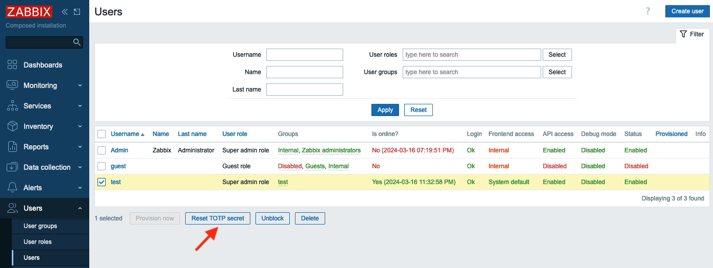
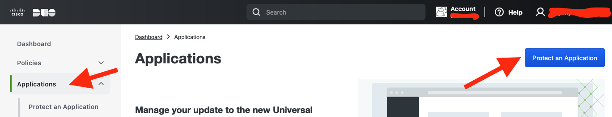
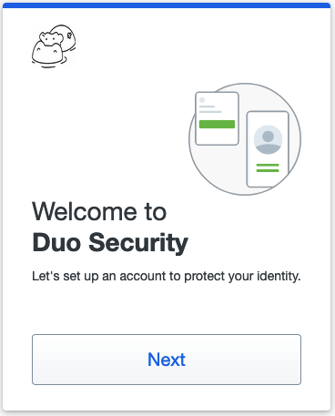
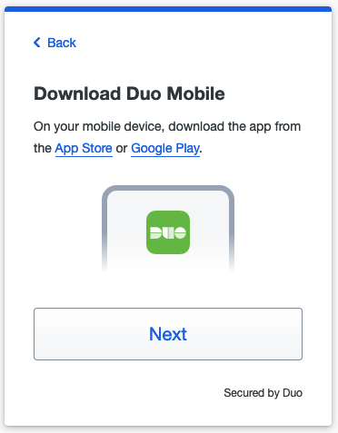

# Zabbix MFA support 

We all know that before you can start configuring Zabbix via WebUI you have to sign in. Zabbix has several options to provide better security for user passwords by configuring password policy:

- Requirement for Minimum password length
- Requirements for password to contain an uppercase and a lowercase Latin letter, a digit, a special character
- Requirement to avoid easy-to-guess passwords

To secure sign in process even more you can configure multi factor authentication (MFA). MFA protects Zabbix by using a second source of validation before granting access to its WebUI after a user enters his/her password correctly. Zabbix offers to types of MFA - Time-based one-time password (TOTP) and Duo MFA provider.

## Time-based one-time password

In the menu select ```Users``` section and then ```Authentication```


{ width=90% }

Now in ```MFA settings``` tab select the ```Enable multi-factor authentication``` check-box, then select ```TOTP``` in Type drop-down list.

{ width=90% }

In ```Hash function``` drop-down list you can choose SHA-1, SHA-256 or SHA-512, the higher number is the better security.

In ```Code lentgh``` you can select how many digits will be generated for you by Authenticator application on your phone.

Click ```Add``` and then ```Update```. Now you have TOTP MFA configured and it is the default method of MFA.

{ width=90% }

Now you need to tell Zabbix for which User group (or groups) to use MFA. Let's create a User group that would require MFA.

In the menu select ```Users``` section and then ```User groups```, then click ```Create user group``` button

{ width=90% }

In ```Group name``` put "test". Note that ```Multi-factor authentication``` field is "Default", as currently we have only one MFA method configured it does not matter whether we select "Default" or "TOTP1" that we created above. You also can disable MFA for all users belonging to this User group. Click ```Add``` button to create "test" User group.

{ width=90% }

???+ Note
    MFA method is defined on per User group basis, i.e. MFA method configured for a User group will be applied to all users belonging to this group.

Let's add a user to this user group. In the menu select ```Users``` section and then ```Users```, then click ```Create user``` button

{ width=90% }

Fill in ```Username```, ```Password``` and ```Password (once again)``` fields. Make sure you select ```test``` user group in ```Groups``` field.

{ width=90% }

Then switch to ```Permissions``` tab and select any role.

{ width=90% }

Click ```Add``` button to add the user.

Now we can test how TOTP MFA works. Sign out and then try to sign in as a test user you just created. You will be presented with a QR code. That means that the user ```test``` has not been enrolled in TOTP MFA yet.

{ width=30% }

On your phone you need to install either "Microsoft authenticator" or "Google authenticator" application. The procedure of adding new QR code is quite similar, here is how it looks in "Google authenticator". Tap ```Add a code``` and then ```Scan a QR code```. You'll be immediately presented with a 6 digit code (remember we selected 6 in ```Code length``` when we configured TOTP MFA?)

{ width=32% }
{ width=32% }
{ width=32% }

Enter this code into ```Verification code``` field of your login screen and click ```Sign in```, if you did everything right you are logged in into Zabbix at this point. At this point the user "test" is considered enrolled into TOTP MFA and Zabbix stores a special code used for furthe authentications in its database. The next time user "test" tries to login into Zabbix there will be only a field to enter verification code

{ width=32% }

???+ warning
    For TOTP MFA to work your Zabbix server must have correct time. Sometimes it's not the case especially if you are working with containers so pay attention to this.

If a user changes (or loses) his/her phone, then Zabbix administrator should reset his/her enrollment. To do that in the menue select ```Users``` then mark a check-box to the left of "test" user and click "Reset TOTP secret" button.

{ width=99% }

After you reset TOTP secret the "test" user will have to undergo enrollment procedure again.

## Duo MFA provider

 Duo is a very famous security platform that provides a lot of security related features/products. To read more please visit https://duo.com/ . Here we'll talk about Duo only in regards to Zabbix MFA.

???+ warning
    For Duo MFA to work your Zabbix WebUI must be configured to work with HTTPS (valid certificate is not required, self-signed certificate will work).

First of all you need to create an account with Duo (it's free to manage up to 10 users) then login into Duo, you are an admin here. In the menu on the left select ```Applications``` and click ```Protect an Application``` button.

{ width=99% }

Then you will see WebSDK in applications list, click on it

{ width=99% }

Here you'll see all the data needed for Zabbix.

{ width=99% }

Now let's go to Zabbix. First we need to configure Duo MFA metod. In the menue select ```Users``` and click ```Authentication```. Then on ```MFA settings``` tab click ```Add``` in ```Methods``` section.

{ width=99% }

Fill in all the fields with data from Duo Dashboard -> Applications -> Web SDK page (see screenshot above) and click ```Add```, then click ```Update``` to update Authentication settings.

{ width=99% }

After the MFA method is configured let's switch the "Test" group to use Duo MFA. In the menu select ```Users``` and click ```User groups```, then click "test" group. In the field ```Multi-factor authentication``` select "DUO1" and click ```Update```.

{ width=99% }

Everything is ready. Let's test it. Sign out of Zabbix and sign back in with "test" user. You should see a welcome screen from Duo. Click several ```Next``` buttons.
 
{ width=32% }
{ width=32% }
{ width=32% }

Then you need to select the method of authentication.

{ width=50% }

It is up to you what to select you can experiment with all these methods. Let's select "Duo Mobile" (you need to install "Duo mobile" application on your device). Click ```I have a tablet``` (it's just easier to activate your device this way) and confirm that you installed "Duo mobile" on your phone. At this point you should see a QR code that you need to scan in "Duo mobile" application.

{ width=32% }
{ width=32% }
{ width=32% }

Open "Duo mobile" on your phone. If you did not have this application previously installed (thus no accounts enrolled) you will see couple of welcome screens.

{ width=48% }
{ width=48% }

Tap on "Use a QR code" and then scan the code presented by Duo in your Zabbix logiin screen. After you do that you will see that the account is enrolled to your Duo MFA. Enter account name and tap "Done" and you will see the account in the list of all account enrolled into Duo MFA on this device. In Zabbix WebUI you will also see a conirmation, click "Continue".

{ width=32% }
{ width=32% }
{ width=32% }

Duo will ask you now whether you want to add another method of authentication, click ```Skip for now``` and you'll see a confirmation that set up completed. Click ```Login with Duo``` and push notification will be pushed to your device.

{ width=32% }
{ width=32% }
{ width=32% }

Now just tap on "Approve" on your device and you will be logged in into Zabbix.

{ width=50% }

Duo MFA enrollment complete. If you sign out and sign in back then immediately a push notification will be sent to your device and all you need is tap on "Approve". Also you will see the user "test" in Duo where you can delete the user, or deactivate just click on it and experiment.

{ width=98% }

