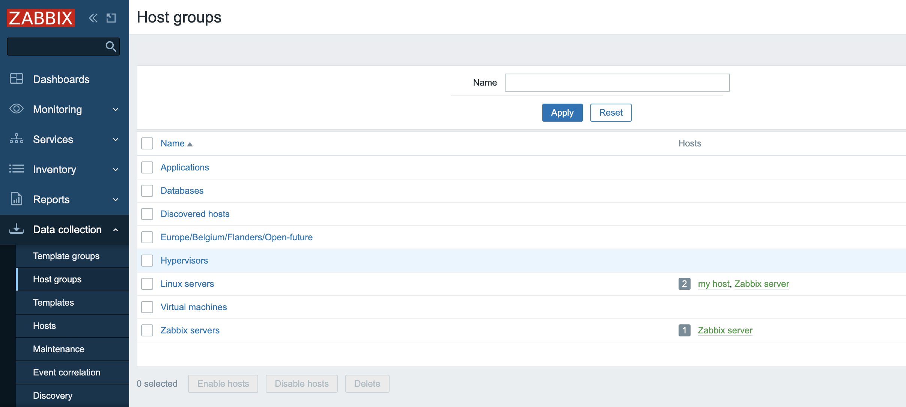
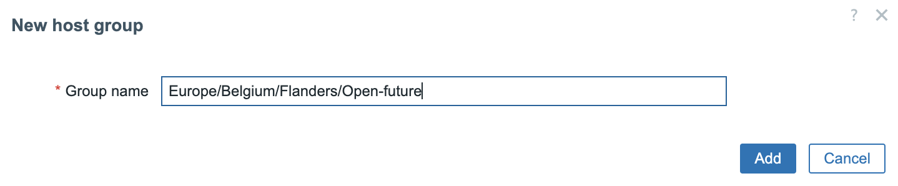

# Host groups

Let's have look at the concepts of host groups and what the benifits are that they provide. 
We have seen that ```Host groups``` can be created directly when we create a new ```Zabbix host```.
Another way to create them is by a ```Super Admin``` going to Data collection -> Host groups. Next press the button ```Create host group``` in the upper right corner of the screen.
Host groups exists to make a logical group so we can add all hosts that belong together in one group or more. Ex all Linux server, all PostgreSQL server, or all the servers that belong to one team.




When going to our menu ```data collection``` you notice that there are ```Host groups``` and ```Template groups```. If you come from an older Zabbix version you will be happy to read that Zabbix made a specific group for Templates. If you are new to Zabbix don't panic :). In older versions Zabbix had mixed Templates and host in one group. This mixing was sometimes confusing especially for new users, as Zabbix doesnt link templates to groups. 

When you click on the menu ```Data collection``` -> Host groups. You will notice that some groups are already made. You will also see that there are some names behind the host groups with numbers in front. These names are the names from the hosts that are in the group. The number in fron is the number of hosts that are in the ```host group.``` To make life more easy you can click on the names of the hosts and Zabbix will bring you directly to the configuration screen for this host.



Zabbix allows the creation of nested groups. As you can see we are using forward slashes in our group name. When you make use of nested group you can use the '/' to separate groups. 


Once our group or set of nested groups is made you can click again from the ```host group``` overview on the group. You will notice that there is now a box that says ```Apply permissions and tag filters to all subgroups```. When pressing this button, all right that are this group will be applied to the sub-groups. So if we have a user ```John``` for example in a user group that has rights to see everything in the ```Host group``` with the name ```Europe/Belgium``` and we apply the option to the subgroups then our user ```John``` will suddenly see also the hosts in all our nestet groups and the tags on this host.


???+ Note
    When creating nested groups, Parent groups don't have to exist. So we can have only the group ```open-future``` without any of the parent groups. It's up to the user to create them or not. Also group names cannot have `/` in their names. We cannot escape the `/` character. Also leading and trailing slashes and multiple slashes in a row are not allowed.

???+ Tip
    Have you tried to put emoticons in fields like host group yet ?
