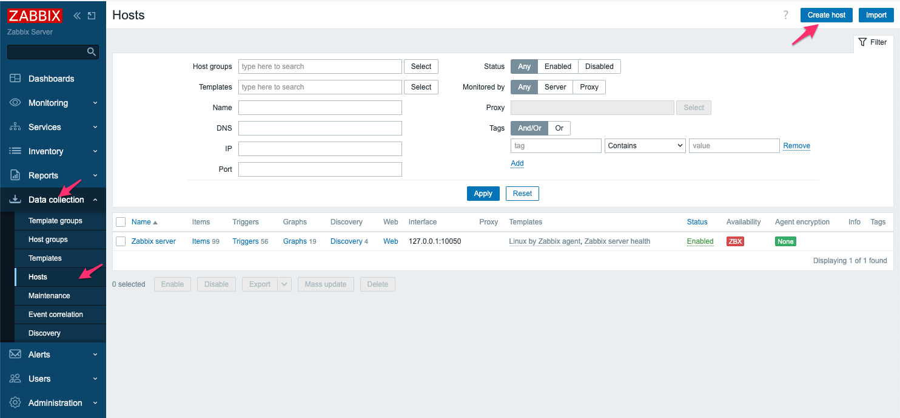
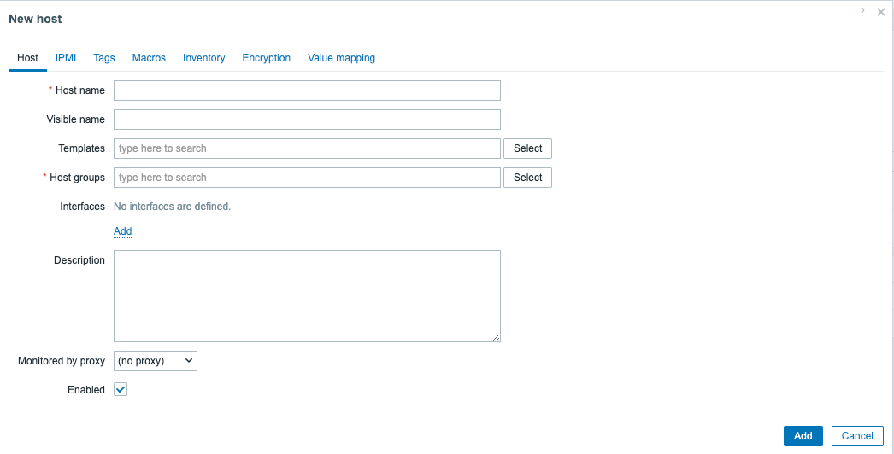
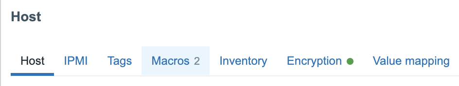

# Zabbix hosts

To understand how Zabbix works, it's important to know that ```Hosts``` in Zabbix are a reference to anything we would like to monitor.
It can be a physical host, a virtual machine, an application, a device, or even just a dummy host used to calculate data from existing  hosts into something new.

It's probably one of the first tasks that we will do as an Admin when we first login to Zabbix because we need a host if we would like to monitor some metrics.
It's however, important to know that hosts cannot be created without being in a hostgroup.

In this chapter we will teach you:

- How to add a host in Zabbix
- Host configuration tabs
  - IPMI
  - Tags
  - Macros
  - Inventory
  - Encryption

---

## How to add a host in Zabbix

With this said, let's see how to create our first host.

Let's go to the menu on your ```left``` and select Data Collection -> Hosts.
We see that there is already a host configured and that the availability icon is "RED". Don't worry about it, this is normal. We have no Zabbix agent installed or configured.

To add a new host to our system, we have to press ```Create host```,  this button can be found in the upper right corner of our screen.



We now get a modal form where we need to fill in some information about our host.
The fields marked with a <span style="color:red"> *red* </span> asterisk <span style="color:red"> "*" </span> are the fields that are mandatory.




| Parameter	| Description			|
| :----		| :----				|
| Host name	| Here we need to enter the Host name of the machine we would like to add. The name can contain alphanumerics, spaces, dots, dashes, and underscores. HOWEVER you are not allowed to use leading and trailing spaces. The Host name in the frontend is what we need later for the configuration of our Zabbix agent, so make sure you remember it.|
| Visible name	| The host name, as we have seen, is needed to configure our Zabbix agent. So in case you like to give it a unique name or one that is randomly generated, ... you can add a visible name here. This name will then be used on the frontend instead of what we call the technical name host name. This name has support for UTF-8, so special characters are supported. This name will be used in all the places like maps, the latest data, inventory, ...|
| Templates	| Templates are like blueprints that we can use on our hosts to add items, triggers, etc. We explain more about it in the topic Zabbix templates. You can start typing the name of the template, and Zabbix will start to show a list with matches, or you can press the ```Select``` box and choose one from the list. |
| Host groups 	| Every host must belong to atleast one ```host group```. This is because permissions are set on host groups. You can type the name of the host group, and a list of matching groups will start to appear. Another way is to select a host group from an existing list by pressing the Select button. Or you can create a new group by just typing the name and pressing on the box that shows the name of the group you typed with (new) behind it |
| Interfaces	| Zabbix supports several host interfaces, like the Zabbix agent, SNMP, JMX, and IPMI. By default, when we create a host, no interface is added. To add an interface, press Add and fill in the needed information, like IP or DNS, depending on the host interface chosen. When an interface is in use (items created that use the interface), then the interface cannot be removed. |
| Description	| A place to enter a short description about our host. |
| Monitored by proxy | If we have proxies configured, we can select them here if we like to monitor our host through a proxy.|
| Enabled	| Mark the checkbox to enable the host. This will keep it monitored by Zabbix. When unchecked, the host will not be monitored.|

---

## Host configuration tabs

Before we add a host ourselves, there are a few things we need to know first.
When we click on a host that we have already configured, there are a few things that we will notice.
First of all, we see a ```blue``` line under ```Host```. This means that we are on the current ```tab``` of the host page.
As you can see, there are multiple tabs that we can click on, like IPMI, Tags, Macros,... 

{ width="600" }

The next thing we see is that next to the tab ```Macros```, there is a number 2. This is because there are two macros configured in the macro tab.
So when we add information to tabs like macros or tags ... , Zabbix will show how many items we have added to these tabs by showing next to the tab name the number.

When looking at the ```encryption``` tab, we notice the green dot. This shows us that an option on the tab has been activated.
Now that we know this, let's get a quick overview of every tab and see what it does.

---

### IPMI

So looking at the ```IPMI``` tab, there are a few things we need to fill in when working with an IPMI interface. IPMI stands for Intelligent Platform Management Interface and is basically a set of standards to manage hardware platforms. In short, it allows us to monitor and manage our servers hardware even if the server is not turned on yet. IPMI is better known as ILO on HP servers and DRAC on Dell servers.

| Parameter			| Description			|
| :----				| :----				|
| Autentication algorithm	| Select the authentication algorithm that we have configured on our IPMI server this can be Default, none, MD2, MD5, Straight, OEM, RMCP+|
| Privelege level		| Here we select the privelege level: Callback, User, Operator, Admin or OEM.|
| Username			| The user for authentication that was created on the host. User Macros can be used. |
| Password			| The password for our user on the host. User macros can be used. |


???+ Note
    We will cover IPMI in more detail later in the Chapter [IPMI Monitoring](../extra-monitoring/IPMI-monitoring.md)

---

### Tags

The **Tags** tab allows you to define host-level [tags](https://www.zabbix.com/documentation/current/en/manual/config/tagging). Host-level tags are used to provide additional information about the host that can be used as a filter in the webUi.

*example*:

We add a `datacenter` tag to physical hosts servers to indicate the location of the server and thus make it easy to list all the servers present in this datacenter, impacted by incident.

---

### Macros

The **macros** tab allows you to define host-level [user macros](https://www.zabbix.com/documentation/current/en/manual/config/macros/user_macros.macr).
Macros in Zabbix can be seen as variables that can be overloaded at will. You need to use and abuse them to make templates as reusable as possible.

???+ Note
    We will cover Macro in more detail later in the Chapter [Macros](./zabbix-macros.md)

---

### Inventory

The Inventory tab allows you to manually enter [inventory](https://www.zabbix.com/documentation/current/en/manual/config/hosts/inventory) information for the host. You can also select to enable Automatic inventory population, or disable inventory population for this host.

---

### Encryption

The **Encryption** tab allows you to configure [encrypted](https://www.zabbix.com/documentation/current/en/manual/encryption) connections with the host.
Il est possible de configurer l'encryption entre le Zabbix proxy/Zabbix server.

|Value|Description|
|--|--|
|no encryption|(default value) Unencrypted|
|PSK| Using [pre-shared keys](https://www.zabbix.com/documentation/current/en/manual/encryption/using_pre_shared_keys)|
|certificate|Using [certificates](https://www.zabbix.com/documentation/current/en/manual/encryption/using_certificates)|

---

### Value Mapping

The Value mapping tab allows to configure human-friendly representation of item data in [value mappings](https://www.zabbix.com/documentation/current/en/manual/config/items/mapping).
