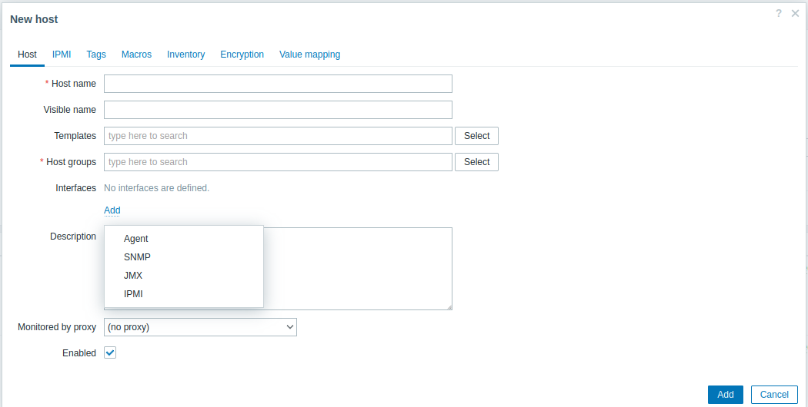

# Interfaces

When setting up your host, if you want to monitor him, you will quickly need to specify an IP address or a FQDN.

This configuration is located in the interface section of the create host view.

After clicking add, a drop-down menu will ask you to select the type of interface.

|||
|--|--|
|Parameters|Description|
|Agent|Allows use of item keys of type Zabbix Agent and Zabbix Agent Active|
|SNMP|Allows monitoring of the host via SNMP type items|
|JMX|Allows monitoring of Java applications through JMX counters|
|IPMI|Allows monitoring of IPMI through items of type|

All types of interfaces need same information, IP or DNS and port number. If you want to use DNSremember to click on the button DNS in `Connect to`.

SNMP interface need four more informations:

* SNMP version, depend of snmp version configured on the host
* SNMP Community, depend of snmp community configured on the host
* Max repetition count, necessary for [native SNMP bulk requests](https://www.zabbix.com/documentation/current/en/manual/config/items/itemtypes/snmp) Note that setting this value too high may cause the SNMP agent check timeout.
* Mark the Use combined requests checkbox to allow [combined processing](https://www.zabbix.com/documentation/6.4/en/manual/config/items/itemtypes/snmp?hl=Count#internal-workings-of-combined-processing) of SNMP requests (not related to native SNMP bulk requests)

You can create several interfaces on a host, which may or may not be identical. If more than one interface of a type exists, you can define the default interface (which will be used by default by all items on the host)

???+ Note
    We will cover IPMI in more detail later in the Chapter [IPMI Monitoring](../extra-monitoring/IPMI-monitoring.md)
    We will cover JAVA in more detail later in the Chapter [IPMI Monitoring](../extra-monitoring/JAVA-monitoring.md)
    We will cover SNMP in more detail later in the Chapter [IPMI Monitoring](../extra-monitoring/SNMP-monitoring.md)

???+ Tip
    If you want to monitor host with HTTP call, interface are not necessary.
