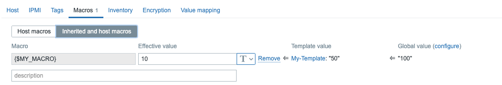

# Macros

Les macros sont l'un des concepts que vous devez comprendre dans Zabbix. Il existe différents types et ils rendent Zabbix plus évolutif et moins statique.


## Built-in macros

Elles correspondent à des macros interne à Zabbix, elles sont représentées via cette notation `{MACRO}`, la liste complète est disponible [ici](https://www.zabbix.com/documentation/7.0/en/manual/appendix/macros/supported_by_location). Chaque built-in macro peut-être utilisée dans un ou plusieurs cas.

Par exemple la built-in macro `{HOST.HOST}` permettra de récupérer le host dans une trigger expression.
ou encore la macro `{HOST.IP}` qui fera la même chose mais en récupérant l'IP du host.

Lorsque vous souhaitez utilser une information interne de Zabbix, il y a de forte chance qu'une built-in macro existe.


## Function macros

Vous serez peut etre amenez à vouloir manipuler la valeur d'une macro, pour raccourcir ou extraire une partie par exemple.
La syntaxe d'une fonction de macro est la suivante : `{macro.func(params)}`

|Function|Description|
|--|--|
|[fmtnum](https://www.zabbix.com/documentation/7.0/en/manual/config/macros/macro_functions#fmtnum)|Number formatting to control the number of digits printed after the decimal point.|
|[fmttime](https://www.zabbix.com/documentation/7.0/en/manual/config/macros/macro_functions#fmttime)|Time formatting.|
|[iregsub](https://www.zabbix.com/documentation/7.0/en/manual/config/macros/macro_functions#iregsub)|Substring extraction by a regular expression match (case-insensitive).|
|[regsub](https://www.zabbix.com/documentation/7.0/en/manual/config/macros/macro_functions#regsub)|Substring extraction by a regular expression match (case-sensitive).|


## User macros

Ce sont c'est macro qui apporte à Zabbix sa grandre flexibilité, elles peuvent être défini de façon global, ou au niveau d'un template ou d'un host.
Elles sont toujours précédé d'un **\$** et se note ainsi: `{$MACRO}`.

Il est important de noter que Zabbix priorise les user macros comme ceci:

1. macros au niveau de l'hôte (vérifié en premier).
2. macros définies pour les modèles de premier niveau de l'hôte (c'est-à-dire les modèles liés directement à l'hôte), triées par ID de modèle.
3. macros définies pour les modèles de deuxième niveau de l'hôte, triées par ID de modèle.
4. macros définies pour les modèles de troisième niveau de l'hôte, triées par ID de modèle, etc.
5. macros globales (vérifiées en dernier)

Ces macros sont utilisable à beaucoup d'[endrois](https://www.zabbix.com/documentation/7.0/en/manual/appendix/macros/supported_by_location_user), elles servent courrament à définir un seuil et servent de valeur par défaut dans un template qu'on peut surcharger au niveau des host-level macro.

Afin d'avoir des templates réutilisables et fonctionnel dans une majorités de situation, il faut abuser des users macros.
Il est également conseillé de ne pas utiliser de macros globales lorsqu'elles ne sont pas nécessaires, car elles ne sont pas portables lors de l'exportation d'hôtes ou de modèles.

Ainsi, lorsque nous définissons des ```macros globales```, elles seront écrasées par des ```macros de modèle``` et nos macros de modèle seront écrasées par des ```macros hôtes```.


C'est facile, alors écrasez une macro par accident pour résoudre ce problème. Zabbix a l'option au niveau ```Host``` et au niveau ```Template``` pour voir s'il y a déjà des macros définies avec le même nom. Cela permet de voir facilement si cette macro est déjà définie et si elle sera écrasée.



Dans cette capture d'écran, nous pouvons voir qu'il existe une ``macro globale``` définie avec une valeur de 100 et que nous avons la même macro au niveau du modèle qui remplace la valeur de la ```macro globale```. Cependant, la valeur effective provient de notre ```macro Host```.


## Low-level discovery macros

Ce type de macros est un peu spéciale, elles s'utilisent dans le cas d'une [Low-level discovery](https://www.zabbix.com/documentation/7.0/en/manual/discovery/low_level_discovery) et sont précédées d'un **#** `{#MACRO}`, elles sont utiles pour variabbilisés la création d'item prototype, de trigger prototype ou d'host prototype.


## Expression macro

Ces macros sont très spécifiques, elles s'utilisent exclusivement dans les graphs name et dans les maps, elles utilisent la syntaxe suivantes: `{?EXPRESSION}`.
`{?avg(/{HOST.HOST}/{ITEM.KEY},1h)}`


## User macro with context

Il reste un dernier sujet concernant les macros est pas des moindres, très rapidement après avoir utilisé vos premières user macros pour définir des seuils vous rendre compte que vous souhaitez
avoir un seuil différent en fonction ... du context, elles utilisent la syntaxe: `{$MACRO:"static text"}`
Vous souhaitez définir un seuil global à 80% mais sur une partition particulière passer ce seuil à 90%, nous allons pour cela utiliser le contexte.

_Exemple:_
{$LOW_SPACE_LIMIT}: 80
{$LOW_SPACE_LIMIT:/tmp}:90

Dans cette exemple l'ensemble l'ensemble des points de montage de notre server auront comme seuil par défaut 80% sauf /tmp qui lui aura un seuil custom à 90%.


## Some useful links

- [https://www.zabbix.com/documentation/7.0/en/manual/appendix/macros/supported_by_location](https://www.zabbix.com/documentation/7.0/en/manual/appendix/macros/supported_by_location)
- [https://www.zabbix.com/documentation/7.0/en/manual/config/macros/macro_functions](https://www.zabbix.com/documentation/7.0/en/manual/config/macros/macro_functions)
- [https://www.zabbix.com/documentation/7.0/en/manual/config/macros/user_macros](https://www.zabbix.com/documentation/7.0/en/manual/config/macros/user_macros)
- [https://www.zabbix.com/documentation/7.0/en/manual/config/macros/lld_macros](https://www.zabbix.com/documentation/7.0/en/manual/config/macros/lld_macros)
- [https://www.zabbix.com/documentation/7.0/en/manual/config/macros/expression_macros](https://www.zabbix.com/documentation/7.0/en/manual/config/macros/expression_macros)
- [https://www.zabbix.com/documentation/7.0/en/manual/config/macros/user_macros_context](https://www.zabbix.com/documentation/7.0/en/manual/config/macros/user_macros_context)
