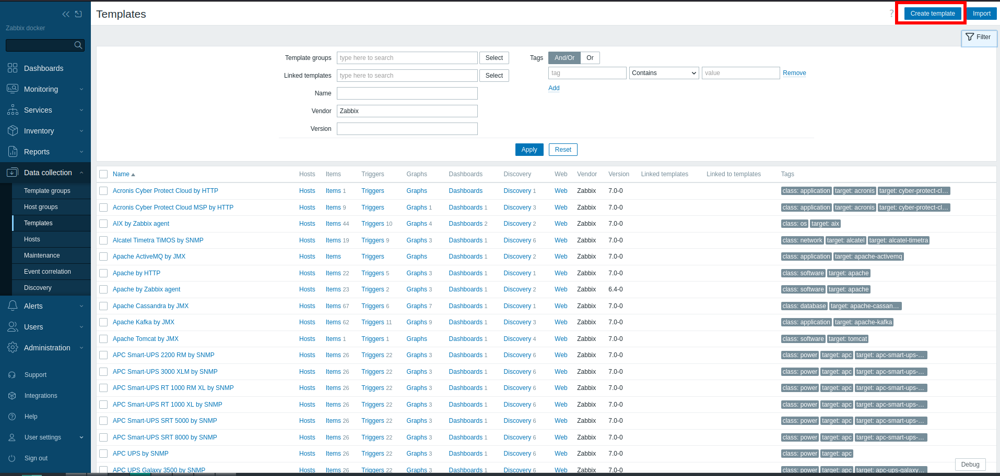
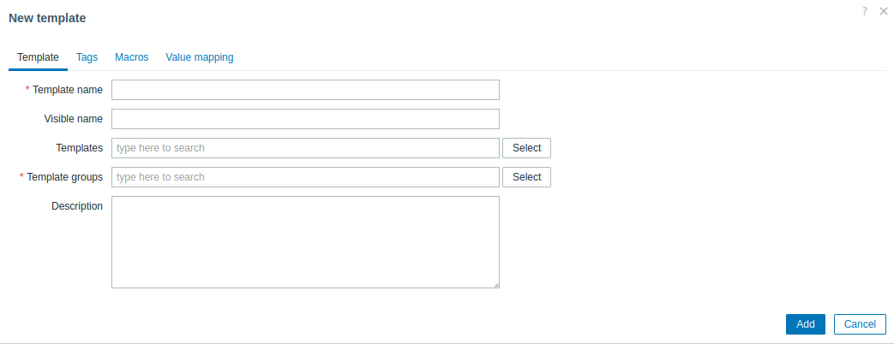

# Templates

Templates are probably the most important notion in Zabbix, and globaly in monitoring tools. They help you to make change more easily and globaly, just make the change one time and will be applied immediately to all hosts concerned.

You can see template like a special host without interface that you can link to a classical host, the configuration added to a template are apply to all hosts using the template.

But in return, when you make a mistake during template evolution, it spreads to all hosts. Make little change and test on one or two hosts before if you have any doubts.

In this chapter we will teach you:

- How to add a new template
- Template configurations tabs
- Tags
- Macros
- Guidelines

## How to add a new template

For build a new templates use the left menu and select Data Collection > Templates. On this menu you can see all templates available on you installation.

Before creating a new template you have to ask yourself one question : `Does a template already exist for monitoring this technology ?`.
Of course the first way is to check the available template, and if no one exist you can check on : [Zabbix Monitoring and Integration Solutions](https://www.zabbix.com/integrations) and more globally on the Internet.

Unfortunitely, no template exist for your needed.  Use the `Create template` button on the top right to start the creation.
Remerber the fields marked with a red asterisk "*" are the fields that are mandatory.

A template is simply a name and a one or more template groups.

__Tips:__: Suffix the technonology name with the type of item used `by Zabbix agent`, `by SNMP`, ...

Template groups is like hostgroup, it's use for classify template and apply rights.

In description you can add information that could be of interest to use the template, the version tested, ...

## Tags

Template-level [tags](https://www.zabbix.com/documentation/current/en/manual/config/tagging) will be visible in case of problems.

## Macros

All user macros used by the template need to be define with default value in this section.
Your template must be able to use without setting on host, _except for connection informations_, the default value especially the thresold must be generic.

## Some useful links

[https://www.zabbix.com/documentation/guidelines/en/thosts/configuration/templates](https://www.zabbix.com/documentation/guidelines/en/thosts/configuration/templates)
