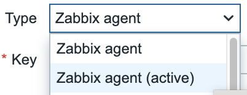
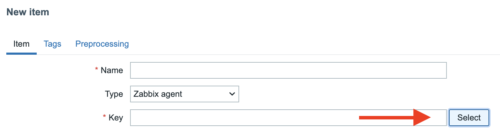
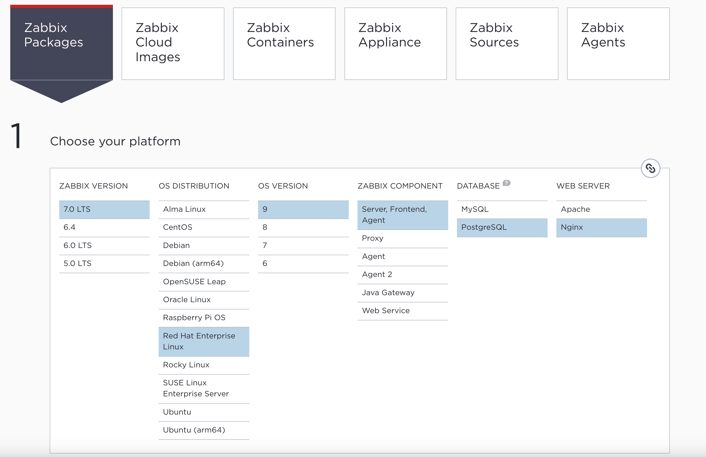
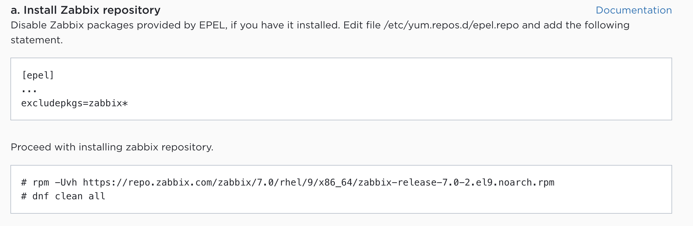
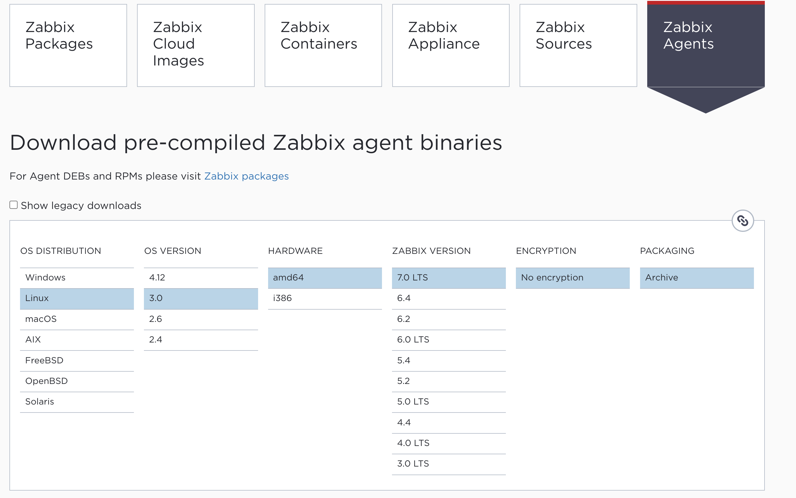
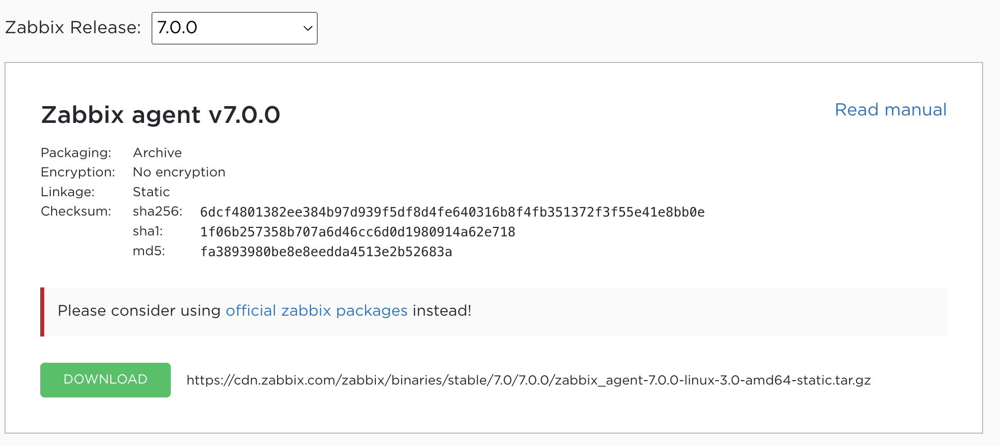

# Zabbix Agent

In this topic we will talk about the Zabbix agent. The Zabbix agent is a native agent made by Zabbix that we can deploy on different Operating Systems and that supports a wide range of build-in items keys.
Zabbix has 2 agents we have the ```Zabbix agent``` and we have the ```Zabbix agent 2``` So when you read in this book about the ```Zabbix agent``` we talk about the 1st agent. This can sound a bit
weird having 2 agents but it's not. The agent was developed years ago when zabbix was first released and is written in C the agent 2 is written in GO and is developed next to the Agent 1.
We will see later what the advantages and disadvantages are of both and give you tips to choose the agent that fits best for you.
To make things more complex both agents can be configure to work in ```active``` or in ```passive``` mode or in both.
When we create an item on our host and we want to use the item that works with our Zabbix agent we have 2 options to choose from.

{width=200px}

We can create items that are active or passive depending on how our agent has been configured.
A zabbix agent can either be active or passive or both active and passive.

???+ Note
    Zabbix 7.0 is backwards compatible with agents back to 1.4 but of course newer item keys added after 1.4 will not be recognized in those older agents. So if you like to use the new items keys it's best to upgrade your agents when you can.

Sometimes there are cases when the item keys provided by Zabbix are just not enough.

In this case it's possible to extend our agents with UserParameters.
This allows us to extend the agent with our own keys based on scripts that we make to extend our agents. This is something we cover in the topic ```UserParameters```.

Zabbix has a huge list of items keys it supports on linux but when we select our item keys we have to careful read the documentation careful as some items keys are OS specific. For example there are item keys that only work on MS Windows.

[https://www.zabbix.com/documentation/7.0/en/manual/config/items/itemtypes/zabbix_agent/win_keys](https://www.zabbix.com/documentation/7.0/en/manual/config/items/itemtypes/zabbix_agent/win_keys)

Some item keys can only be used on the new Agent 2.

[https://www.zabbix.com/documentation/7.0/en/manual/config/items/itemtypes/zabbix_agent/zabbix_agent2](https://www.zabbix.com/documentation/7.0/en/manual/config/items/itemtypes/zabbix_agent/zabbix_agent2)

Here is a list of the item keys that will work on Linux. But also here be careful as some things can be different depending on the OS or the kernel version.

[https://www.zabbix.com/documentation/7.0/en/manual/config/items/itemtypes/zabbix_agent](https://www.zabbix.com/documentation/7.0/en/manual/config/items/itemtypes/zabbix_agent)

When we want to add an item we can either lookup the item in the online documetation, try to remember it and just write it in the box or press the select button next to the item field. This will give a popup with a short explanation about what the items does.



However you will see that it's lacking lots of information.
My advice is to use the online documentation.

So in this topic we will explain you all the differences :

- Zabbix Agent (Legacy)
- Zabbix Agent 2
- Agent vs Agent 2
- Active Agent
- Passive Agent
- Active vs Passive
- Zabbix agent Linux
- Zabbix agent Windows


## Zabbix Agent (Legacy)

Our Zabbix agent or the legacy agent can run on a whole set of supported platforms. At the time of writing the agent on Zabbix 7 supports:

- Linux (Redhat, Suse, Ubuntu, Debian, Rocky, Alma, ...)
- FreeBSD
- Windows
- MacOS
- Raspberry Pi
- HPUnix
- OpenBSD
- AIX
- Solaris

???+ info
    A full up to date list can be found here https://www.zabbix.com/download

The agent can be installed on a host to collect data from that host or from an application running on that host.
The advantage is that the agent has a very small footprint and that we can extend the agent by creating our own scripts.
Agents can work in active or in passive mode or can do this in both ways simultaniously.

The legacy agent can be extended with modules that are written in C.
More information about modues can be found in the Zabbix documentation [https://www.zabbix.com/documentation/7.0/en/manual/extensions/loadablemodules](https://www.zabbix.com/documentation/7.0/en/manual/extensions/loadablemodules).

The Zabbix agent will run with limited privileges and user ```zabbix```. With the legacy agent this can be changed easy if you want.


In the config file there is an option ```User=zabbix``` that can be changed. This however will not work if you are like 99% running on an OS that uses SystemD. Same it's not possible to run the agent with ```root``` privileges by enabeling the option ```AllowRoot```. Changing these options will only work on non SystemD systems.

What we need to do is change the SystemD service for our ```zabbix-agent```.

```systemctl edit zabbix-agent```

Next we have to add the following content. If you like to run as another user then root then just create an account and replace root with this account.

```
[Service]
User=root
Group=root
```

Exit the file and save it. We now have to tell SystemD to reload the config by running the next command.

```
systemctl daemon-reload
```

The only thing that rests us now is restarting the ```zabbix-agent``` so that it picks up the config changes.

```
systemctl restart zabbix-agent
```

???+ warning
    Running the Zabbix agent under root privileges is not recommended. It's a high security risk but in some cases it is maybe needed and then this is your only solution. 

???+ Note
    The agent will inculde by default all the files under /etc/zabbix/zabbix_agentd.d/ with extension .conf. Its good practice to not edit the standard config file and just add your changes in a dedicated file in this folder.


## Zabbix Agent 2

The Zabbix Agent2 is the new generation of agent and is written in GO. Because of this i's not possible to install the Agent 2 on systems like BSD or HPUniX. At the moment there are only clients for linux and Windows.

Since 
???+ info
    A full up to date list can be found here https://www.zabbix.com/download If your OS supports GO and there are no packages you could always try to download the source and compile it by your own.

Our agent 2 can be extended with plugins just like the Agent was extensible with modules. However plugins are way more advanced then the modules on agent 1 and there is already an extensive list of modules that are supported. The full list can be found here [https://www.zabbix.com/documentation/7.0/en/manual/appendix/config/zabbix_agent2_plugins](https://www.zabbix.com/documentation/7.0/en/manual/appendix/config/zabbix_agent2_plugins).

Running the Agent2 under root or another non privilege account is more or less the same as with the legacy agent. This agent only runs on Linux systems with SystemD.

```systemctl edit zabbix-agent2```

Next we have to add the following content. If you like to run as another user then root then just create an account and replace root with this account.

```
[Service]
User=root
Group=root
```

Exit the file and save it. We now have to tell SystemD to reload the config by running the next command.

```
systemctl daemon-reload
```

The only thing that rests us now is restarting the ```zabbix-agent``` so that it picks up the config changes.

```
systemctl restart zabbix-agent2
```


The plugins have their own timeout settings and the agent will do a compatibility check when it starts up.

Another advantage of the agent2 is that it supports scheduled and flexible intervals for active and for passive checks. Something that is not possible with the agent.

Plugins can execute tasks in parallel and scaling up to 1000 workers per plugin. Every plugin has it's own set of configuration parameters. The syntax used for this is ```Plugins.<PluginName>.<Parameter>=<Value>. As example the plugin to configure the logging of remote commands looks like ```Plugins.SystemRun.LogRemoteCommands=0```. 
Some of the plugins even work with together with templates. This makes it easy so configure some settings by changing macro values in the templates. Some more advanced parameters can then still be adjusted in the config of the plugin.


???+ warning
    Running the Zabbix agent under root privileges is not recommended. It's a high security risk but in some cases it is maybe needed and then this is your only solution.

???+ Note
    The agent will inculde by default all the files under /etc/zabbix/zabbix_agent2.d/ with extension .conf. Its good practice to not edit the standard config file and just add your changes in a dedicated file in this folder.


## Agent1 vs Agent2

| Parameter 			| Agent					 | Agent 2 				|
| :----				| :----					 |:----					|
| Programming language 		| C					 | Go and some parts in C		|
| Linux daemonization 		| Yes					 | By systemd only			|
| Run as Windows service	| Yes					 | Yes					|
| Supported extensions		| Loadable Modules in C	 		 | Plugins in Go			|
| Supported platforms		| All					 | Linux, Window, any OS with GO	|
| Concurrency			| Active checks are executed sequentialy | All check executed concurrently	|
| Scheduled/flexible intervals	| Passive check only			 | Acive and Passsive checks		|
| Persistent storage 		| No					 | Yes (SQLite3)			|
| Timeout settings		| On agent level only			 | Plugins can override the timout	|
| Changes user at runtime	| Yes (on Unix like sytems only)	 | No (controlled by SystemD		|
| Cipersuits user configurable  | Yes					 | No					|

???+ info
    For more details bout the differences check the official documentation.
    https://www.zabbix.com/documentation/6.0/en/manual/appendix/agent_comparison


We can detect the generation from the agent by using the ```agent.variant``` item key this will return us 1 for the legacy agent and 2 for agent2.
[agent.variant](https://www.zabbix.com/documentation/7.0/en/manual/config/items/itemtypes/zabbix_agent?hl=agent.variant#agent.variant)


## Active Agent

## Passive Agent

## Active vs Passive

## UserParameters

## Zabbix agent Linux

The agent can be installed on Linux in different ways. The most easy way however is probably installing the agent from Package.

Most of the popular operating systems are supported by Zabbix and installation instrucations are provided on the Zabbix webpage when you go to https://www.zabbix.com/download

Here we just have to choose that we like to install from Zabbix packages and choose our OS and the version. Then we just need to follow the instructions to add the repository to our OS. From here we can install the Agent.



After selecting the correct settings we get to see the instructions how to add our repo to the OS.



In case your OS was not in the list there is still the option to download the agents pre compiled. Choose ```Zabbix agents``` and select your correct kernel version.



Then select the Zabbix release and press ```Download``` to get a binary version.



If all this fails then there is still the option to download the source and compile the agent yourself.

The Agent can be installed from the reposity with ```dnf install zabbix-agent``` after the installation the configuration files can be found at ```/etc/zabbix/zabbix_agentd.conf```.
The log files will be written in ```/var/log/zabbix_agentd.log``` by default.

The Agent2 can be installed from our repository with ```dnf install zabbix-agent2```.
After the installation, the configuration files can be found at ```/etc/zabbix/zabbix_agent2.conf```.
The log files will be written in ```/var/log/zabbix_agent2.log``` by default.


## Zabbix agent windows
