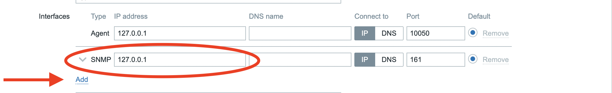
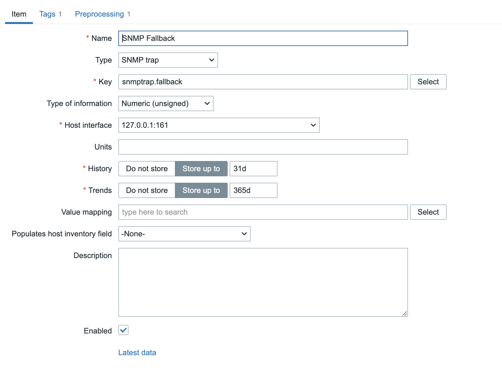
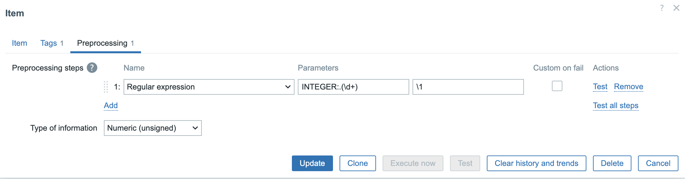
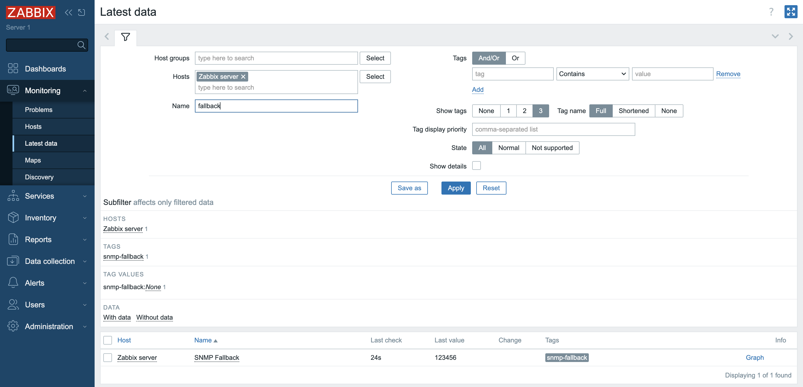
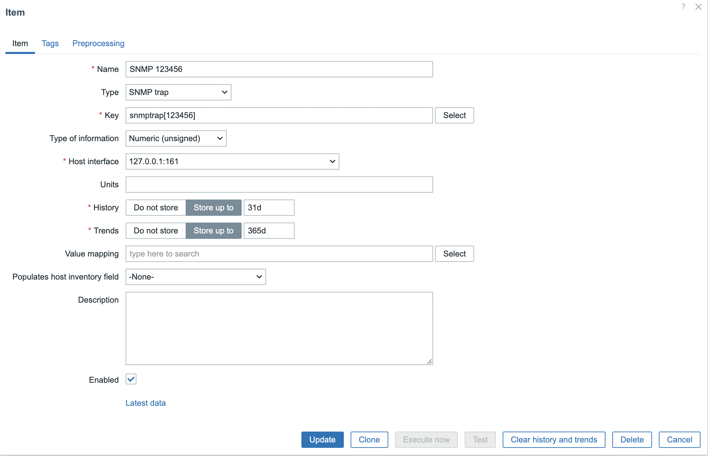
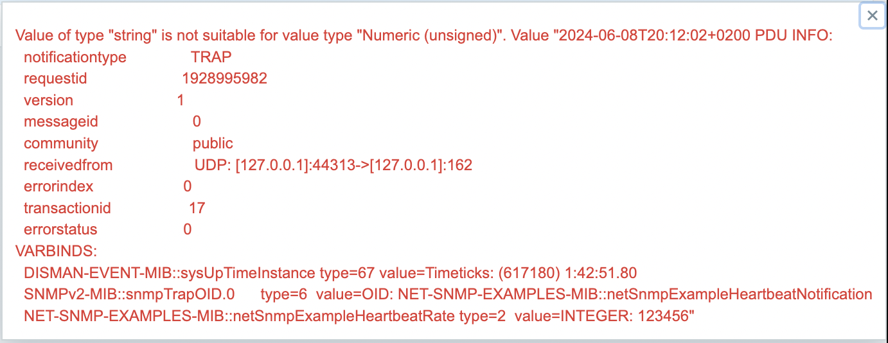

# SNMP trap monitoring

If you have been reading previous topic about SMNP monitoring then you know by now that SNMP monitoring is all about polling information form a device.
However there is another way to gather information from a device with SNMP that does not expect us to poll for information but that accepts information being sent from the SNMP device to our Zabbix server or Proxy.
This is what we call SNMP traps.

Traps are sent from a device to our Zabbix server or proxy and usually are only being sent when there is a change in the status of a device. Traps also dont use TCP but are being sent over UDP to port 162. So why would we use traps as we already can poll SNMP devices ?

Well first of all let's imagine there is a short fluke in the power of your switch for only a second. This would never be noticed by Zabbx as we usually poll an item once per minute or even less. If we had to poll every second it would create a huge load on the device and we would maybe overload it and we would need also a more beefy Zabbix server if we had to to this for every item.

A trap is sent when a problem is detected so this is extra data that else would probably be missed by Zabbix. There are of course some disadvantages with traps else we would only use traps and never poll for problems. The problem with traps is that they are sent over UDP and the problem with UDP is that packages are being sent without waiting for any acknowledgement that they have arrived at the destination. It's a bit like talking to your wife not even knowing she is in the same room and then thinking she has understood you.

We all know how that works out ....

So the best way to monitor SNMP devices is probably an implementation of both SNMP polling and SNMP traps.

There is one small problem that is not really a problem but complicates things a bit and that is that Zabbix has no build in trap receiver. Zabbix can use SNMP traps but it needs to rely on the OS for this and so we need to install snmptrapd to catch traps when they are bein sent to our Zabbix server/proxy .

Once we have catched the trap we need to process the trap to make it readable by Zabbix and for this there are 2 ways:

- We can make use of a script usually a perl script that is delivered with the sourcecode from Zabbix or a bash script
- by making use of SNMPTT.

Since there are 2 solutions it makes sense that they both have advantages and disadvantages as you probably already know.

- The perl/bash script is the most easy solution and quit performant but more difficult to make customizations so less flexible.
- The SNMPTT,snmptrapfmt, ...  is more complex but give more flexiblity.

This table will give us a short overview of the differences between the 2 solutions:

|			| Perl Script		| SNMPTT		|
| ----			| ----			| ----			|
| MIBS			| Not Required		| Required		|
| Trap formatting	| Script		| Config file		|
| Trap matching		| snmptrap["PCRE"]	| snmptrap["PCRE"]	|
| Unknown traps		| snmptrap.fallback	| Configuration file	|
| Acc or reject trap	| No			| Yes			|
| Search and replace	| No			| Yes			|

The perl script is the most easy way so if you don't need any of the fancy features that are not possible with the perl script it's probably best to stick to this script. In this book we will cover the script. The other way is more or less the same but you will have to do some tuning yourself on the config of SNMPTT or other solution.

The script can be found in the source code. You can download the source [here](https://www.zabbix.com/download_sources). Once downloaded you can find the perl script in the folder ```/misc/snmptrap/zabbix_trap_receiver.pl``` If you can not use perl you can find the bash script in the same location.

## Setting up snmptraps 

Now that we know a bit more about snmptraps let's set it up and configure our Zabbix server. Traps are sent to the zabbix server so in case we have a proxy insteqd of the zabbix server we need to send traps to the proxy.

???+ warning
    At this moment Zabbix has loadbalancing for proxies implemented but there is no support for SNMP traps in this case. So only the active proxy will accept traps.

## Configure SNMP traps on our system with snmptrapd

First thing first we will have to open our firewall if we want to accept traps. Traps are being sent over UDP and arrive on port 162 so let's open a port.

```
# firewall-cmd --add-port=162/udp --permanent
# firewall-cmd --reload
```

Next we need to install the net-snmp, net-snmp-utils package and the net-snmp-perl package for our perl script to work with snmptrapd.

```
dnf install -y net-snmp net-snmp-utils net-snmp-perl
```

Copy our zabbix_trap_receiver file to /usr/bin/ and make it executable

```
# cp zabbix_trap_receiver.pl /usr/bin/.
# chmod +x /usr/bin/zabbix_trap_receiver.pl
```

We can now configure ```snmptrapd```  and tell our server what traps it should accept.

```
# vi /etc/snmp/snmptrapd.conf
add the following line
```
```
authCommunity execute public
perl do "/usr/bin/zabbix_trap_receiver.pl";
```

This line will tell our ```snmptrapd``` to accept all the traps that are being sent to our device with the community string set as public. so please adapt it to your needs.

We also need to tell our Zabbix server to start up the trapper process this can be done in the configuration file of the server. Edit the following file 

```
# vi /etc/zabbix/zabbix_server.conf
```
And look for the line with the parameter ```StartSNMPTrapper=``` and make sure that the line is active by removing the # in front and replace `0` with `1` so that Zabbix knows it needs to activate the trapper for SNMP

```
StartSNMPTrapper=1
```

There is another parameter that we need to configure and that is ```SNMPTrapperFile=```. Same here make sure that the line is active by removing the `#` in front and poit to the location of the location where Zabbix can read the traps that are written by our perl script.
If it's not the same then adapt the script or zabbix_server.conf file so thqt in both files the location point to the same path: The perl script will write with trap information in this file and Zabbix server will look for this file to read the information.

```
SNMPTrapperFile=/var/log/snmptrap/snmptrap.log
```

Make sure the folder exists
```
mkidr /var/log/snmptrap/
```

Once everything is done restart the Zabbix server so that it picks up the config changes.

```
# systemct restart zabbix-server
```
Also enable ```snmptrapd``` and make sure it starts at boot.

```
# systemctl enable snmptrapd --now
```

There is one thing we need to do extra and that is to configure log rotate. Snmptrapd will sent traps to the ```/var/log/zabbix_traps.tmp``` file and the file weill keep growing and growing so we need to make sure logrotate will cleanup from time to time.

Zabbix is not managing the trap file so we need to create the logrotate config for our trap file else it will keep growing over time

```
# vi /etc/logrotate.d/zabbix_traps
```

Copy following content in to this file and adqpt to your own needs.

```
/var/log/snmptrap/snmptrap.log { 
   weekly 
   size 10M 
   compress 
   notifempty 
   dateext 
   dateformat -%Y%m%d 
   olddir /var/log/snmptrap/
   maxage 365 
   rotate 10 
} 
```

## Testing if traps are received

To see if we can receive traps let's run a few tests on our system. In case things don't work as expected verify every step again 
see that snmptrapd is calling the perl script on the correct location ,verify that your community names are correct, make sure snmptraps are active in the Zabbix server configureation.
And in your perl script check that file will be written to the correct folder and that the script is executable.

```
- # snmptrap -v 1 -c public 127.0.0.1 '.1.3.6.1.6.3.1.1.5.4' '0.0.0.0' 6 33 '55' .1.3.6.1.6.3.1.1.5.4 s "enp0s1"
```
If all goes well we should now see in our log file the trap 

```
# cat snmptrap.log

2024-06-08T19:03:08+0200 ZBXTRAP 127.0.0.1
PDU INFO:
  messageid                      0
  requestid                      0
  version                        0
  community                      public
  notificationtype               TRAP
  errorstatus                    0
  receivedfrom                   UDP: [127.0.0.1]:32790->[127.0.0.1]:162
  errorindex                     0
  transactionid                  5
VARBINDS:
  DISMAN-EVENT-MIB::sysUpTimeInstance type=67 value=Timeticks: (55) 0:00:00.55
  SNMPv2-MIB::snmpTrapOID.0      type=6  value=OID: IF-MIB::linkUp.0.33
  IF-MIB::linkUp                 type=4  value=STRING: "enp0s1"
  SNMP-COMMUNITY-MIB::snmpTrapCommunity.0 type=4  value=STRING: "public"
  SNMPv2-MIB::snmpTrapEnterprise.0 type=6  value=OID: IF-MIB::linkUp
```

We can now do the same for a snmp trap v2


```
- # snmptrap -v 2c -c public localhost '' 1.3.6.1.4.1.8072.2.3.0.1 1.3.6.1.4.1.8072.2.3.2.1 i 123456
```

This should return the following information

```
# cat snmptrap.log

2024-06-08T19:03:08+0200 ZBXTRAP 127.0.0.1
PDU INFO:
  messageid                      0
  requestid                      0
  version                        0
  community                      public
  notificationtype               TRAP
  errorstatus                    0
  receivedfrom                   UDP: [127.0.0.1]:32790->[127.0.0.1]:162
  errorindex                     0
  transactionid                  5
VARBINDS:
  DISMAN-EVENT-MIB::sysUpTimeInstance type=67 value=Timeticks: (55) 0:00:00.55
  SNMPv2-MIB::snmpTrapOID.0      type=6  value=OID: IF-MIB::linkUp.0.33
  IF-MIB::linkUp                 type=4  value=STRING: "enp0s1"
  SNMP-COMMUNITY-MIB::snmpTrapCommunity.0 type=4  value=STRING: "public"
  SNMPv2-MIB::snmpTrapEnterprise.0 type=6  value=OID: IF-MIB::linkUp
2024-06-08T19:05:31+0200 ZBXTRAP 127.0.0.1
PDU INFO:
  notificationtype               TRAP
  community                      public
  messageid                      0
  requestid                      2002881661
  version                        1
  transactionid                  6
  errorindex                     0
  receivedfrom                   UDP: [127.0.0.1]:53810->[127.0.0.1]:162
  errorstatus                    0
VARBINDS:
  DISMAN-EVENT-MIB::sysUpTimeInstance type=67 value=Timeticks: (218161) 0:36:21.61
  SNMPv2-MIB::snmpTrapOID.0      type=6  value=OID: NET-SNMP-EXAMPLES-MIB::netSnmpExampleHeartbeatNotification
  NET-SNMP-EXAMPLES-MIB::netSnmpExampleHeartbeatRate type=2  value=INTEGER: 123456
```
First trap has sent us the name of our networkcard the second trap has sent us the value `123456`.


## Create a trap item in Zabbix

So we have our traps working but there is still something missing. We don't see any traps yet in Zabbix.
This is because we have not created an item yet. We still have to tell zabbix to look in our trap file for items that we like to monitor.

Zabbix can monitor for specific items like for example the trap with the networkcard we just sent or in case we don't know what exact item will arrive Zabbix has also a fallback option. Let's create both items so that we have an idea how to do this.


### Create a fallback item


### Create a specific item

Before we can create an item we have to add a ```SNMP``` host interface on our host. Go to ```Data collection``` -> ```Host``` click on the host where you would like to sent the trap to and add a ```SNMP``` host interface with the correct IP of your host. In my case I am sending a trap to the zabbix server with the loopback interface as the IP. This will be different for every host. Zabbix will look in your log file and match the IP in the log with the host in your Zabbix setup.

Also for this to work you will have to disable ```SeLinux``` as it will block or Zabbix server from accessing the log file. So don't forget to fix this afterwards.
to temporary disable run ```setenforce 0```.




Once you have added your SNMP interface go to ```Data collection``` -> ```Hosts``` and click on items behind the name of your hosts.
Let's create or fallback item by clicking on ```Create item``` in the upper right corner.

When you see the popup to create the new item we have to add a few things copy everything I will explain later what it does.

Name : SNMP Fallback
Type : SNMP trap
Key : snmptrap.fallback
Type of information : Numeric
Host interface : <the snmp interface of your hosts>



Go to the tab Preporcessing and fill in the following information for our Preprocessing setp 1:

- Name: Regular expression 
- Parameters: INTEGER:.(\d+)
- after the parameter field there is another field here you can fill in : \1



So let us explain quick what we just filled in.
The name is just the name that will be visible in our latest data page etc for our item. The type we have to select ```SNMP trap``` as we are monitoring for incoming SNMP traps.
The key is freeform and needs to be unique so we just choose something that makes sense in this case ```snmptrap.fallback``` as this item is a catch all item.
Type of information I have chosen numeric usually you will want to keep it as text. I have chosen numeric because with preprocessing I will extract a numeric value from our test trap.

In the ```Preprocessing tab``` 
We added a regular expression in Perl this expression will look for the line starting with ```INTEGER:``` and the numeric value behind it. by adding ( ) we created a group. the \1 is a selector for the number of groups we like to extract in this case we have only 1 group so we look for group 1

Sent the following trap to your zabbix server and replace the IP with the IP of the hosts you have added. 
```
snmptrap -v 2c -c public 127.0.0.1 '' 1.3.6.1.4.1.8072.2.3.0.1 1.3.6.1.4.1.8072.2.3.2.1 i 123456
```
Just run the trap on your Zabbix server and have a look in the latest data page of your hosts
Monitoring -> Latest data and fill the name in of your ```host``` in the ```Hosts``` field.
In the ```Name``` field you can filter for fallback if there are too many items



Adding a specific SNMP trap item works exactly the same only here we dont use the item key ```snmptrap.fallback``` but the item key ```snmptrap[regex]```.
So in our case it will be snmptrap[123456].

Create the same item as before but don't add any Preprocessing rules this time.



Let's send the trap again and go to latest data to see what we have received this time.
```
snmptrap -v 2c -c public 127.0.0.1 '' 1.3.6.1.4.1.8072.2.3.0.1 1.3.6.1.4.1.8072.2.3.2.1 i 123456
```



It looks like something went wrong in latest data we got a warning. This warning as in the screenshot above can be seen when you go with your mouse over the ```i``` in red at the end of you item.

So what happened here is that Zabbix looks for a regex in this case ```123456``` it has found in the trap the value ```123456``` and it will show us the complete trap.

So we have 2 options here :

- We can change the item it's ```type of information``` to ```Text``` and choose to see the whole trap.
or 
- We can add again a Preprocessing step like we did with our fallback and filter for the numbers ```123456```.

Once this is done our items will work.


## Working with SNMPv3 Traps

If you like to use SNMPv3 devices and protect the traps that are being sent then this is also possible. It works like with SNMPv1 and v2 we just have to change the config in our snmptrapd config and add the following lines.

```
createUser -e <engineid> <user> SHA <key> AES <key>
authUser log,execute <user>
perl do "/usr/bin/zabbix_trap_receiver.pl";
```
This will make sure snmptrapd will catch our SNMPv3 traps and sent them to our perl script. 

???+ Note
    An engine ID should be unique for every device you can't have devices with the same ```engineid``` so for every device you will have to add a line in the config file.

 

???+ tip
    The PDU info can be removed from the zabbix_trap_reciever.pl in case you dont like it

Remove the folowing lines in the perl script or add a ```#``` in front :
```
        # print the PDU info
        print OUTPUT_FILE "PDU INFO:\n";
        foreach my $key(keys(%pdu_info))
        {
                if ($pdu_info{$key} !~ /^[[:print:]]*$/)
                {
                        my $OctetAsHex = unpack('H*', $pdu_info{$key}); # convert octet string to hex
                        $pdu_info{$key} = "0x$OctetAsHex";              # apply 0x prefix for consistency
                }

                printf OUTPUT_FILE "  %-30s %s\n", $key, $pdu_info{$key};
        }
```


## Some useful links

- https://www.unix.com/man-page/redhat/8/logrotate/
- https://www.netreo.com/blog/snmp-traps-definition-types-examples-best-practices/
- https://www.zabbix.com/documentation/7.0/en/manual/config/items/itemtypes/snmptrap
- https://net-snmp.sourceforge.io/wiki/index.php/TUT:Configuring_snmptrapd
- https://net-snmp.sourceforge.io/wiki/index.php/TUT:Configuring_snmptrapd_to_receive_SNMPv3_notifications

