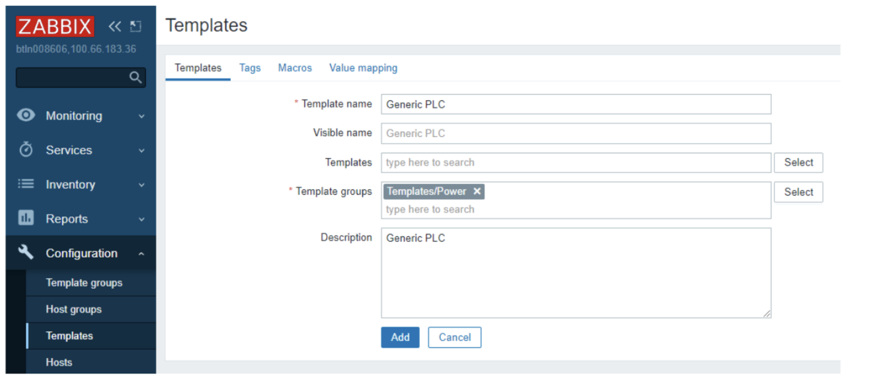
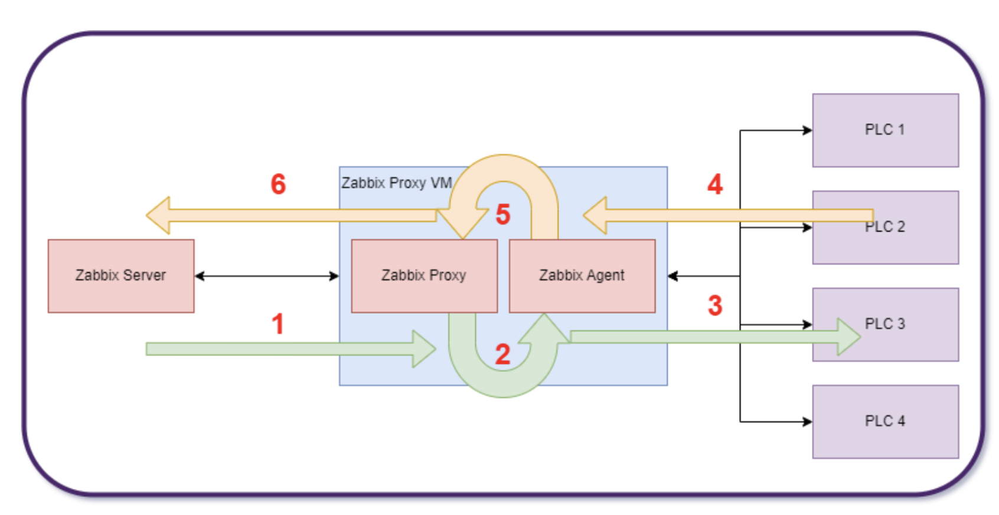

# Modbus monitoring with Zabbix.

## Introduction

MODBUS TCP is a technology that takes MODBUS RTU packets and encapsulates this in a TCP/IP
wrapper for communication over a network instead of typical RS485 serial connections.
MODBUS as a technology has been around since 1979 and is one of the de-facto industrial application protocols
commonly found in HVAC controllers, Generator controllers and a multitude of other PLC devices.
Zabbix has the ability to monitor MODBUS using a Zabbix agent.
If the Zabbix agent is running on a machine with a serial connection to the Modbus device, this monitoring can be done over serial
communications. 
If the Modbus device is connected to a TCP/IP network, the Zabbix agent will still be required for sending/receiving commands.
TCP port 502 is commonly used for modbus TCP communications.

In this example, all generator PLCs are connected to a TCP/IP network.

{ width=90% }

Due to the nature of the network used for this example, a Zabbix proxy is also required.
In this case the Zabbix proxy server is a docker container on a virtual machine that can reach  both the Zabbix server
network and the network the PLC devices are connected too.
The Zabbix agent that is needed for the Modbus commands is also running as a docker container on the same virtual machine as the Zabbix proxy server.
Different networks may require different solutions. The common element for all networks for Modbus monitoring is there needs to be a Zabbix agent that can interface with the Modbus devices.


{ width=90% }

In this screenshot is the initial template creation step. The template group used in this screen shot is templates/power as this example will be using a generator PLC.
Templates should be named in a self explanatory way. 
If monitoring a Horner XL4 PLC, it would be best to name the template “Horner XL4”

{ width=90% }

Before adding in the template, add in a default Macro under the tab macros wich is called {$DEVICE_CONNECTION} and set the value to “tcp://127.0.0.1:502”.
Later when adding in hosts, each host that is added in will overwrite this value with the actual value of the connection string for that particular host.
This will allow for troubleshooting in the future if communications are not established with a host.


## Template Item creation

For a detailed explanation of all the modbus.get parameters see the Zabbix documentation:

https://www.zabbix.com/documentation/7.0/en/manual/appendix/items/modbus

The item key for modbus.get looks like this:
```
modbus.get[<endpoint>,<slaveid>,<function>,<address>,<count>,<type>,<endianness>,<offset>]
```

For creating the template of the item, in this example the following values will be set:

- Endpoint – the protocol/connection string in this example this is set to {$DEVICE_CONNECTION}
- Slaveid – for Serial communications, multiple Modbus can be on the same serial connection and this value allows addressing of those devices. For this TCP example, this value will be 1
- Function – 1 - Read Coil, 2 - Read Discrete Input, 3 - Read Holding Registers, 4 - Read Input Register – please read Modbus documentation on these 4 different modes.
- Address – this is the internal address of the registry to be read. In this example, address 42 is used. This will require in-depth knowledge of the Modbus device to properly determine.
- Count – if the function is 1 or 2, then count = 1 bit, for all other cases, (count*type)/2 = real count of registers for reading. To simplify, this is the number of registers to read with this command. 
- Type – this is the data type to be returned from the Modbus device, for function 1 and 2, this should be set to bit. For function 3 and 4 there is a wide variety of options from bit to double. Please see the Zabbix documentation linked above, also you will need to fully understand your Modbus device and know what data types it returns.
- Endianness – does the Modbus device return big endian, little endian, Mid-big endian, or Mid-little endian values? For bit values that are returned the value be for big endian is used here. Again knowledge of the data type returned by the Modbus device is important
- Offset – for some Modbus devices that do not support random read access an offset has to be given. This allows the Modbus device to return a data byte, and the correct bit to be selected by Zabbix. The example below allows random read access so Offset is set to 0

### Example Item key:

In this example the Modbus device is a generator controller. For this generator controller I have address 42 for a generator AC Fail alarm. This is a coil read operation. The Modbus.get item key will look like this:

```
modbus.get[{$DEVICE_CONNECTION},1,1,42,1,bit,be,0]
```

- {$DEVICE_CONNECTION} – this allows the use of a macro set in the host creation step
- 1 – Slaveid, for this example, MODBUS TCP is used so this is ignored
- 1 – Function, for this example, it is a read coil operation
- 42 – this is the internal address in the Modbus device to be read
- 1 – Count is set to 1 because this value is a bit for this example
- bit – The type of data for the example
- be – endianness – big endianness for bit operations
- 0 – the offset for this example.

### Full Item template example

{ width=90% }

This is the full example of the item creation window.
- Name – Generator AC fail – this is the name of the item we are creating
- Type – Zabbix agent – This is used so that the Modbus.get command can be used
- Key – modbus.get – explained above for this example
- Type of information – In this case the value is either 0 or 1 so we used numeric (unsigned)
- Units – There are no units to assign to this item
- Update interval – 15m, this could be quicker if the Modbus device has data at a quicker interval, for this example 15m was used as a proof of concept
- Value Mapping – A map was created called Alarm status where 0 = OK and 1 = Alarm which matches the expected data from this Modbus device


### Host Creation

{ width=90% }

After creating the template, with all the items to be monitored, the hosts can be created and assigned to the template
In this example:

- Host name – Test PLC for this example host
- Templates – The generic PLC template from the above example was used
- Host Group – Since this will eventually be used for a generator Modbus PLC I have a generator/Modbus host group created
- Interfaces – We use a Zabbix Agent interface with a DNS name of the Zabbix agent running on the same virtual machine as the Zabbix Proxy. This is setup due to the network configuration presented above. The Zabbix agent and Zabbix proxy are docker containers on the virtual machine with connections to both the PLC network and the Zabbix server. To communicate with a Modbus device a zabbix agent needs to be used.
- Monitored by proxy – The proxy server that will communicate with the Zabbix agent

### Host Creation – Macro definition

Before adding the host in, the device connection string needs to be applied. In this case we change {$DEVICE_CONNECTION} to the actual value we will be using for this Modbus device. Doing it this way will allow for the template to be used over and over with different Modbus devices.

{ width=90% }

### Network Diagram explained

{ width=90% }

1. The Zabbix Server requests the Zabbix proxy to get the item value
2. The Zabbix proxy requests the modbus.get command from the Zabbix agent
3. The Zabbix Agent executes the modbus.get command to the PLC via Modbus TCP in this example
4. The PLC responds to the Modbus TCP command to the Zabbix Agent
5. The Zabbix agent returns the results of the modbus.get query to the Zabbix proxy 
6. The Zabbix proxy returns the item value to the zabbix server.


By : Jason Drummond
