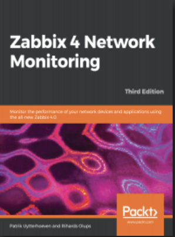

# Worum geht es in diesem Buch?

Willkommen und danke für Ihr Interesse an diesem Zabbix-Handbuch.

In der Vergangenheit habe ich bereits das [Zabbix Cookbook](https://www.packtpub.com/product/zabbix-cookbook/9781784397586)
verfasst und habe zusammen mit Richards das [Zabbix 4 Network Monitoring](https://www.packtpub.com/product/zabbix-4-network-monitoring-third-edition/9781789340266)
verfasst, welche beide bei Packt erschienen sind.

{width=200} {width=200}

Das _Zabbix Cookbook_ war eine der ersten umfassenden Ressourcen für Zabbix Benutzer, obwohl es jetzt etwas veraltet ist. Inzwischen wurde es durch das [Zabbix 7 IT Infrastructure Monitoring Cookbook](https://www.packtpub.com/product/zabbix-7-it-infrastructure-monitoring-cookbook-third-edition/9781801078320) abgelöst, das von Brian und Nathan geschrieben wurde - zwei Personen, die ich sehr empfehle und mit denen ich gerne zusammenarbeite.

Packt bietet eine große Auswahl an anderen Büchern zu Zabbix an.
Sie können die gesamte Sammlung [hier](https://www.packtpub.com/search?query=zabbix) durchstöbern. Für diejenigen, die nach nicht-englischen Titeln suchen, bietet Amazon Zabbix-Bücher in Sprachen wie Chinesisch, Spanisch und anderen an, die von Packt und anderen Verlagen veröffentlicht werden. Sie finden sie [hier](https://www.amazon.com/s?k=zabbix&crid=3G0JRTVTKS7YU&sprefix=zabbix+%2Caps%2C167&ref=nb_sb_noss_2).

Da Zabbix ein Open-Source-Produkt ist, war es nie mein Ziel, mit den von mir geschriebenen Büchern Geld zu verdienen. Das brachte mich dazu, darüber nachzudenken, wie ich die Dinge anders angehen könnte. Ich wollte ein Buch schreiben, das frei verfügbar ist und mit jeder neuen Version von Zabbix aktualisiert wird.

Da ich ein starker Befürworter von Dokumentationen in Markdown oder AsciiDoc bin, beschloss ich, das Buch in einem Git-Repository zu veröffentlichen und dabei Markdown als Format zu verwenden. Die einzige Herausforderung bestand darin, diese Markdown-Dateien in einer leserfreundlichen Art und Weise zu präsentieren, wie in einem traditionellen Buch. Nach einigen Recherchen stieß ich auf [MkDocs](https://www.mkdocs.org), eine auf Python basierende Bibliothek, die Markdown-Dateien in HTML umwandelt und mit Vorlagen versehen werden kann. Mit MkDocs wurde das Problem gelöst, und ein neues Buch war geboren.

## Wer bin ich?

Mein Name ist Patrik Uytterhoeven, und ich arbeite für ein belgisches Unternehmen namens Open-Future. Ich bin im Januar 2013 zu Open-Future gekommen, und da begann meine Reise mit Zabbix. Das Unternehmen bot mir die Möglichkeit, mein Fachwissen zu erweitern und ein zertifizierter Zabbix-Trainer zu werden. In diesem Jahr bin ich bereits seit 10 Jahren Zabbix-Trainer.

Wenn Sie Interesse haben, an einer meiner Schulungen teilzunehmen, können Sie sich unter [www.open-future.be](https://www.open-future.be) anmelden. Sie fragen sich vielleicht: „Warum eine Schulung besuchen, wenn ich dieses Buch kostenlos lesen kann?“ Während Bücher umfangreiche Informationen über die Einrichtung und Konfiguration liefern, bieten Schulungen wertvolle Einblicke, Tipps und Feedback, die Sie in einem Buch nicht so einfach finden. Bücher können einfach nicht jedes Detail abdecken.

## Welches Betriebssystem brauche ich?

Als jemand, der hauptsächlich mit RHEL-basierten Systemen arbeitet, glaube ich, dass RHEL die optimale Wahl für Produktionsumgebungen ist. Aus diesem Grund habe ich mich entschieden, mich auf einen der freien Forks zu konzentrieren. Zabbix wird auf Ubuntu, Debian, SUSE, Raspberry Pi und anderen Systemen unterstützt und kann auf jedem Unix-basierten Betriebssystem kompiliert werden. Es ist jedoch fast unmöglich, jedes Betriebssystem in diesem Buch zu behandeln. Da das Buch Open-Source ist und auf Git gehostet wird, können Sie gerne Code für Ihre bevorzugte Distribution beisteuern! In diesem Buch verwende ich [Rocky Linux](https://rockylinux.org/) 9, aber die Anweisungen sollten auch für die meisten anderen Installationen gelten.

## Welche Version von Zabbix wird in diesem Buch verwendet?

Dieses Buch konzentriert sich auf Zabbix 7.0, da dies die letzte LTS (Long Term Support) Version ist. Der größte Teil des Inhalts ist auch für andere Versionen relevant, obwohl es kleinere Änderungen geben kann. Wenn die Community die Aktualisierung dieses Buches unterstützt, wäre es fantastisch, in Zukunft eine Version für jede LTS-Version zu erstellen.

## Wie man dieses Buch benutzt

Dieses Buch ist so konzipiert, dass es ein breites Spektrum an Themen abdeckt. Wenn Sie das Gefühl haben, dass etwas fehlt, wenden Sie sich bitte an uns oder stellen Sie einen Pull-Request.

Sie müssen nicht auf Seite eins beginnen und bis zum Ende lesen. Einige Leser suchen vielleicht nach grundlegendem Wissen, während andere direkt zu fortgeschritteneren Themen übergehen möchten. Ich habe mir zum Ziel gesetzt, dieses Buch für alle nützlich zu machen, indem ich für jedes Thema detaillierte Erklärungen und klare Schritte anbiete.

Überall im Buch werden Sie Code-Schnipsel finden. Diese werden in Codeblöcken wie dem folgenden dargestellt:

REHL

```bash
# sudo yum install zabbix-server-mysql
```

Ubuntu

```bash
# sudo apt install zabbix-server-mysql
```

Hinweise auf nützliche Dokumentation werden am Ende der Seite eingefügt.

Hier ist eine einfache Fußnote[^1]. Mit etwas zusätzlichem Text dahinter.

[^1]: Meine Referenz.

Falls es wichtige Informationen zu teilen gibt, werde ich Hinweise in die Dokumentation einfügen, wie hier zu sehen ist:

???+ note
    Lorem ipsum dolor sit amet, consectetur adipiscing elit. Nulla et euismod nulla.
    Curabitur feugiat, tortor non consequat finibus, justo purus auctor massa,
    nec semper lorem quam in massa.

???+ info
    Lorem ipsum dolor sit amet, consectetur adipiscing elit. Nulla et euismod nulla.
    Curabitur feugiat, tortor non consequat finibus, justo purus auctor massa,
    nec semper lorem quam in massa.

???+ tip
    Lorem ipsum dolor sit amet, consectetur adipiscing elit. Nulla et euismod nulla.
    Curabitur feugiat, tortor non consequat finibus, justo purus auctor massa,
    nec semper lorem quam in massa.

???+ question
    Lorem ipsum dolor sit amet, consectetur adipiscing elit. Nulla et euismod nulla.
    Curabitur feugiat, tortor non consequat finibus, justo purus auctor massa,
    nec semper lorem quam in massa.

???+ warning
    Lorem ipsum dolor sit amet, consectetur adipiscing elit. Nulla et euismod nulla.
    Curabitur feugiat, tortor non consequat finibus, justo purus auctor massa,
    nec semper lorem quam in massa.

???+ bug
    Lorem ipsum dolor sit amet, consectetur adipiscing elit. Nulla et euismod nulla.
    Curabitur feugiat, tortor non consequat finibus, justo purus auctor massa,
    nec semper lorem quam in massa.

???+ example
    Lorem ipsum dolor sit amet, consectetur adipiscing elit. Nulla et euismod nulla.
    Curabitur feugiat, tortor non consequat finibus, justo purus auctor massa,
    nec semper lorem quam in massa.
