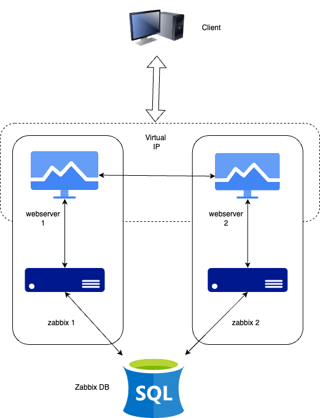
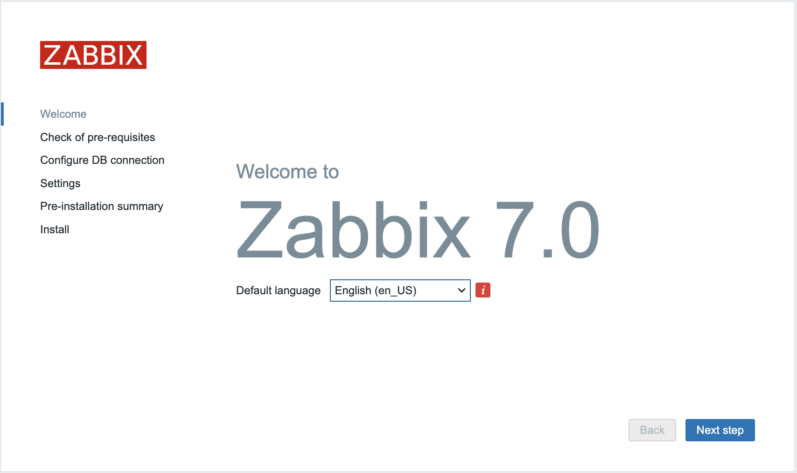
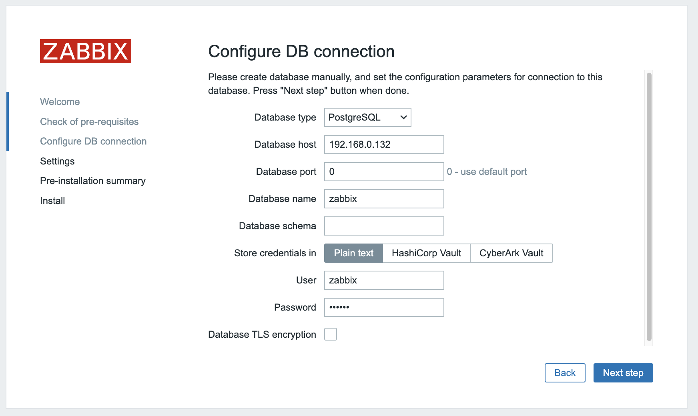
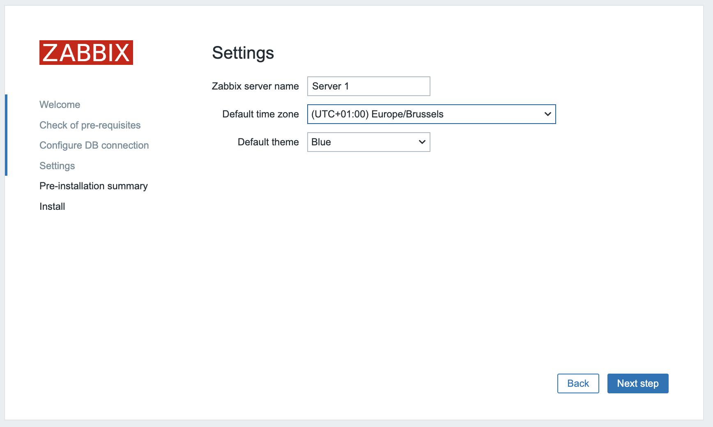

# Configure Zabbix HA

In this topic  we will setup Zabbix in a High Available setup. This feature was added in Zabbix 6 and was one of the most important features added that time.
The idea about this functionallity is that if your Zabbix server fails that another Zabbix server can take over.
In this setup we will use 2 Zabbix servers but you are not limited to this you can add as many as you like.

The HA setup in Zabbix is rather basic but works like a charm so don't expect fancy things like load balancing.

Just like we did in our basic setup we will make a few notes again about the setup of the servers we have.
I added the IP's that we will use here don't forgot to make notes of your own ip adresses.


{width=80%}


| Server 	| IP	|
|:----		|:----	|
|Zabbix Server 1|192.168.0.130 |
|Zabbix Server 2|192.168.0.131 |
|Postgres DB	|192.168.0.132 |
|Virtual IP	|192.168.0.135 |


???+ Note
    As you notice our DB is not HA this is not a Zabbix component you have to implement your own solution this can be a HA SAN or you DB in a HA cluster setup.
    The cluster setup of our DB is out of the scope and not related to Zabbix so we will not cover this here. 

---

## Let's install our Postgres DB

???+ Note
    If you are not running on x86 or like to try on another OS, then have a look at https://www.postgresql.org/download/ for the commands you need.

???+ Warning
    In this exercise we will take some shortcuts for the installation of the PostgreSQLDB and the OS. Look at our previous topics to get a better understanding where to tweak.


```
# Install the repository RPM:
sudo dnf install -y https://download.postgresql.org/pub/repos/yum/reporpms/EL-9-x86_64/pgdg-redhat-repo-latest.noarch.rpm

# Disable the built-in PostgreSQL module:
sudo dnf -qy module disable postgresql

# Install PostgreSQL:
sudo dnf install -y postgresql16-server

# Initialize the database and enable automatic start:
sudo /usr/pgsql-16/bin/postgresql-16-setup initdb
sudo systemctl enable postgresql-16 --now
```

### Securing the PostgreSQL database¶

PostgreSQL works a bit different then MySQL or MariaDB and this applies aswell to how we manage access permissions.
Postgres works with a file with the name ```pg_hba.conf``` where we have to tell who can access our database from where and what encryption is used for the password. So let's edit this file to allow our frontend and zabbix server to access the database.

```
# vi /var/lib/pgsql/16/data/pg_hba.conf
```

```
# "local" is for Unix domain socket connections only
local   all             all                                         trust
# IPv4 local connections:
host    zabbix          zabbix     192.168.0.130/32  		scram-sha-256
host    zabbix          zabbix     192.168.0.131/32  		scram-sha-256
host    all             all            127.0.0.1/32            	scram-sha-256
```
After we changed the pg_hba file don't forget to restart postgres else the settings will not be applied.
But before we restart let us also edit the file postgresql.conf and allow our database to listen on our network interface for incomming connections from the zabbix server.
Postgresql will standard only allow connections from the socket.

```
# vi /var/lib/pgsql/16/data/postgresql.conf
```
Replace the line with listen_addresses so that PostgreSQL will listen on all interfaces and not only on our localhost.

```
listen_addresses = '*'
```
When done restart the PostgreSQL cluster and see if it comes back online in case of an error check the ```pg_hba.conf``` file you just edited for typos.

```
# systemctl restart postgresql-16
```

For our Zabbix server we need to create tables in the database for this we need ot install the Zabbix repository like we did for our Zabbix server and install the Zabbix package containing all the database tables images icons, ....

#### Add the Zabbix repository and populate the DB

Add the Zabbix repo to your server (Don't forget to select the correct repo for your OS and Zabbix version) for this go to www.zabbix.com/download

```
# rpm -Uvh https://repo.zabbix.com/zabbix/7.0/rhel/9/x86_64/zabbix-release-6.5-2.el9.noarch.rpm
```

### Install the database scripts.

```
# dnf install zabbix-sql-scripts -y
```
Next we have to unzip the database schema files. Run as user root followin command::

```
# gzip -d /usr/share/zabbix-sql-scripts/postgresql/server.sql.gz
```
### Create the DB users

Now we are ready to create our Zabbix users for the server and the frontend. If you like to separate users for frontend and server have a look at the basic installation guide.

```
# su - postgres
# createuser --pwprompt zabbix
Enter password for new role: <server-password>
Enter it again: <server-password>
```
#### Populate the database.

We are now ready to create our database zabbix. Become user postgres again and run next command to create the database as our user zabbix:

```
# su - postgres
# createdb -E Unicode -O zabbix  zabbix
```
Let's upload the Zabbix SQL file we extracted earlier to populate our database with the needed schemas images users etc ...
For this we need to connect to the DB as user zabbix.

```
# psql -U zabbix -W zabbix
Password:
psql (16.2)
Type "help" for help.

zabbix=> SELECT session_user, current_user;
 session_user | current_user
--------------+--------------
 zabbix       | zabbix
(1 row)

zabbix=> \i /usr/share/zabbix-sql-scripts/postgresql/server.sql
CREATE TABLE
CREATE INDEX
CREATE TABLE
....
....
INSERT 0 1
DELETE 80424
COMMIT
```

Make sure the owner of your tables is the user zabbix;

```
zabbix=> \dt
                  List of relations
 Schema |            Name            | Type  | Owner
--------+----------------------------+-------+--------
 public | acknowledges               | table | zabbix
 public | actions                    | table | zabbix
...
...
...

zabbix=> \q

```
### Configure the firewall¶

One last thing we need to do is open the firewall and allow incoming connections for the PostgreSQL database from our Zabbix server because at the moment we dont accept any connections yet.

```
# firewall-cmd --new-zone=postgresql-access --permanent
success

# firewall-cmd --reload
success

# firewall-cmd --get-zones
block dmz drop external home internal nm-shared postgresql-access public trusted work

# firewall-cmd --zone=postgresql-access --add-source=<zabbix-serverip 1> --permanent
# firewall-cmd --zone=postgresql-access --add-source=<zabbix-serverip 1> --permanent

success
# firewall-cmd --zone=postgresql-access --add-port=5432/tcp  --permanent

success
# firewall-cmd --reload
```
Now lets have a look to our firewall rules to see if they are what we expected:
```
# firewall-cmd --zone=postgresql-access --list-all
```

Our database server is ready now to accept connections from our Zabbix server :). You can continue with the next task

---


## Install our Zabbix Cluster

Setting up a Zabbix cluster is not really different from setting up a regular Zabbix server obviously we need more then one.
And there are also a few parameters that we need to configure.

Let's start by adding our Zabbix 7.0 repositories to our 2 Zabbix servers.

```
rpm -Uvh https://repo.zabbix.com/zabbix/7.0/rhel/9/x86_64/zabbix-release-6.5-2.el9.noarch.rpm
```

Once this is done we can install our Zabbix servers on both systems.

```
dnf install zabbix-server-pgsql -y
```

We will now edit the config file on our first zabbix server. Run the next command:

```
vi /etc/zabbix/zabbix_server.conf
```
Once in the file edit the following lines to make our Zabbix server 1 connnect to the database

```
DBHost=<zabbix db ip>
DBName=zabbix
DBUser=zabbix
DBPassword=<your secret password>
```

In the same file we also have to edit another parameter to activate HA on this host.

```
HANodeName=zabbix1 (or whatever you like)
```

We are not done yet.
We also have to tell Zabbix in case of a node fail to what server the frontend needs to connect.

```
NodeAddress=<Zabbix server 1 ip>>:10051
```
We are now done with the configuration of our 1st Zabbix server. Now let's do the same for our second server.
I case you have more then 2 servers you can update them as well.

When you are done patching the config of your servers you can start the ```zabbix-server``` service on both servers

```
systemctl enable zabbix-server --now
```

Let's have a look at the log files from both servers to see if it came online as we had hoped.
on our first server we can run:

```
#grep HA /var/log/zabbix/zabbix_server.log

22597:20240309:155230.353 starting HA manager
22597:20240309:155230.362 HA manager started in active mode
```
Now do the same on our other node(s)

```
# grep HA /var/log/zabbix/zabbix_server.log
22304:20240309:155331.163 starting HA manager
22304:20240309:155331.174 HA manager started in standby mode
```

---


## Installing the frontends

First things first before we can install and configure our webserver we need to install keepalived. 
Keepalived allows us to use a VIP for our frontends. Keepalived provides frameworks for both load balancing and high availability.

???+ info
    Some useful documentation on the subject you might like.
    https://www.redhat.com/sysadmin/advanced-keepalived and https://keepalived.readthedocs.io/en/latest/introduction.html


### Setup keepalived

So let's get started.
On both our servers we have to install keepalived.

```
dnf install keepalived
```

We also need to adapt the configuration of keepalived on both servers. The configuration for both servers needs to be a bit changed so let's start with our server 1.
Edit the config file with the following command:

```
# vi /etc/keepalived/keepalived.conf
```
Delete everything and replace it with the following lines:

```
vrrp_track_process track_nginx {
    process nginx
    weight 10
}

vrrp_instance VI_1 {
    state MASTER
    interface enp0s1
    virtual_router_id 51
    priority 244
    advert_int 1
    authentication {
        auth_type PASS
        auth_pass 12345
    }
    virtual_ipaddress {
        192.168.0.135
    }
    track_process {
         track_nginx
      }
}
```
Replace ```enp0s1``` with the interface name of your machine and replace the password with something secure. For the virual_ipaddress use aa free IP from your network.
Now do the same thing for our second Zabbix server.

```
# vi /etc/keepalived/keepalived.conf
```
Delete everything and replace it with the following lines:

```
vrrp_track_process track_nginx {
      process nginx
      weight 10
}

vrrp_instance VI_1 {
    state BACKUP
    interface enp0s1
    virtual_router_id 51
    priority 243
    advert_int 1
    authentication {
        auth_type PASS
        auth_pass 12345
    }
    virtual_ipaddress {
        192.168.0.135
    }
    track_process {
         track_nginx
      }
}
```

Just as with our 1st Zabbix server, replace ```enp0s1``` with the interface name of your machine and replace the password with something secure.
For the virual_ipaddress use aa free IP from your network.

### Install and configure the frontend

On both servers we can run the following commands to install our webserver and the zabbix frontend packages:

```
dnf install nginx zabbix-web-pgsql zabbix-nginx-conf
```

Also let's not forget to configure our firewall

```
firewall-cmd --add-service=http --permanent
firewall-cmd --add-service=zabbix-server --permanent
firewall-cmd --reload
```

And now we can start our keepalived and enable it so that it comes up next reboot

```
systemctl enable keepalived nginx --now
```


### Configure Zabbix Frontend

{width=80%}

Click next till you see the following page and fill in the ip of your DB server. The port can be 0 this means we will use the default port.
fill in the database name, user and password you used for the database. Make sure you deselect TLS encryption and select store passwords as plaintext.
When you click next it won't work because we did not disable SELinux. Run the following command first on both Zabbix servers.

```
setsebool -P httpd_can_network_connect_db on
setsebool -P httpd_can_connect_zabbix on
```
This will allow your webservers to communicate with our database over the network. Now when we click next it should work.

{width=80%}

We are almost ready the only thing left here is now to add the name of our server and configure the default timezone.

{width=80%}

Since you’re using a host-based firewall, you need to add the necessary rules to permit IP protocol 112 traffic. Otherwise, Keepalived’s advertisement method won’t work.
```
firewall-cmd --add-rich-rule='rule protocol value="112" accept' --permanent
```

Now that this is all taken care of stop keepalived on our server and repeat the same steps on the second server. After this is finished start keepalived again.

Congratulations you have a HA Zabbix server now .

#### Checking the Database for HA info.

Now that everything is up and running there is probably something you like to know. 
Where can we find the info in our database ?

It's actually very straighforward we can go to our zabbix database and run the following query to see our servers: ```SELECT *FROM ha_node;```

```
zabbix=# SELECT *FROM ha_node;
         ha_nodeid         |  name   |    address    | port  | lastaccess | status |       ha_sessionid
---------------------------+---------+---------------+-------+------------+--------+---------------------------
 cltk7h2n600017kkd1jtx6f1f | zabbix2 | 192.168.0.131 | 10051 | 1710085786 |      0 | cltlov4ly0000jkkdteikeo77
 cltk7ci340001inkc2befwg9f | zabbix1 | 192.168.0.130 | 10051 | 1710085787 |      3 | cltlov1r00000jtkcpeh9oqhp
```

This is also how our frontend is able to know what server it needs to connect to. Remember our picture in the first page ? Actually the frontend has a connection to our database and reads out the status from our ```zabbix server```.
This way it knows what server is active.

It's probably also good to know that we can have 4 statusses:

| status      | number | info |
|:----        |:----   |:---- |
| Active      | 3      | Only one node can be active |
| Standby     | 0      | Multiple nodes can be in standby |
| Stopped     | 1      | A previous detected node is nog stopped |
| Unavailable | 2      | A previous dtected node was lost without being shutdown |

???+ Note
    Zabbix agents need to have their Server and ServerActive addresses pointed to both active and passive Zabbix server. 
    This option is supported in all agents since Zabbix 6.0
