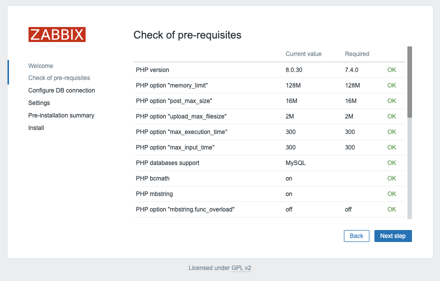
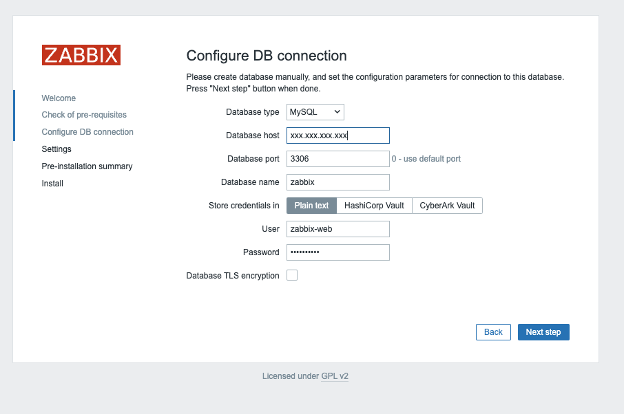

# Installing Zabbix

In this chapter we will cover the installation of our Zabbix server. 
In the previous topic we already installed the DB now we will see how to install our Zabbix server and to connect it to our database. We will cover also possible design choices as Zabbix can be installed in a modular way.

Before we can install Zabbix we first have to know how the design is. The Zabbix server has been build op modular based on 3 components.

- The Zabbix server
- The Zabbix web server
- The Zabbix database

{width=80%}

All these components can be installed on 1 server or can be split over 3 different servers.
The Zabbix server itself is the brain this part is doing all the trigger calculations and sending all the alert.
The database is where the Zabbix server stores its config and all the data that we have gathered.
The web server provides us with a front-end. Note that Zabbix has a API and that this is also located on the front-end and not on the Zabbix server side.

All these parts have to work together so as you can see in our image above. The Zabbix server needs to read the config and store the data in our database and the Zabbix front-end needs to be able to write the configuration in the database as well. The Zabbix front-end also needs to check the online status of our Zabbix server and needs to read some other information as well.

For our setup, we will use 2 VM's, 1 VM with a Zabbix server and our Zabbix web server and another VM with our Zabbix database.


In this chapter we will see how to :

- Install the Zabbix server for MySQL/MariaDB
- Install the Zabbix server for PostgreSQL
- Install the Zabbix frontend with NginX
- Install the Zabbix frontend with Apache

---

## Installing the Zabbix Server

Before you start to install your Zabbix server make sure the server is properly configure as we explained in our topic [Basic OS configuration before we start](Requirements.md).
Something else that is important in this case is that we need to disable SELinux. We will see later in chapter [Securing Zabbix with SELinux](../security/securing-zabbix-selinux.md) how to do this properly. 
We can check the status of SELinux with the command ```sestatus``` :

```
# sestatus
SELinux status:                 enabled
SELinuxfs mount:                /sys/fs/selinux
SELinux root directory:         /etc/selinux
Loaded policy name:             targeted
Current mode:                   enforcing
Mode from config file:          enforcing
Policy MLS status:              enabled
Policy deny_unknown status:     allowed
Memory protection checking:     actual (secure)
Max kernel policy version:      33
```

As you can see we are now in enforcing mode.
To disable SELinux just run ```setenforce 0``` to disable it. 

```
# setenforce 0
# sestatus

SELinux status:                 enabled
SELinuxfs mount:                /sys/fs/selinux
SELinux root directory:         /etc/selinux
Loaded policy name:             targeted
Current mode:                   permissive
Mode from config file:          enforcing
Policy MLS status:              enabled
Policy deny_unknown status:     allowed
Memory protection checking:     actual (secure)
Max kernel policy version:      33
```
As you can see our current mode is now permissive. 
However this is not persistent so we also need to alter our SELinux configuration file. This can be done by altering the file ```/etc/config/selinux``` and replacing enforcing by permissive.
A more easy way is to run the following command :
```
sed -i 's/SELINUX=enforcing/SELINUX=permissive/g' /etc/selinux/config
```

This line will alter the config file for you. So when we run ```sestatus``` again we will see that we are in ```permissive``` mode and that our config file is also in ```permissive``` mode. 


We can verify this with our **cat** commando.

```
# cat /etc/selinux/config

# This file controls the state of SELinux on the system.
# SELINUX= can take one of these three values:
#     enforcing - SELinux security policy is enforced.
#     permissive - SELinux prints warnings instead of enforcing.
#     disabled - No SELinux policy is loaded.
# See also:
# https://docs.fedoraproject.org/en-US/quick-docs/getting-started-with-selinux/#getting-started-with-selinux-selinux-states-and-modes
#
# NOTE: In earlier Fedora kernel builds, SELINUX=disabled would also
# fully disable SELinux during boot. If you need a system with SELinux
# fully disabled instead of SELinux running with no policy loaded, you
# need to pass selinux=0 to the kernel command line. You can use grubby
# to persistently set the bootloader to boot with selinux=0:
#
#    grubby --update-kernel ALL --args selinux=0
#
# To revert back to SELinux enabled:
#
#    grubby --update-kernel ALL --remove-args selinux
#
SELINUX=permissive
# SELINUXTYPE= can take one of these three values:
#     targeted - Targeted processes are protected,
#     minimum - Modification of targeted policy. Only selected processes are protected.
#     mls - Multi Level Security protection.
SELINUXTYPE=targeted
```
And we can also verify it with our commando ```setstatus``` 

```
# sestatus

SELinux status:                 enabled
SELinuxfs mount:                /sys/fs/selinux
SELinux root directory:         /etc/selinux
Loaded policy name:             targeted
Current mode:                   permissive
Mode from config file:          permissive
Policy MLS status:              enabled
Policy deny_unknown status:     allowed
Memory protection checking:     actual (secure)
Max kernel policy version:      33
```


#### Adding the Zabbix repository

From the [Zabbix Download page](https://www.zabbix.com/download) select the correct Zabbix version you would like to install. In our case it will be 7.0 LTS. Select the correct OS distribution as well. This will be Rocky Linux 9 in our case. We are going to install the Server and will be using NGINX.


Our first step is to disable Zabbix packages provided by EPEL, if you have it installed. Edit file /etc/yum.repos.d/epel.repo and add the following statement.

```
[epel]
...
excludepkgs=zabbix*
```
???+ Tip
    Having the EPEL repository enabled is a bad practice and could be dangerous if you use EPEL it's best to disable the repo and use dnf install <package> --enablerepo=epel. This way you will never overwrite or install unwanted packages by accident.

Our next task is to install the Zabbix repository on our OS and do a dnf cleanup so that old cache files from our repository metadata is cleaned up.

``` 
rpm -Uvh https://repo.zabbix.com/zabbix/7.0/rhel/9/x86_64/zabbix-release-6.5-2.el9.noarch.rpm
dnf clean all
```
???+ note
    A repository is a config in Linux that you can add to make packages available for you OS to install. The best way to look at it is maybe to think of it like an APP store that you add where you can find the software of your vendor. In this case the repository form Zabbix. There are many repositories you can add but you should be sure that they can be trusted. So it's always a good idea to stick to the repositories of your OS and only add extra repositories when you are sure they are to be trusted and needed. In our case the repository is from our vendor Zabbix so it should be safe to add. Epel is another popular repository for RedHat systems that is considered to be safe.


#### Installing the Zabbix server for MySQL/MariaDB

Now that we have our repository with software added to our system we are ready to install our Zabbix server and webserver. Remember the webserver could be installed on another system. There is no need to install both on the same server.

```dnf install zabbix-server-mysql zabbix-web-mysql```

Now that we have installed our packages for the Zabbix server and our frontend we still need to change the configuration of our Zabbix server so that we can connect to our database. Open the file ```/etc/zabbix/zabbix_server.conf``` and replace the following lines:

```
DBHost=<ip or dns of your MariaDB server>
DBName=<the name of your database>
DBUser=<the user that will connect to the database>
DBPassword=<your super secret password>
```
Make sure you don't have a '#' in front of the config parameter else Zabbix will see this as text and not as a parameter. Also make sure that there are not extra duplicate lines Zabbix will always take the last config parameter if there is more then 1 line with the same parameter

In our case the config will look like this:

```
# vi /etc/zabbix/zabbix_server.conf

DBHost=<ip or dns of your MariaDB server>
DBName=zabbix
DBUser=zabbix-srv
DBPassword=<your super secret password>
DBPort=3306
```

???+ Note
    The Zabbix server configuration file has the option to include an extra config file with parameters you like to alter or add. In production it's probably better to not touch the configuration file but to add a new file and include the parameters you like to change. This way you never have to edit your original configuration file after an upgrade it will also make your life more easy when working with configuration tools like Ansible, Puppet, SaltStack, .... The only thing that needs to be done is remove the # in front of the line '# Include=/usr/local/etc/zabbix_server.conf.d/*.conf' and make sure the path exists with a customized config file of your won that is readable by the user zabbix.


Ok now that we have changed the configuration of you Zabbix server so that it is able to connect to our DB we are  ready to start. Run the following command to enable the Zabbix server and make it active on boot next time.

```systemctl enable zabbix-server --now```

Our Zabbix server service will start and if everything goes well you should see in the Zabbix server log file the following output 

```tail /var/log/zabbix/zabbix_server.log```

```
  1123:20231120:110604.440 Starting Zabbix Server. Zabbix 7.0.0alpha7 (revision 60de6a81aca).
  1123:20231120:110604.440 ****** Enabled features ******
  1123:20231120:110604.440 SNMP monitoring:           YES
  1123:20231120:110604.440 IPMI monitoring:           YES
  1123:20231120:110604.440 Web monitoring:            YES
  1123:20231120:110604.440 VMware monitoring:         YES
  1123:20231120:110604.440 SMTP authentication:       YES
  1123:20231120:110604.440 ODBC:                      YES
  1123:20231120:110604.440 SSH support:               YES
  1123:20231120:110604.440 IPv6 support:              YES
  1123:20231120:110604.440 TLS support:               YES
  1123:20231120:110604.440 ******************************
  1123:20231120:110604.440 using configuration file: /etc/zabbix/zabbix_server.conf
  1123:20231120:110604.470 current database version (mandatory/optional): 06050143/06050143
  1123:20231120:110604.470 required mandatory version: 06050143
  1124:20231120:110604.490 starting HA manager
  1124:20231120:110604.507 HA manager started in active mode
  1123:20231120:110604.508 server #0 started [main process]
  1126:20231120:110604.509 server #2 started [configuration syncer #1]
  1125:20231120:110604.510 server #1 started [service manager #1]
  1133:20231120:110604.841 server #9 started [lld worker #1]
  1132:20231120:110604.841 server #8 started [lld manager #1]
  1134:20231120:110604.841 server #10 started [lld worker #2]
```

If there was an error and the server was not able to connect to the database you would see something like this in the server log file :

```
 10773:20231118:213248.570 Starting Zabbix Server. Zabbix 7.0.0alpha7 (revision 60de6a81aca).
 10773:20231118:213248.570 ****** Enabled features ******
 10773:20231118:213248.570 SNMP monitoring:           YES
 10773:20231118:213248.570 IPMI monitoring:           YES
 10773:20231118:213248.570 Web monitoring:            YES
 10773:20231118:213248.570 VMware monitoring:         YES
 10773:20231118:213248.570 SMTP authentication:       YES
 10773:20231118:213248.570 ODBC:                      YES
 10773:20231118:213248.570 SSH support:               YES
 10773:20231118:213248.570 IPv6 support:              YES
 10773:20231118:213248.570 TLS support:               YES
 10773:20231118:213248.570 ******************************
 10773:20231118:213248.570 using configuration file: /etc/zabbix/zabbix_server.conf
 10773:20231118:213248.574 [Z3001] connection to database 'zabbix' failed: [2002] Can't connect to server on 'xxx.xxx.xxx.xxx' (115)
 10773:20231118:213248.574 database is down: reconnecting in 10 seconds
 10773:20231118:213258.579 [Z3001] connection to database 'zabbix' failed: [2002] Can't connect to server on 'xxx.xxx.xxx.xxx' (115)
 10773:20231118:213258.579 database is down: reconnecting in 10 seconds
```

Let's check the Zabbix server service to see if it's enabled so that it survives a reboot 

```
# systemctl status zabbix-server

● zabbix-server.service - Zabbix Server
     Loaded: loaded (/usr/lib/systemd/system/zabbix-server.service; enabled; preset: disabled)
     Active: active (running) since Mon 2023-11-20 11:06:04 CET; 1h 2min ago
   Main PID: 1123 (zabbix_server)
      Tasks: 59 (limit: 12344)
     Memory: 52.6M
        CPU: 20.399s
     CGroup: /system.slice/zabbix-server.service
             ├─1123 /usr/sbin/zabbix_server -c /etc/zabbix/zabbix_server.conf
             ├─1124 "/usr/sbin/zabbix_server: ha manager"
             ├─1125 "/usr/sbin/zabbix_server: service manager #1 [processed 0 events, updated 0 event tags, deleted 0 problems, synced 0 service updates, idle 5.008686 sec during 5.016382 sec]"
             ├─1126 "/usr/sbin/zabbix_server: configuration syncer [synced configuration in 0.092797 sec, idle 10 sec]"
             ├─1127 "/usr/sbin/zabbix_server: alert manager #1 [sent 0, failed 0 alerts, idle 5.027620 sec during 5.027828 sec]"
             ├─1128 "/usr/sbin/zabbix_server: alerter #1 started"
             ├─1129 "/usr/sbin/zabbix_server: alerter #2 started"
             ├─1130 "/usr/sbin/zabbix_server: alerter #3 started"
             ├─1131 "/usr/sbin/zabbix_server: preprocessing manager #1 [queued 1, processed 2 values, idle 5.490312 sec during 5.490555 sec]"
             ├─1132 "/usr/sbin/zabbix_server: lld manager #1 [processed 1 LLD rules, idle 5.028973sec during 5.029123 sec]"
             ├─1133 "/usr/sbin/zabbix_server: lld worker #1 [processed 1 LLD rules, idle 60.060180 sec during 60.085009 sec]"
             ├─1134 "/usr/sbin/zabbix_server: lld worker #2 [processed 1 LLD rules, idle 60.065526 sec during 60.095165 sec]"
             ├─1135 "/usr/sbin/zabbix_server: housekeeper [deleted 0 hist/trends, 0 items/triggers, 0 events, 0 sessions, 0 alarms, 0 audit items, 0 autoreg_host, 0 records in 0.019108 sec, idle for 1 hour(s)]"
             ├─1136 "/usr/sbin/zabbix_server: timer #1 [updated 0 hosts, suppressed 0 events in 0.002856 sec, idle 59 sec]"
             ├─1137 "/usr/sbin/zabbix_server: http poller #1 [got 0 values in 0.000059 sec, idle 5 sec]"
             ├─1138 "/usr/sbin/zabbix_server: discovery manager #1 [processing 0 rules, 0.000000% of queue used, 0 unsaved checks]"
             ├─1139 "/usr/sbin/zabbix_server: history syncer #1 [processed 0 values, 0 triggers in 0.000036 sec, idle 1 sec]"
             ├─1140 "/usr/sbin/zabbix_server: history syncer #2 [processed 1 values, 0 triggers in 0.005016 sec, idle 1 sec]"
             ├─1141 "/usr/sbin/zabbix_server: history syncer #3 [processed 0 values, 0 triggers in 0.000031 sec, idle 1 sec]"
             ├─1142 "/usr/sbin/zabbix_server: history syncer #4 [processed 0 values, 0 triggers in 0.000014 sec, idle 1 sec]"
             ├─1143 "/usr/sbin/zabbix_server: escalator #1 [processed 0 escalations in 0.005587 sec, idle 3 sec]"
             ├─1144 "/usr/sbin/zabbix_server: proxy poller #1 [exchanged data with 0 proxies in 0.000010 sec, idle 5 sec]"
             ├─1145 "/usr/sbin/zabbix_server: self-monitoring [processed data in 0.000016 sec, idle 1 sec]"
             ├─1146 "/usr/sbin/zabbix_server: task manager [processed 0 task(s) in 0.002511 sec, idle 5 sec]"
             ├─1147 "/usr/sbin/zabbix_server: poller #1 [got 0 values in 0.000009 sec, idle 1 sec]"
             ├─1148 "/usr/sbin/zabbix_server: poller #2 [got 1 values in 0.000232 sec, idle 1 sec]"
             ├─1149 "/usr/sbin/zabbix_server: poller #3 [got 0 values in 0.000015 sec, idle 1 sec]"
             ├─1150 "/usr/sbin/zabbix_server: poller #4 [got 0 values in 0.000010 sec, idle 1 sec]"
```

This concludes our chapter on installing and configuring our Zabbix server. 
Next we have to configure our frontend. You can have a look at [Installing Zabbix frontend with Nginx](#installing-zabbix-frontend-with-nginx) or [Installing Zabbix frontend with Apache](#installing-zabbix-frontend-with-apache)


#### Installing the Zabbix server for PostgreSQL

Now that we have our repository with software added to our system we are ready to install our Zabbix server and webserver. Remember the webserver could be installed on another system. There is no need to install both on the same server.

```dnf install zabbix-server-pgsql zabbix-web-pgsql```

Now that we have installed our packages for the Zabbix server and our frontend we still need to change the configuration of our Zabbix server so that we can connect to our database. Open the file ```/etc/zabbix/zabbix_server.conf``` and replace the following lines:

```
DBHost=<ip or dns of your PostgreSQL server>
DBName=<the name of your database>
DBSchema=<our PostgreSQL schema name>
DBUser=<the user that will connect to the database>
DBPassword=<your super secret password>
```
Make sure you don't have a '#' in front of the config parameter else Zabbix will see this as text and not as a parameter. Also make sure that there are not extra duplicate lines Zabbix will always take the last config parameter if there is more then 1 line with the same parameter

In our case the config will look like this:

```
# vi /etc/zabbix/zabbix_server.conf

DBHost=<ip or dns of your MariaDB server>
DBName=zabbix
DBSchema=zabbix_server
DBUser=zabbix-srv
DBPassword=<your super secret password>
DBPort=5432
```

???+ Note
    The Zabbix server configuration file has the option to include an extra config file with parameters you like to alter or add. In production it's probably better to not touch the configuration file but to add a new file and include the parameters you like to change. This way you never have to edit your original configuration file after an upgrade it will also make your life more easy when working with configuration tools like Ansible, Puppet, SaltStack, .... The only thing that needs to be done is remove the # in front of the line '# Include=/usr/local/etc/zabbix_server.conf.d/*.conf' and make sure the path exists with a customized config file of your won that is readable by the user zabbix.


Ok now that we have changed the configuration of you Zabbix server so that it is able to connect to our DB we are  ready to start. Run the following command to enable the Zabbix server and make it active on boot next time.

```systemctl enable zabbix-server --now```

Our Zabbix server service will start and if everything goes well you should see in the Zabbix server log file the following output

```tail /var/log/zabbix/zabbix_server.log```

```
  1123:20231120:110604.440 Starting Zabbix Server. Zabbix 7.0.0alpha7 (revision 60de6a81aca).
  1123:20231120:110604.440 ****** Enabled features ******
  1123:20231120:110604.440 SNMP monitoring:           YES
  1123:20231120:110604.440 IPMI monitoring:           YES
  1123:20231120:110604.440 Web monitoring:            YES
  1123:20231120:110604.440 VMware monitoring:         YES
  1123:20231120:110604.440 SMTP authentication:       YES
  1123:20231120:110604.440 ODBC:                      YES
  1123:20231120:110604.440 SSH support:               YES
  1123:20231120:110604.440 IPv6 support:              YES
  1123:20231120:110604.440 TLS support:               YES
  1123:20231120:110604.440 ******************************
  1123:20231120:110604.440 using configuration file: /etc/zabbix/zabbix_server.conf
  1123:20231120:110604.470 current database version (mandatory/optional): 06050143/06050143
  1123:20231120:110604.470 required mandatory version: 06050143
  1124:20231120:110604.490 starting HA manager
  1124:20231120:110604.507 HA manager started in active mode
  1123:20231120:110604.508 server #0 started [main process]
  1126:20231120:110604.509 server #2 started [configuration syncer #1]
  1125:20231120:110604.510 server #1 started [service manager #1]
  1133:20231120:110604.841 server #9 started [lld worker #1]
  1132:20231120:110604.841 server #8 started [lld manager #1]
  1134:20231120:110604.841 server #10 started [lld worker #2]
```

If there was an error and the server was not able to connect to the database you would see something like this in the server log file :

```
 10773:20231118:213248.570 Starting Zabbix Server. Zabbix 7.0.0alpha7 (revision 60de6a81aca).
 10773:20231118:213248.570 ****** Enabled features ******
 10773:20231118:213248.570 SNMP monitoring:           YES
 10773:20231118:213248.570 IPMI monitoring:           YES
 10773:20231118:213248.570 Web monitoring:            YES
 10773:20231118:213248.570 VMware monitoring:         YES
 10773:20231118:213248.570 SMTP authentication:       YES
 10773:20231118:213248.570 ODBC:                      YES
 10773:20231118:213248.570 SSH support:               YES
 10773:20231118:213248.570 IPv6 support:              YES
 10773:20231118:213248.570 TLS support:               YES
 10773:20231118:213248.570 ******************************
 10773:20231118:213248.570 using configuration file: /etc/zabbix/zabbix_server.conf
 10773:20231118:213248.574 [Z3001] connection to database 'zabbix' failed: [2002] Can't connect to server on 'xxx.xxx.xxx.xxx' (115)
 10773:20231118:213248.574 database is down: reconnecting in 10 seconds
 10773:20231118:213258.579 [Z3001] connection to database 'zabbix' failed: [2002] Can't connect to server on 'xxx.xxx.xxx.xxx' (115)
 10773:20231118:213258.579 database is down: reconnecting in 10 seconds
```

Let's check the Zabbix server service to see if it's enabled so that it survives a reboot

```
# systemctl status zabbix-server
```

```
● zabbix-server.service - Zabbix Server
     Loaded: loaded (/usr/lib/systemd/system/zabbix-server.service; enabled; preset: disabled)
     Active: active (running) since Mon 2023-11-20 11:06:04 CET; 1h 2min ago
   Main PID: 1123 (zabbix_server)
      Tasks: 59 (limit: 12344)
     Memory: 52.6M
        CPU: 20.399s
     CGroup: /system.slice/zabbix-server.service
             ├─1123 /usr/sbin/zabbix_server -c /etc/zabbix/zabbix_server.conf
             ├─1124 "/usr/sbin/zabbix_server: ha manager"
             ├─1125 "/usr/sbin/zabbix_server: service manager #1 [processed 0 events, updated 0 event tags, deleted 0 problems, synced 0 service updates, idle 5.008686 sec during 5.016382 sec]"
             ├─1126 "/usr/sbin/zabbix_server: configuration syncer [synced configuration in 0.092797 sec, idle 10 sec]"
             ├─1127 "/usr/sbin/zabbix_server: alert manager #1 [sent 0, failed 0 alerts, idle 5.027620 sec during 5.027828 sec]"
             ├─1128 "/usr/sbin/zabbix_server: alerter #1 started"
             ├─1129 "/usr/sbin/zabbix_server: alerter #2 started"
             ├─1130 "/usr/sbin/zabbix_server: alerter #3 started"
             ├─1131 "/usr/sbin/zabbix_server: preprocessing manager #1 [queued 1, processed 2 values, idle 5.490312 sec during 5.490555 sec]"
             ├─1132 "/usr/sbin/zabbix_server: lld manager #1 [processed 1 LLD rules, idle 5.028973sec during 5.029123 sec]"
             ├─1133 "/usr/sbin/zabbix_server: lld worker #1 [processed 1 LLD rules, idle 60.060180 sec during 60.085009 sec]"
             ├─1134 "/usr/sbin/zabbix_server: lld worker #2 [processed 1 LLD rules, idle 60.065526 sec during 60.095165 sec]"
             ├─1135 "/usr/sbin/zabbix_server: housekeeper [deleted 0 hist/trends, 0 items/triggers, 0 events, 0 sessions, 0 alarms, 0 audit items, 0 autoreg_host, 0 records in 0.019108 sec, idle for 1 hour(s)]"
             ├─1136 "/usr/sbin/zabbix_server: timer #1 [updated 0 hosts, suppressed 0 events in 0.002856 sec, idle 59 sec]"
             ├─1137 "/usr/sbin/zabbix_server: http poller #1 [got 0 values in 0.000059 sec, idle 5 sec]"
             ├─1138 "/usr/sbin/zabbix_server: discovery manager #1 [processing 0 rules, 0.000000% of queue used, 0 unsaved checks]"
             ├─1139 "/usr/sbin/zabbix_server: history syncer #1 [processed 0 values, 0 triggers in 0.000036 sec, idle 1 sec]"
             ├─1140 "/usr/sbin/zabbix_server: history syncer #2 [processed 1 values, 0 triggers in 0.005016 sec, idle 1 sec]"
             ├─1141 "/usr/sbin/zabbix_server: history syncer #3 [processed 0 values, 0 triggers in 0.000031 sec, idle 1 sec]"
             ├─1142 "/usr/sbin/zabbix_server: history syncer #4 [processed 0 values, 0 triggers in 0.000014 sec, idle 1 sec]"
             ├─1143 "/usr/sbin/zabbix_server: escalator #1 [processed 0 escalations in 0.005587 sec, idle 3 sec]"
             ├─1144 "/usr/sbin/zabbix_server: proxy poller #1 [exchanged data with 0 proxies in 0.000010 sec, idle 5 sec]"
             ├─1145 "/usr/sbin/zabbix_server: self-monitoring [processed data in 0.000016 sec, idle 1 sec]"
             ├─1146 "/usr/sbin/zabbix_server: task manager [processed 0 task(s) in 0.002511 sec, idle 5 sec]"
             ├─1147 "/usr/sbin/zabbix_server: poller #1 [got 0 values in 0.000009 sec, idle 1 sec]"
             ├─1148 "/usr/sbin/zabbix_server: poller #2 [got 1 values in 0.000232 sec, idle 1 sec]"
             ├─1149 "/usr/sbin/zabbix_server: poller #3 [got 0 values in 0.000015 sec, idle 1 sec]"
             ├─1150 "/usr/sbin/zabbix_server: poller #4 [got 0 values in 0.000010 sec, idle 1 sec]"
```

This concludes our chapter on installing and configuring our Zabbix server.
Next we have to configure our frontend. You can have a look at [Installing Zabbix frontend with Nginx](#installing-zabbix-frontend-with-nginx) or [Installing Zabbix frontend with Apache](#installing-zabbix-frontend-with-apache)


### Installing Zabbix frontend with Nginx

Before we can configure our frontend we need to install our package first. If you run the frontend on the same server as the Zabbix server then there is nothing else you have to do you can just run the following command on your server to install the packages needed for our frontend to install:
```
dnf install zabbix-nginx-conf and zabbix-web-mysql or if you used Postgres dnf install zabbix-web-pgsql
```

In case the frontend is on another server installed you need to add the Zabbix repository first like we did on our Zabbix server. In case you forgot or just skipped to this topic and don't know how to do this have a look at [Adding the Zabbix repository](#adding-the-zabbix-repository)

First thing we have to do is alter the Nginx configuration file so that we don't  use the standard config.
```
vi /etc/nginx/nginx.conf
```

In this config look for the followin block that starts with :
```
    server {
        listen       80;
        listen       [::]:80;
        server_name  _;
        root         /usr/share/nginx/html;

        # Load configuration files for the default server block.
        include /etc/nginx/default.d/*.conf;
```

And place the following lines in comment:

```
    server {
#        listen       80;
#        listen       [::]:80;
#        server_name  _;
#        root         /usr/share/nginx/html;
```

We now have to alter the Zabbix configuration file so that it matches our setup. Edit the following file:
```
vi /etc/nginx/conf.d/zabbix.conf
```

```
server {
        listen          8080;
        server_name     example.com;

        root    /usr/share/zabbix;

        index   index.php;
```

Replace the first 2 lines with the correct port and domain for your frontend in case you don't have a domain you can replace server_name with _; like in the exaple below:

```
server {
#        listen          8080;
#        server_name     example.com;
        listen          80;
        server_name     _;

        root    /usr/share/zabbix;

        index   index.php;
```

We are now ready to start our websever and enable it so that it comes online after a reboot.

```
systemctl enable php-fpm --now
systemctl enable nginx --now
```

Let's verify if the service is properly started and enabled so that it survives our reboot next time.

```
# systemctl status nginx

● nginx.service - The nginx HTTP and reverse proxy server
     Loaded: loaded (/usr/lib/systemd/system/nginx.service; enabled; preset: disabled)
    Drop-In: /usr/lib/systemd/system/nginx.service.d
             └─php-fpm.conf
     Active: active (running) since Mon 2023-11-20 11:42:18 CET; 30min ago
   Main PID: 1206 (nginx)
      Tasks: 2 (limit: 12344)
     Memory: 4.8M
        CPU: 38ms
     CGroup: /system.slice/nginx.service
             ├─1206 "nginx: master process /usr/sbin/nginx"
             └─1207 "nginx: worker process"

Nov 20 11:42:18 zabbix-srv systemd[1]: Starting The nginx HTTP and reverse proxy server...
Nov 20 11:42:18 zabbix-srv nginx[1204]: nginx: the configuration file /etc/nginx/nginx.conf syntax is ok
Nov 20 11:42:18 zabbix-srv nginx[1204]: nginx: configuration file /etc/nginx/nginx.conf test is successful
Nov 20 11:42:18 zabbix-srv systemd[1]: Started The nginx HTTP and reverse proxy server.
```

The service is running and enabled so there is only 1 thing left to do before we can start the configuration in the GUI and that is to configure our firewall to allow incoming communication to the webserver.

```
firewall-cmd --add-service=http --permanent
firewall-cmd --reload
```

Open your browser and go to the url or ip of your frontend :

```
http://<ip or dns of the zabbix frontend server>/
```

If all goes well you should be greeted with a Zabbix welcome page.
In case you have an error check the configuration again or have a look at the nginx log file : 

``` /var/log/nginx/error.log ```

or run 

``` journalctl -xe ``` 

This should help you in locating the errors you made.

When you point your browser to the correct URL you should be greeted with a page like here :

{width=800}


As you see there is only a limited list of local translations available on our Zabbix frontend to choose from 

{width=800}

What if we want to install Chinese as language or another language from the list ?
Run the next command to get a list of all locales available for your OS.

```dnf list glibc-langpack-*```

This will give you a list like 

```
Installed Packages
glibc-langpack-en.x86_64
Available Packages
glibc-langpack-aa.x86_64
...

glibc-langpack-zu.x86_64
```

Let's search for our Chinese locale to see if it is available. As you can see the code starts with zh

```
# dnf list glibc-langpack-* | grep zh
glibc-langpack-zh.x86_64
glibc-langpack-lzh.x86_64
```

The command returns us 2 lines but as we have seen that the code was zh_CN we only have to install the first package.

```
# dnf install glibc-langpack-zh.x86_64 -y
```

When we return now to our frontend we are able to select the Chinese language. 


???+ Note 
    If your language is not available in the frontend don't panic it just means that there is no translation or that the translation was not 100% complete. Zabbis is free and relies on the community for it's translations so you can help in creating the translation. Go to the page ```https://translate.zabbix.com/``` and help us to make Zabbix get better. Once the translation is complete the next Zabbix minor patch version should have your language included.

Click next when you are satisfied with the transaltions available. You will arrive at a screen to verifiy if all pre-requisites are met. If not fix them first but normaly it should be fine and you should be just able to click Next



The next page will show you a page with the connection parameters for our database.

First you select your DB type 'MySQL' or 'PostgreSQL' and fill in the IP or DNS name of the location of your database server. Use port 3306 for MariaDB/MySQL or 5432 if you used PostgreSQL.

Fill in the correct  database name, in our case it was ```zabbix```.
If you used PostgreSQL then you also need to fill in the correct schema name in our case it was ``` zabbix_server```

Next line will ask you for the DB users here we created a user ```zabbix-web```. Enter it in the correct field and fill in the password that you used for this user.

Make sure the option ```Database TLS encryption``` is not selected and press ```Next step```.



We are almost there. The only thing that rests us to do is give our instance a name, select our timezone and select a default time we like to use.


Press ```Next step``` again you will see a page that tells you that the configuration is successful.
Press Finish to end the configuration.


We are now ready to login :


Login : Admin
Password : zabbix


If you like to secure the frontend with SSL then checkout the following topic

[Securing Zabbix](../security/securing-zabbix.md)


### Installing Zabbix frontend with Apache

Before we can configure our frontend we need to install our package first. If you run the frontend on the same server as the Zabbix server then there is nothing else you have to do you can just run the following command on your server to install the packages needed for our frontend to install:
```
dnf install zabbix-apache-conf and zabbix-web-mysql or if you used Postgres dnf install zabbix-web-pgsql
```

In case the frontend is on another server installed you need to add the Zabbix repository first like we did on our Zabbix server. In case you forgot or just skipped to this topic and don't know how to do this have a look at [Adding the Zabbix repository](#adding-the-zabbix-repository)


We are now ready to start our websever and enable it so that it comes online after a reboot.

```
systemctl enable php-fpm --now
systemctl enable httpd --now
```

Let's verify if the service is properly started and enabled so that it survives our reboot next time.

```
# systemctl status httpd

```
```
● httpd.service - The Apache HTTP Server
     Loaded: loaded (/usr/lib/systemd/system/httpd.service; enabled; preset: disabled)
    Drop-In: /usr/lib/systemd/system/httpd.service.d
             └─php-fpm.conf
     Active: active (running) since Mon 2024-03-04 08:50:17 CET; 7min ago
       Docs: man:httpd.service(8)
   Main PID: 690 (httpd)
     Status: "Total requests: 96; Idle/Busy workers 100/0;Requests/sec: 0.213; Bytes served/sec: 560 B/sec"
      Tasks: 278 (limit: 22719)
     Memory: 39.6M
        CPU: 1.132s
     CGroup: /system.slice/httpd.service
             ├─ 690 /usr/sbin/httpd -DFOREGROUND
             ├─ 736 /usr/sbin/httpd -DFOREGROUND
             ├─ 737 /usr/sbin/httpd -DFOREGROUND
             ├─ 738 /usr/sbin/httpd -DFOREGROUND
             ├─ 739 /usr/sbin/httpd -DFOREGROUND
             └─4534 /usr/sbin/httpd -DFOREGROUND

Mar 04 08:50:17 localhost.localdomain systemd[1]: Starting The Apache HTTP Server...
Mar 04 08:50:17 localhost.localdomain httpd[690]: AH00558: httpd: Could not reliably determine the server's fully qualified domain name, using localhost.localdomain. Set th>
Mar 04 08:50:17 localhost.localdomain httpd[690]: Server configured, listening on: port 80
Mar 04 08:50:17 localhost.localdomain systemd[1]: Started The Apache HTTP Server.x
```

The service is running and enabled so there is only 1 thing left to do before we can start the configuration in the GUI and that is to configure our firewall to allow incoming communication to the webserver.

```
firewall-cmd --add-service=http --permanent
firewall-cmd --reload
```

Open your browser and go to the url or ip of your frontend :

```
http://<ip or dns of the zabbix frontend server>/zabbix/
```
If all goes well you should be greeted with a Zabbix welcome page.
In case you have an error check the configuration again or have a look at the Apache log file :

``` /var/log/httpd/error_log ```

or run

``` journalctl -xe ```

This should help you in locating the errors you made.

When you point your browser to the correct URL you should be greeted with a page like here :

{width=800}


As you see there is only a limited list of local translations available on our Zabbix frontend to choose from

{width=800}

What if we want to install Chinese as language or another language from the list ?
Run the next command to get a list of all locales available for your OS.

```dnf list glibc-langpack-*```

This will give you a list like

```
Installed Packages
glibc-langpack-en.x86_64
Available Packages
glibc-langpack-aa.x86_64
...

glibc-langpack-zu.x86_64
```

Let's search for our Chinese locale to see if it is available. As you can see the code starts with zh

```
# dnf list glibc-langpack-* | grep zh
glibc-langpack-zh.x86_64
glibc-langpack-lzh.x86_64
```

The command returns us 2 lines but as we have seen that the code was zh_CN we only have to install the first package.

```
# dnf install glibc-langpack-zh.x86_64 -y
```

When we return now to our frontend we are able to select the Chinese language.


???+ Note
    If your language is not available in the frontend don't panic it just means that there is no translation or that the translation was not 100% complete. Zabbis is free and relies on the community for it's translations so you can help in creating the translation. Go to the page ```https://translate.zabbix.com/``` and help us to make Zabbix get better. Once the translation is complete the next Zabbix minor patch version should have your language included.

Click next when you are satisfied with the transaltions available. You will arrive at a screen to verifiy if all pre-requisites are met. If not fix them first but normaly it should be fine and you should be just able to click Next


The next page will show you a page with the connection parameters for our database.

First you select your DB type 'MySQL' or 'PostgreSQL' and fill in the IP or DNS name of the location of your database server. Use port 3306 for MariaDB/MySQL or 5432 if you used PostgreSQL.

Fill in the correct  database name, in our case it was ```zabbix```.
If you used PostgreSQL then you also need to fill in the correct schema name in our case it was ``` zabbix_server```

Next line will ask you for the DB users here we created a user ```zabbix-web```. Enter it in the correct field and fill in the password that you used for this user.

Make sure the option ```Database TLS encryption``` is not selected and press ```Next step```.


We are almost there. The only thing that rests us to do is give our instance a name, select our timezone and select a default time we like to use.


Press ```Next step``` again you will see a page that tells you that the configuration is successful.
Press Finish to end the configuration.


We are now ready to login :


Login : Admin
Password : zabbix


In case you are like me and don't like the /zabbix path at the end of you url then there is an easy way to remove this. Edit you ```httpd``` config file and add the lines below and replace it with your own domain:
```
vi /etc/httpd/conf/httpd.conf
```
```
NameVirtualHost 172.1.11.21:80

<VirtualHost "your ip or dns":80>
  ServerName zabbixserver.mydomain.org
  ServerAlias zabbixserver
  DocumentRoot /usr/share/zabbix
</VirtualHost>
```
Don't forget to restart the ```httpd``` service

```
systemctl restart httpd
```


