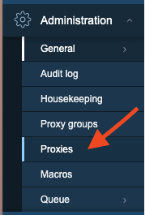
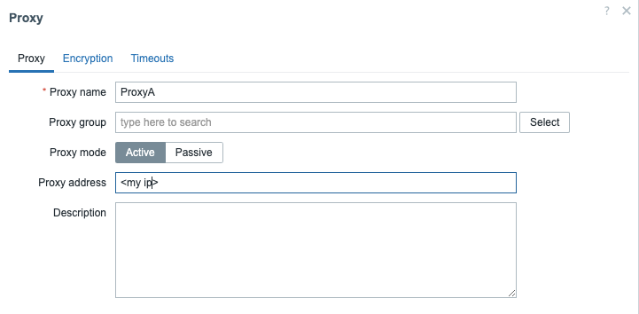

# Active proxy


Let's first start with the setup of an active Proxy.
Things should be very simple just make sure you have a VM that you can use to install a proxy.

#### Zabbix Gui config

First we will have to add the config in our Zabbix server frontend. From our Administration menu choose the menu ```Proxies```.



Go to the upper right corner of the screen and press ```Create proxy```
You will now get a pop-up like shown here. Fill in the proxy name. I have chosen for ProxyA as it will be our active proxy. You can use for yourself whatever you like. In production I would suggest to use names that make it easy for you to see it's a proxy and where the proxy belongs to. Ex: what vlan or what division ....

Choose Proxy mode ```Active``` and fill in the IP of your virtualmachine.



When done press ```Add``` at the bottom.


#### Zabbix Proxy config

Ok now that this is done lets go to the VM where we like to install our proxy and add the Zabbix repository so we can install our needed packages.

```
rpm -Uvh https://repo.zabbix.com/zabbix/7.0/rhel/9/x86_64/zabbix-release-7.0-1.el9.noarch.rpm
```

Zabbix provides the proxy with the option to connecto to a SQLiteDB this can be enough for most setups. In case you need more performance from the DB there is also the option to install the Proxy with a PostgreSQL or MySQL DB. We will cover how to do with the SQLite db as this is the most easy way. We show you later what to look for if installing a proxy With MySQL or PostgreSQL.


```
dnf install zabbix-proxy-sqlite3 zabbix-selinux-policy -y
```

Once this is done let's change the proxy configuration by editing the proxy configuration file.

```
vi /etc/zabbix/zabbix_proxy.conf
```
Here a few parameters needs to be changed before we can use our proxy

- Server=
- DBName=
- Hostname=

Change them according to your settings:

- Server=< zabbix server ip >
- Hostname=ProxyA ( or the name you have used in your Zabbix frontend for the Proxy )
- DBName=/tmp/zabbix_proxy.db

The parameters are explained as follows:

- Server: Same as with active agents this parameter is used to connect to the Zabbix server, we can use the IP or DNS name here.
- DBName: This depends a bit, it is usually the name of the database like we configured on the Zabbix server in case we use PostgreSQL or MySQL. However with SQLite we need to specify dbname and location.
          Username and Password will be ignored when using SQLite. Just make sure SELinux is properly configured else the DB will not be created. It can help to put SELinux in permissive first.
- Hostname: This parameter is used by the proxy to identify itself to the Zabbix server. This needs to be the same name we have registered in the Zabbix frontend.

???+ tip
    Another parameter that can be useful is ListenPort this is usually 10051 for Active and Passive proxies. But if you run for some reason the proxy on the zabbix server then you have to change this port to something else.

???+ note
    With Zabbix 7 a new parameter has been introduced on the proxy side ```ProxyBufferMode```. This is standard set to ```Hybrid``` and is what is recommended. With Hybrid the proxy will buffer will work in memory and fallback to the database if needed.
    The documentation states that the proxy buffer normally works like in memory mode until it runs out of memory or the oldest record exceeds the configured age. If that happens the buffer is flushed
    to database and it works like in disk mode until all data have been uploaded and it starts working with memory again. On shutdown the memory buffer is flushed to database.

???+ note
    Don't worry about the file for the db not existing Zabbix will create it by itself.

???+ warning
    If you use DNS names make sure there is DNS caching configured on the machine. If not Zabbix will do a lookup on the DNS server everytime it wants to make a connection.


So now that we have configured everything let's start our proxy. First disable SELinux as it will block a few things this can be done by running ```setenforce 0```. This is only temporary and either you keep it disabled permanent or you fix the config.
An easy way is to use ```sealert -a /var/log/audit/audit.log```.
Once this is done there is only 1 thing that rests us to do and that is start and enable the zabbix-proxy service.

```
systemctl enable zabbix-proxy --now
```

If you look now in the frontend of the Zabbix server you will see that the proxy we have configured is Online


???+ note
    If you like to install the proxy with MySQL or PostgreSQL as database then it is important to also install the package ```zabbix-sql-scripts```. There is a special shema to be used for the proxy database that can be found under ```/usr/share/zabbix-sql-scripts/mysql|postgresql>/proxy.sql```.
    Also in this case don't forget to edit the zabbix_proxy.conf file and add DBHost, DBUser, DBPassword and DBSchema as needed.

