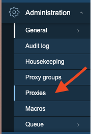

# Installing Proxies

There are some cases where monitoring with the Zabbix server and agents …. is not enough. 
Imagine monitoring external clients, different VLANs or just monitoring a DMZ where you don’t want to open for every agent a port in the firewall for the agent, SNMP, IPMI, … 
Here Zabbix proxies come to the rescue.
A Zabbix proxy is a small remote Zabbix server that supports the collection of data. With Zabbix 7 it’s now even possible to run Zabbix proxies in HA.
Proxies will also become important in larger environments to simplify the management and most importantly to offload the Zabbix server. Our proxies can do pre-processing and it will also limit the number of connections from devices to the Zabbix server.

So in short a Zabbix proxy can be used to :
- Monitor remote locations
- Monitor locations that have unreliable connections
- Offload the Zabbix server when monitoring thousands of devices
- Simplify the maintenance and management

## Proxy requirements

If you like to setup a few proxies for test or in your environment you will need a few Linux hosts to install the Proxies on. 
Proxies are also available in containers so a full VM is not needed. However here we will use a VM so we can show you how to install a proxy.
When it comes to proxies they are very lightweight however since Zabbix 4.2 Proxies are able to do Item value preprocessing and this can use a lot of CPU power.
So the number of CPUs and memory will depends on how many machines you will monitor and how many preprocessing rules you have on your hosts.


???+ note
    Imagine that you need to restart your Zabbix server and that all proxies start to push the data they have gathered during the downtime of the Zabbix server. This would create ahuge amount of data being sent at once to the Zabbix server and bring it to its knees in no time.
    Since Zabbix 6 Zabbix has added protection for overload. When Zabbix server history cache is full the history cache write access is being throttled. Zabbix server will stop accepting data from proxies when history cache usage reaches 80%. Instead those proxies will be put on a throttling list.
    This will continue until the cache usage falls down to 60%. Now server will start accepting data from proxies one by one, defined by the throttling list. This means the first proxy that attempted to upload data during the throttling period will be served first and until it's done the server will not accept data from other proxies.

|History write cache usage 	| Zabbix server mode	| Zabbix server action 	|
|----				|----			|----			|
|Reaches 80%			|Wait			|Stops accepting proxy data, but maintains a throttling list (prioritized list of proxies to be contacted later).|
|Drops to 60%			|Throttled		|Starts processing throttling list, but still not accepting proxy data.	|
|Drops to 20%			|Normal			|Drops the throttling list and starts accepting proxy data normally.|


## Configuration

Zabbix actually has 2 proxy modes it supports. A Zabbix proxy can be Active or Passive just like the Zabbix agent with this exception that the agent can be both on the same time.
So our first problem will be choose the Zabbix proxy that fits us. When we talk about active / passive we always talk about the proxy being active or passive.
Active means the Proxy will initiate the connection to the Zabbix server, passive means it will be the Zabbix server taking contact with the proxy to gather the data.

### Active vs Passive proxy

Zabbix proxies have been available since Zabbix 1.6, at that time they where available only as what we know today as ```Active proxies```. Active means that the proxy would initiate the connection by itself to the Zabbix Server.
Since version 1.8.3 passive proxies where introduced. This allowed the server to connect to the proxy. As mentioned before Zabbix agents can be both active and passive however proxies cannot be both so whe have to choose the way of the communication when we install a proxy.
Just remember that choosing the proxy mode ```active``` or ```passive``` has no impact on how Zabbix agents can communicate with our proxy. It's perfectly fine to have an ```active proxy``` and a ```passive agent``` working together.


### Active proxy


Let's first start with the setup of an active Proxy.
Things should be very simple just make sure you have a VM that you can use to install a proxy.

#### Zabbix Gui config

First we will have to add the config in our Zabbix server frontend. From our Administration menu choose the menu ```Proxies```.



Go to the upper right corner of the screen and press ```Create proxy```
You will now get a pop-up like shown here. Fill in the proxy name. I have chosen for ```ProxyA``` as it will be our active proxy.
In case you like to configure the Passive proxy use the name ```ProxyP```.

You can use for yourself whatever you like. In production I would suggest to use names that make it easy for you to see it's a proxy and where the proxy belongs to. Ex: what vlan or what division ....

Choose Proxy mode ```Active``` and fill in the IP of your virtualmachine if you like to install an active proxy.
or
Choose Proxy mode ```Passive``` and fill in the IP of your virtualmachine if you like to install a passive proxy.


When done press ```Add``` at the bottom.

