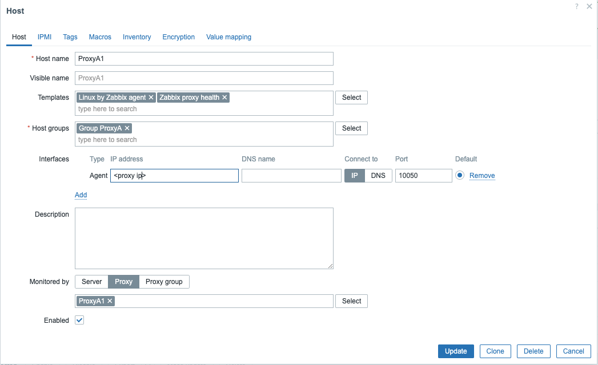

# Proxy loadbalancing

With the introduction of Zabbix 7.0 proxy loadbalancing has been introduced. After running the server in a native HA setup this was probably the next logical step to add.
So like the name implies it's not just a simple HA solution but Zabbix proxies will loadbalance the hosts connected to them in an automated way.

Zabbix has added something new to manage how we group those proxies together with the obvious name ```Proxy groups``` and it works for active and for passive proxies.

Zabbix is able to detect 3 states in our group with proxies

 - Online: This implies that everything is working as expected so there was communication with all the proxies.
 - Offline: The minimum number of proxies defined in our proxy config group has not been met.
 - Recovering: Some proxies are offline but we still have enough proxies online to not drop below the setting ```minimum proxies```.


## Configuration

The first thing we have to do is of course set up a couple of proxies. Here I will make use of 3 active proxies but feel free to use passives if you prefer or to do a mix.
If you don't know how to install a proxy take a look at the installation guides for [Active proxies](active-proxy.md) or [Passive proxies](passive-proxy.md).

I have set up 3 proxies for this example:

- ProxyA1
- ProxyA2
- ProxyA3

each of them has a unique IP and hostname.

So once you have set up 3 proxies and have added them into the frontend like we did for active and passive proxies you should have a similar looking config in your Administration frontend under Proxies.


Before we start to create a loadbalancing group there are a few steps we need to fix first. We need to monitor our proxies and we also need to install some Zabbix agents on the proxies.
To install the agents we have to follow a few simple steps.

On every proxy run the following commands:

```dnf install zabbix-agent```

We already installed the zabbix repository when we installed the proxy so no need to add it again.
Now we have to adjust a few configuration options.

- Server: A list of IP adressess or DNS names pointing to our zabbix servers. This is for the Passive agent only
- ServerActive: A list of IP adressess or DNS names pointing to our zabbix servers. This is for the Active agent only.
- Hostname: The hostname of our proxy server

So set the unique hostname and point every proxy for Server and or ServerActive to the IP of your Zabbix proxy and not the Zabbix server. Our Proxy is in this case acting as our Zabbix server.

Do this for all the agents that are installed on the proxies and when done start the agents and enable them to start automatic.

```
systemctl enable zabbix-agent --now
```

Our next step will be to create our proxies in the Zabbix frontend to monitor them.
For this we go to ```Data collection -> Hosts``` and click on ```Create host```.

Next we have to fill in a few fields:

- Host name: Name of the agent on the proxy. I used the same name for my agent as on the proxy this makes it easy to see when a proxy is down. Ex ProxyA1, ProxyA2, ProxyA3
- Templates: We will want to monitor the OS and the proxy so we have to apply 2 templates : Linux by Zabbix agent and Zabbix proxy health
- Host groups: Here we choose a group to put our proxies is you can choose what you want this is just a logical grouping used for permissions.
- Interface: Every hosts needs to have an interface where we define the IP of the host and the port.




Make sure your proxies are properly monitored before you continue to the next step.

## Configure proxy groups


As one of the final steps we have to Create a ```proxy group``` to gather all proxies we want to use for our loadbalancing.
In our Zabbix menu go to ```Administration -> Proxy groups```
Click in the upper right corner on ```Create proxy group```.

Here we have to define a few options:

- Name : The name of our proxy group. This can be anything you like I have chosen for the group ```Active proxies``` because I have setup 3 proxies for this test.
- Failover period: Period in seconds before failover is executed (1m by default; allowed range 10s-15m).
- Minimum number of proxies: The minimum number of online proxies required for the group to be online (1 by default; allowed range 1-1000). Since we have 3 proxies I added 2 as minimum.


Next we have to configure our 3 existing proxies to join this proxy group.
Go in the Zabbix menu to ```Administration -> Proxies```
click on every proxy in the list you would like to add to the group and enter following details.


- Proxy group: ```Active proxies``` (or whatever name you gave to your proxy group.)
- Proxy address: The active proxy ip, If specified then active proxy requests are only accepted from this list of comma-delimited IP addresses, optionally in CIDR notation, or DNS names of active Zabbix proxy.
- Address for active agents: The address and port where active agents will connect to. Usually same IP as the IP from the proxy but not needed to be the same.
- Proxy Mode: Configure if it proxy is Active or Passive 


The next step is now to reconfigure our Agents on our proxies so that they are monitored by The proxy group ```Active Proxies``` instead of only the proxy they run on.
Go to ```Data collection -> Hosts``` and click on every host that you have configured to monitor the proxy agent. Switch Monitored by ```Proxy``` to ```Proxy group```.


Because our proxies will accept active connections make sure to open firewall port 10051 on all the proxies and because we have Agents that we monitor passive make sure port 10050 is also open

```
firewall-cmd --add-port=10051/tcp --permanent
firewall-cmd --add-port=10050/tcp --permanent
firewall-cmd --reload
```

Now there is another step that we need to fix. On our Zabbix Agents we need to add all the proxy addresses to our Zabbix agents configuration.

open the file ```/etc/zabbix/zabbix_agentd.conf``` and add a comma delimited list of IPs for ```Server``` and ```ServerActive``` pointing to all your proxies
This way the agent can sent active data to the proxies or it can be polled by all 3 proxies

???+ Note
    Don't forget to restart your agents and proxies when making changes in the configuration files.

## Loadbalancing and HA

Ok now that we have configured our proxies and agents properly and made a proxy group everything is up and running. When you go to ```Data Collection -> Hosts``` you will see that your proxie agents  are monitored by the group ```Active proxies```. It is possible that your ProxyA1 is monitored by ProxyA2 or A3 so don't panic if your dashboard is not the same. Zabbix proxies will besides HA also do loadbalancing.


It's time to test this so let us stop one of our proxies for example ProxyA2

```
systemctl stop zabbix-proxy
```

Since we configured our Proxy group failover period to be 1m it can take 1m before you will see changes


When you look at the log files of the agent you will see that he is not able to connect the proxy anymore and that he will be redirected to another proxy in the group

```
  1391:20240528:115433.344 Unable to connect to [xxx.xxx.xxx.xxx]:10051 [cannot connect to [[xxx.xxx.xxx.xxx]:10051]: connection error (POLLERR,POLLHUP)]
  1391:20240528:115433.344 Unable to send heartbeat message to [xxx.xxx.xxx.xxx]:10051 [cannot connect to [[xxx.xxx.xxx.xxx]:10051]: connection error (POLLERR,POLLHUP)]
  1392:20240528:115433.344 Unable to connect to [xxx.xxx.xxx.xxx]:10051 [cannot connect to [[xxx.xxx.xxx.xxx]:10051]: connection error (POLLERR,POLLHUP)]
  1392:20240528:115433.353 Unable to connect to [xxx.xxx.xxx.xxx]:10051 [cannot connect to [[xxx.xxx.xxx.xxx]:10051]: connection error (POLLERR,POLLHUP)]
  1392:20240528:115433.355 Unable to send heartbeat message to [xxx.xxx.xxx.xxx]:10051 [sequential redirect responses detected]
  1390:20240528:115433.407 Unable to connect to [xxx.xxx.xxx.xxx]:10051 [cannot connect to [[xxx.xxx.xxx.xxx]:10051]: connection error (POLLERR,POLLHUP)]
  1390:20240528:115433.408 Unable to connect to [xxx.xxx.xxx.xxx]:10051 [cannot connect to [[xxx.xxx.xxx.xxx]:10051]: connection error (POLLERR,POLLHUP)]
  1390:20240528:115433.408 Unable to send heartbeat message to [xxx.xxx.xxx.xxx]:10051 [sequential redirect responses detected]
  1392:20240528:115533.508 Successfully sent heartbeat message to [xxx.xxx.xxx.xxx]:10051
  1390:20240528:115533.562 Successfully sent heartbeat message to [xxx.xxx.xxx.xxx]:10051
  1392:20240528:115558.583 Active check configuration update from [xxx.xxx.xxx.xxx:10051] is working again
  1391:20240528:115558.598 Active check configuration update from [xxx.xxx.xxx.xxx:10051] is working again
```


???+ warning
    There are a few limitations when using proxies in HA/Loadbalancing.
    - SNMP traps are not supported by proxies in proxy group.
    - Checks depending on external configuration must have the same configuration on all proxies in proxy group. That includes:
      - external checks - scripts;
      - database checks - odbc configuration.
      - When monitored in proxy group the VMware hosts will be randomly spread between proxies in the group and will cause each proxy to cache all VMware data causing additional load to vCenter.
