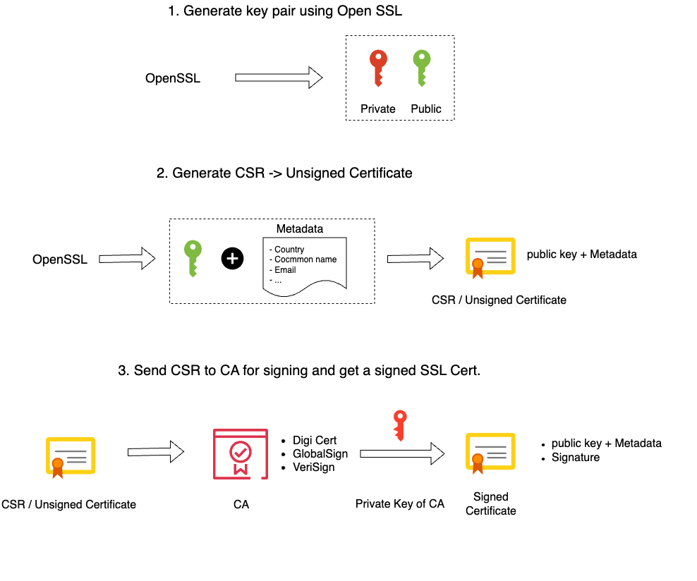
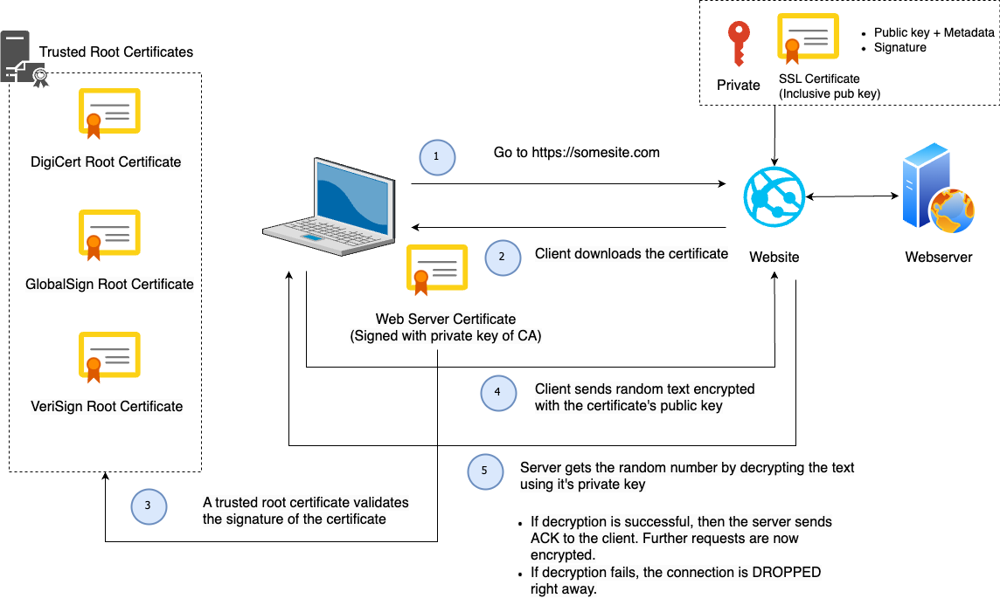
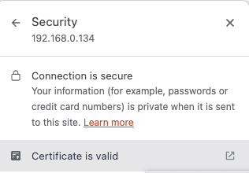

# Securing Zabbix Frontend

The frontend is what we use to login into our system. The Zabbix frontend will connect to our Zabbix server and our database.
But we also send information from our laptop to the frontend. It's important that when we enter our credentials that we can do this in a safe way.
So it makes sense to make use of certificates and one way to do this is by making use of Self-Signed certificates.

To give you a better understanding of why your browser will warn you when using self signed certificates, we have to know that when we request an SSL certificate from an official Certificate Authority (CA) that you submit a Certificate Signing Reauest (CSR) to them.
They in return provide you with a Signed SSL certificate. For this they make use of their root certificate and private key.
Our browser comes with a copy of the root certificate (CA) from various authorities or it can access it from the OS.
This is why our self signed certificates are not trusted by our browser, we don't have any CA validation.
Our only workaround is to create our own root certificate and private key.

## Understanding the concepts

### How to create an SSL certificate
<br />



## How SSL works - Client - Server flow


<br />

???+ Note
    Borrowed the designs from https://www.youtube.com/watch?v=WqgzYuHtnIM this video explains well how SSL works.


## Securing the Frontend with Self signed SSL on Nginx


To configure this there are a few steps that we need to follow:
```
- Generate a private key for the CA ( Certificate Authority )
- Generate a root certficate
- Generating CA-Authenticated Certificates
- Generate a Certificate Signing Request (CSR)
- Generate an X509 V3 certificate extension configuration file
- Generate the certificate using our CSR, the CA private key, the CA certificate, and the config file
- Copy the SSL certificates to our Virtual Host
- Adapt your Nginx Zabbix config
```

### Generate a private key for the CA

First step is to make a folder named SSL so we can create our certificates and safe them:

```
>- mkdir ~/ssl
>- cd ~/ssl
>- openssl ecparam -out myCA.key -name prime256v1 -genkey
```
Let's explain all the options;

>- openssl : The tool to use the OpenSSL library, this library provides us with cryptographic functions and utilities.
>- out myCA.key : This part of the command specifies the output file name for the generated private key. 
>- name prime256v1: Name of the elliptic curve; X9.62/SECG curve over a 256 bit prime field
>- ecparam: This command is used to manipulate or generate EC parameter files.
>- genkey: This option will generate a EC private key using the specified parameters.


### Generate a Root Certificate

```
openssl req -x509 -new -nodes -key myCA.key -sha256 -days 1825 -out myCA.pem
```

Let's explain all the options;

>- openssl: The command-line tool for OpenSSL.
>- req: This command is used for X.509 certificate signing request (CSR) management.
>- x509: This option specifies that a self-signed certificate should be created.
>- new: This option is used to generate a new certificate.
>- nodes: This option indicates that the private key should not be encrypted. It will generates a private key without a passphrase, making it more convenient but potentially less secure.
>- key myCA.key: This specifies the private key file (myCA.key) to be used in generating the certificate.
>- sha256: This option specifies the hash algorithm to be used for the certificate. In this case, SHA-256 is chosen for stronger security.
>- days 1825: This sets the validity period of the certificate in days. Here, it’s set to 1825 days (5 years).
>- out myCA.pem: This specifies the output file name for the generated certificate. In this case, “myCA.pem.”


The information you enter is not so important but it's best to fill it in as good as possible.
Just make sure you enter for CN you IP or DNS.


```
You are about to be asked to enter information that will be incorporated
into your certificate request.
What you are about to enter is what is called a Distinguished Name or a DN.
There are quite a few fields but you can leave some blank
For some fields there will be a default value,
If you enter '.', the field will be left blank.
-----
Country Name (2 letter code) [XX]:BE
State or Province Name (full name) []:vlaams-brabant
Locality Name (eg, city) [Default City]:leuven
Organization Name (eg, company) [Default Company Ltd]:
Organizational Unit Name (eg, section) []:
Common Name (eg, your name or your server's hostname) []:192.168.0.134
Email Address []:
```


### Generating CA-Authenticated Certificates

It's probably good practice to use de dns name of your webiste in the name fo the private key.<br />
As we use in this case no DNS but an IP address I will use the fictive dns zabbix.mycompany.internal.

```
openssl genrsa -out zabbix.mycompany.internal.key 2048
```

### Generate a Certificate Signing Request (CSR)

```
openssl req -new -key zabbix.mycompany.internal.key -out zabbix.mycompany.internal.csr
```
You will be asked the same set of questions as above.
Once again your answers hold minimal significance and in our case no one will inspect the certificate so they matter even less.

```
You are about to be asked to enter information that will be incorporated
into your certificate request.
What you are about to enter is what is called a Distinguished Name or a DN.
There are quite a few fields but you can leave some blank
For some fields there will be a default value,
If you enter '.', the field will be left blank.
-----
Country Name (2 letter code) [XX]:BE
State or Province Name (full name) []:vlaams-brabant
Locality Name (eg, city) [Default City]:leuven
Organization Name (eg, company) [Default Company Ltd]:
Organizational Unit Name (eg, section) []:
Common Name (eg, your name or your server's hostname) []:192.168.0.134
Email Address []:

Please enter the following 'extra' attributes
to be sent with your certificate request
A challenge password []:
An optional company name []:
```

### Generate an X509 V3 certificate extension configuration file.

```
# vi zabbix.mycompany.internal.ext
```
Add the following lines in your certificate extension file. Replace IP or DNS with your own values.
```
authorityKeyIdentifier=keyid,issuer
basicConstraints=CA:FALSE
keyUsage = digitalSignature, nonRepudiation, keyEncipherment, dataEncipherment
subjectAltName = @alt_names

[alt_names]
IP.1 = 192.168.0.133
#DNS.1 = MYDNS (You can use DNS if you have a dns name if you use IP then use the above line)
```

### Generate the certificate using our CSR, the CA private key, the CA certificate, and the config file

```
openssl x509 -req -in zabbix.mycompany.internal.csr -CA myCA.pem -CAkey myCA.key \
-CAcreateserial -out zabbix.mycompany.internal.crt -days 825 -sha256 -extfile zabbix.mycompany.internal.ext
```


### Copy the SSL certificates to our Virtual Host

```
cp zabbix.mycompany.internal.crt /etc/pki/tls/certs/. 
cp zabbix.mycompany.internal.key /etc/pki/tls/private/.
```

#### Import the CA in Linux (RHEL)

We need to update the CA certificate’s, run the below command to update the CA certs.

```
cp myCA.pem /etc/pki/ca-trust/source/anchors/myCA.crt
update-ca-trust extract
```

#### Import the CA in OSX

- Open the macOS Keychain app.
- Navigate to File > Import Items
- Choose your private key file (i.e., myCA.pem)
- Search for the “Common Name” you provided earlier.
- Double-click on your root certificate in the list.
- Expand the Trust section.
- Modify the “When using this certificate:” dropdown to “Always Trust”.
- Close the certificate window.


#### Import the CA in Windows

- Open the “Microsoft Management Console” by pressing Windows + R, typing mmc, and clicking Open.
- Navigate to File > Add/Remove Snap-in.
- Select Certificates and click Add.
- Choose Computer Account and proceed by clicking Next.
- Select Local Computer and click Finish.
- Click OK to return to the MMC window.
- Expand the view by double-clicking Certificates (local computer).
- Right-click on Certificates under “Object Type” in the middle column, select All Tasks, and then Import.
- Click Next, followed by Browse. Change the certificate extension dropdown next to the filename field to All Files (*.*) and locate the myCA.pem file.
- Click Open, then Next.
- Choose “Place all certificates in the following store.” with “Trusted Root Certification Authorities store” as the default. Proceed by clicking Next, then Finish, to finalize the wizard.
- If all went well you should find your certficate under Trusted Root Certification Authorities > Certificates


???+ Warning
    You also need to import the myCA.crt file in your OS we are not an official CA so we have to import it in our OS and tell it to trust this Certificate. This action depends on the OS you use.


As you are using OpenSSL, you should also create a strong Diffie-Hellman group, which is used in negotiating Perfect Forward Secrecy with clients.
You can do this by typing:

```
openssl dhparam -out /etc/ssl/certs/dhparam.pem 2048
```

#### Adapt your Nginx Zabbix config

Add the following lines to your Nginx configuration, modifying the file paths as needed.<br />
Replace the the already existing lines with port 80 with this configuration. This will enable SSL and HTTP2.


```
# vi /etc/nginx/conf.d/zabbix.conf
```

```
server {
        listen          443 http2 ssl;
        listen          [::]:443 http2 ssl;
        server_name     <ip qddress>;
        ssl_certificate /etc/ssl/certs/zabbix.mycompany.internal.crt;
        ssl_certificate_key /etc/pki/tls/private/zabbix.mycompany.internal.key;
        ssl_dhparam /etc/ssl/certs/dhparam.pem;
```
To redirect traffic from port 80 to 443 we can add the following lines above our https block:

```
server {
       listen         80;
       server_name    _; #dns or ip is also possible
       return         301 https://$host$request_uri;
}
```

#### Restart all services and allow https traffic

```
systemctl restart php-fpm.service
systemctl restart nginx

firewall-cmd --add-service=https --permanent
firewall-cmd --reload
```

When we go to our url ```http://<IP or DNS>/``` we get redirected to our ```https:// ``` page and when we check we can see that our site is secure:




???+ Note
    - To be even more secure have a loot at https://cipherlist.eu/ this page maintains a list of strong ciphers that you can use so secure your Nginx even more.<br />
    - You can test your nginx config with 'nginx -t' before you restart.<br />
    - For HTTP/2 to work you need atleast nginx 1.9.5 or later


## Securing the Frontend with Let's Encrypt  on Nginx
