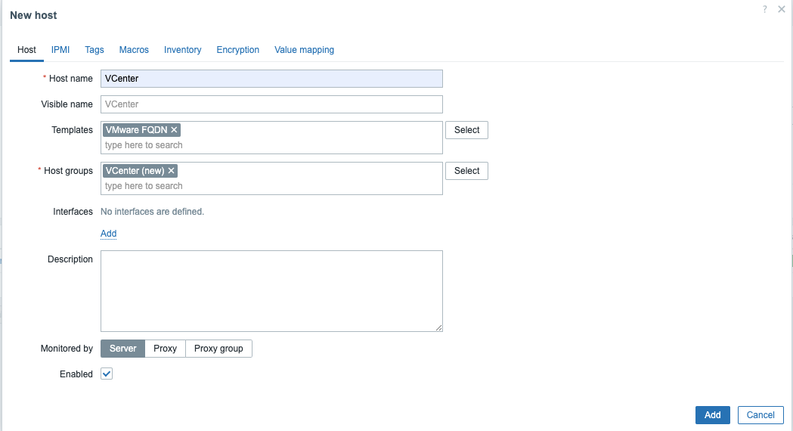
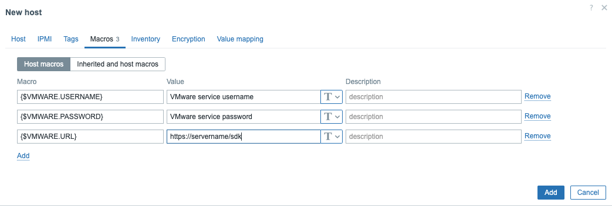
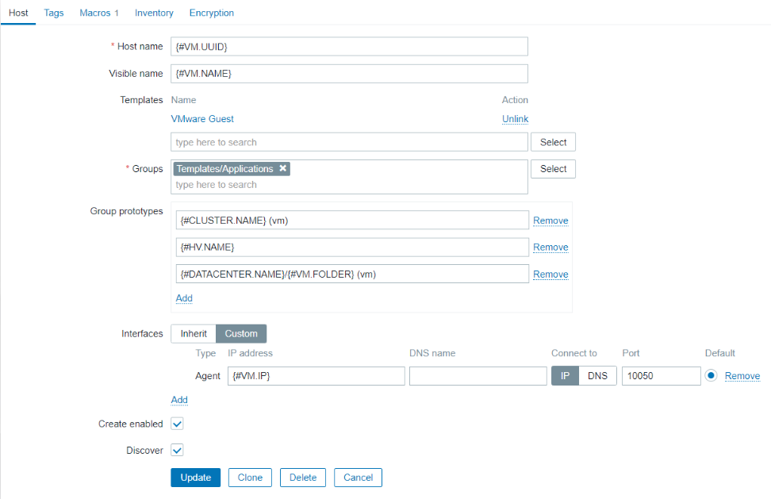

# VMware monitoring with Zabbix

Zabbix can automatically discover Virtual Machines and VMware hypervisors based on Low-level discovery rules. Zabbix provides a set of templates to do this out of the box to make life more easy.
In this chapter, we will see how we can configure this.

Zabbix requires VMware vCenter or vSphere to be at least 5.1 or higher but always check the official documentation to be sure this hasn't changed.

## What do we need ?

- VMware vCenter or vSphere to be at least 5.1
- A monitoring account with RO access to the API
- Enable performance counter statistics and requests on the VMware side as well.


Before we start it's important to know that Zabbix does not start any processes to start monitoring VMware out of the box if we do not configure this.
So the first thing we have to do is edit out ```zabbix_server.conf``` file. This file can be found here : ```/etc/zabbix/zabbix_server.conf```.

Look for the parameter StartVMwareCollectors, edit this line, or add a new line where you add ```StartVMwareCollectors=2``` and restart the server service.
Why do we add 2? Is it always 2? Of course not else it would be hardcoded. But Zabbix recommends not going below 2 and it should also not exceed twice the amount of monitored VMware services.


So we can use the next formula to calculate the optimal value?

```Amount of services < StartVMwareCollectors < (Amount of services * 2)```

So for the setups with 1 VMware service we will set it to 2 and with instances where we have 3 we will set it to 5 

???+ note
    A VMware instance can be a vSphere or vCenter instance and not a virtual machine or hypervisor. So the number of collectors depends on the data points we use to collect values from.

## Configuration

The first step is to create a new host. If you are unsure how to take a look at the topic [Zabbix hosts](../../configuration/zabbix-hosts/).
Only adding a ```Host name``` should be ok we don't need to configure any interfaces. Once this is done before you press ```Add``` go to the tab ```Macros```.



Add the following macros :

 - {$VMWARE.USERNAME}
 - {$VMWARE.PASSWORD}
 - {$VMWARE.URL}



???+ tip
    Do not use the admin account of your VMware VCenter but create a new monitoring account with RO rights to read out the information and use a secret macro for the password and even maybe the username.

Once done go back to the ```Host``` tab and fill in the ```Host group``` and the correct template.
Zabbix provides 2 templates to choose from. 

- VMware FQDN : The template making use of the FQDN for the VMs (recommended) but:
  - Every Monitored VM should have a unique OS name compliant with the FQDN rules.
  - VMware Tools must be installed on every machine

- VMware : The template making use of the UUID for every VM.
  - This one is recommended if the FQDN requirements cannot be met.

- VMWare Guest : Will monitor the virtual machines
- VMWare Hypervisor : Will monitor the hypervisors
  - These 2 templates should not be linked manually Zabbix will handle this for you !


Zabbix will discover VMware clusters, hypervisors, data stores, and virtual machines. It's possible to control which parts will be monitored by going to the template to the Discovery and disabling the Discovery rules you don't need.

It's also possible to change the configuration of our host prototype. Ex: we can configure the host interface to ```Inherit``` or to create the interface with ```Custom``` data.
A list with ```MACROS``` can be found here https://www.zabbix.com/documentation/7.0/en/manual/vm_monitoring/discovery_fields



As you have may have noticed already, in the Zabbix server configuration file there are a few more parameter that we can tweak.

- VMWareFrequency
  - How often Zabbix will connect to the VMWare service to collect new data.
- VMwarePerfFrequency
  - How often Zabbix will connect to the VMWare service to collect performance data.
- VMWareTimeout
  - This is the maximum number of seconds that a VMWare collector will wait for a response from the VMWare vCenter or Hypervisor
- VMwareCacheSize
  - This is the shared memory size for storing VMware data. A VMware internal check zabbix[vmware,buffer,...] can be used to monitor the VMware cache usage. This should be verified if enabled in your ```zabbix server healt template```. The size of the cache will depend on the size of your VMware setup.


???+ note
    It's best to keep VMWareFrequency and VMwarePerfFrequency with the same values. Using values where ```VMWareFrequency``` is less then ```VMwarePerfFrequency``` will lead to strange looking graphs.

???+ note
    If config.vpxd.stats.maxQueryMetrics is invalid or exceeds the maximum number of characters permitted error, add a config.vpxd.stats.maxQueryMetrics parameter to the vCenter Server settings. The value of this parameter should be the same as the value of maxQuerysize in VMware's web.xml file.

## Available metrics

After some time in latest data you should see for all the items data being populated. It can take a while before every item is populated it depends a bit on the order of the LLD rule being executed.

These are the items that are configure with our standard Zabbix VMware template. But the template does not cover all items and more items might be added over time. A list of all keys can be found in the online documentation. https://www.zabbix.com/documentation/7.0/en/manual/vm_monitoring/vmware_keys
Those items are ```simple checks``` so when creating a new item don't forget to select the correct item type.

## Internal working

We know now that Zabbix can monitor VMware out of the box and the setup for it is very easy. There is a lot of information that we can retreive but to get to this information there is a complex process behind it. To tune this process we have seen that there are parameters that can be set like VMWareFrequency, VMwarePerfFrequency, VMWareTimeout and VMwareCacheSize.

The next diagram shows us how Zabbix collects the data and end up with the data in it's history Cache.


Here we can see the different steps involving in the data flow when monitoring VMWare with Zabbix. Connections are made from the VMWare collector to the SDK interface.
The collectors will grab the data and place it in a special VMWare chache. Pollers then will look into the cache and grab the data from it and send it to the preprocessors. The data after preprocessin is then placed in the Zabbix history cache. In case of a proxy it will be sent to the Zabbix server.

???+ Note
VMwarePerfFrequency and VMWareFrequency are both set standard to 60 seconds wich is fine for small to medium setups lowering this number could create some overload on the VMWare servers. On a larger instance it's probably best to increase then together with the VMWareTimeout parameter.


## Debugging

???+ warning
    It can take some time before you will see all the VMs in your Zabbix setup popup. If you want to know what the Zabbix server or Proxy (if you monitor VMware over a proxy then you have to adjust all config on the proxy) is doing then you can increase the debug level. This can be done on they fly without changing the debug parameter in the zabbix_server.conf file. Just one the console run the following command to increase logging for all the vmware collectors.

```
zabbix_server -R log_level_increase="vmware collector"
```

In case you like to increase logging for only collector 2 then you could run the following command:

```
zabbix_server -R log_level_increase="vmware collector,2"
```

???+ note
    If you see a message like "config.vpxd.stats.maxQueryMetrics' is invalid or exceeds the maximum number of characters permitted**" in the debug don't be alarmed right away. The message is a bit confusing.
    Have alook at this ticket as it will explain that its not always a problem. https://support.zabbix.com/browse/ZBX-24499

